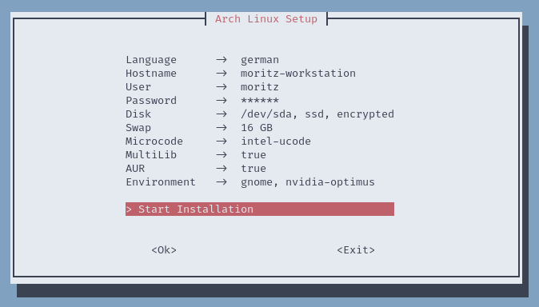
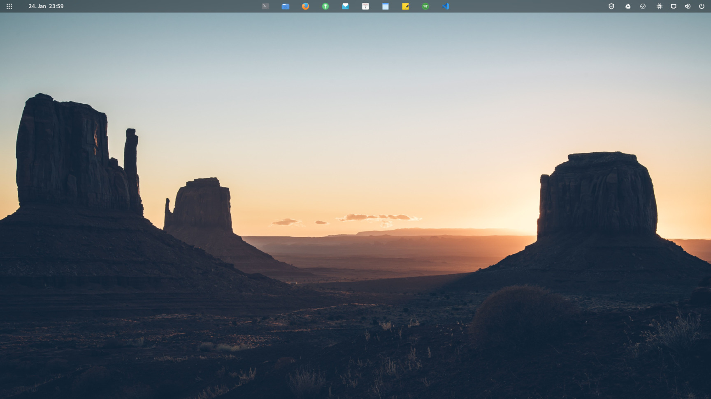

<h1 align="center">Arch Linux Distro</h1>

  

    
  

  

    
    
  

This script installs an encrypted and minimal version of Arch Linux with optionally paru preinstalled as AUR Helper and Multilib enabled. In addition, you can select GNOME as Desktop Environment. For installing Arch Linux, this script is used: [Arch Install](https://github.com/murkl/arch-install)

# Features

- 100% TUI Installation
- Bootable Arch USB Creator
- Recovery Support
- Configurable Install Properties
- Minimal Arch Linux Installation
- GNOME Desktop Environment (optional)
- Bootloader (systemd-boot)
- Network Manager (WiFi & Ethernet)
- Disk Encryption (optional)
- Multilib & Paru AUR Helper (optional)
- Only UEFI Support
- More information: [Arch Install](https://github.com/murkl/arch-install)

# Step by Step Installation

- Create bootable Arch USB Device from latest [Arch ISO](https://www.archlinux.de/download)
  - `curl -Ls http://arch.webhop.me | bash`
  - Alternatively use [Etcher](https://www.balena.io/etcher)
- Disable Secure Boot
- Set Boot Mode to UEFI
- Boot from Arch USB Device...
  - Load Keyboard Layout (use prefered language)
    - `loadkeys de-latin1`
  - If you are using WLAN, run `iwctl` and type into console
    - `station wlan0 connect "SSID"`
  - Install Arch Linux or open Recovery
    - `curl -Ls http://arch.webhop.me | bash`
  - Boot into new Arch Linux System
    - `reboot`

# Additional Customization

If you prefer, you can make these customizations manually. This is not part of the installation.

## GNOME Shell Extensions

- https://extensions.gnome.org/extension/1160/dash-to-panel/
- https://extensions.gnome.org/extension/615/appindicator-support/
- https://extensions.gnome.org/extension/1010/archlinux-updates-indicator/
- https://extensions.gnome.org/extension/19/user-themes/
- https://extensions.gnome.org/extension/3843/just-perfection/
- https://extensions.gnome.org/extension/5237/rounded-window-corners/
- https://extensions.gnome.org/extension/5612/focus-indicator/
- https://extensions.gnome.org/extension/3733/tiling-assistant/
- https://extensions.gnome.org/extension/3193/blur-my-shell/

## Theming

- Icon Theme: https://github.com/vinceliuice/Tela-icon-theme
- Firefox Theme: https://github.com/rafaelmardojai/firefox-gnome-theme
- Libadwaita GTK Theme: https://github.com/lassekongo83/adw-gtk3
- Libadwaita GTK Colors: https://github.com/lassekongo83/adw-colors
- Libadwaita Customization Tool: https://github.com/GradienceTeam/Gradience
