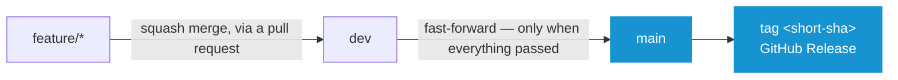
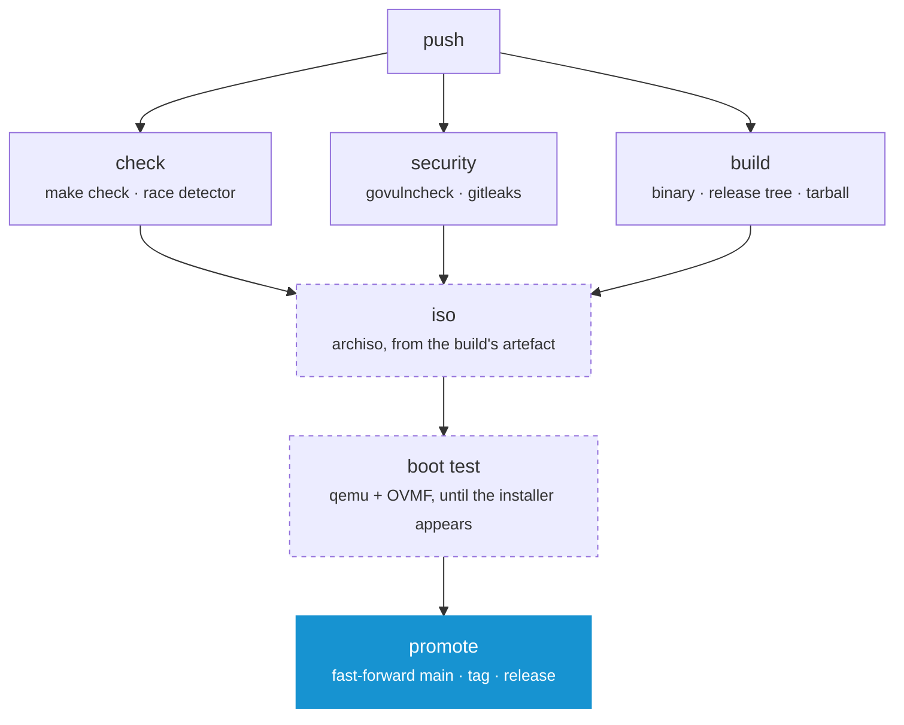

# Working on Arch OS

Everything below follows from one decision: **a commit is built once**. The
image on the release page is not a rebuild of what was tested — it is the file
that was tested, moved. That only works if promoting a commit does not change
it, which is why `main` is only ever fast-forwarded.

## Branches



**`feature/*`** is where work happens. Push as often as you like — every push is
checked, and nothing else follows from it.

**`dev`** is the only branch anything is merged into, and it is merged into by
squash, so one change is one commit. It is also the branch that gets built: a
push here produces an image, boots it, and — if all of that passed — promotes.

**`main`** is not written to by hand. CI fast-forwards it onto the `dev` commit
that just passed, and every commit that arrives there is tagged and released.
Its history is therefore linear, and every entry in it is a state that was
checked, built and booted. A release is not a separate act: it is what landing
on `main` means.

Because the fast-forward keeps the commit, the short SHA is the same on both
branches — and that short SHA is the version everywhere: inside the binary, on
the ISO label, in both filenames, and as the tag.

### Why not squash into `main` as well

A squash makes a new commit with a new SHA. The image built on `dev` would then
carry a version no branch has, and the release would have to be rebuilt to agree
with its own tag — which is the rebuild this whole arrangement exists to avoid.
Fast-forward is not a style preference here; it is what makes the artefact
promotable.

### There is no CI on `main`

The commit that arrives on `main` is the commit that was checked on `dev`, down
to the SHA. Running everything again would prove nothing and would mean building
a second image nobody publishes. Branch protection on `main` therefore requires
a linear history and forbids force pushes, but does **not** require status
checks — a required check on `main` would block the very push that publishes the
release.

## What a push runs



| Job | Where it runs | What it does |
| --- | --- | --- |
| `check` | every branch | `make check`, then the tests again under the race detector |
| `security` | every branch | vulnerabilities in the runtime's imports, and a scan for secrets in the tree |
| `build` | every branch | the runtime binary, the release tree, the tarball — and unpacks the tarball to load the tree out of it |
| `iso` | `dev`, `main`, `neo`, on demand | the bootable image, out of the artefact `build` produced |
| `boot test` | after `iso` | boots that image and waits for the installer's first page |
| `promote` | `dev` | fast-forwards `main`, tags, publishes, signs |

The dashed jobs are the expensive ones. An archiso build is a quarter of an
hour, and a work in progress does not need an image — so a feature branch gets
everything except those two, in about two minutes. When you do want an image
from a branch, run the CI workflow on it by hand (Actions ▸ CI ▸ Run workflow).

`neo` is the exception while the rewrite is being done there: it builds and
boots an image on every push, like `dev`. It promotes nothing — that stays with
`dev` — and the line in `ci.yml` naming it comes out again when the branch is
merged.

`build` is the only job that compiles anything. `iso` downloads what it made
rather than making it again, and `promote` downloads what both of them made. The
binary is compiled once per commit, and the image exists exactly once.

## Doing the work

```sh
make check        # everything below, and what has to pass before a commit
make -C runtime run   # the installer against ../setup, on this machine
make tarball      # the release, as a stock Arch ISO downloads it
make iso          # the release, as a bootable image
make -C iso smoke # boot the newest image and wait for the installer
make clean        # all of the above, taken back
```

`make check` needs `go`, `shellcheck`, `shfmt`, `staticcheck`, `yamllint` and
`actionlint`. `make iso` needs `archiso` and root; `make -C iso smoke` needs
`qemu-base`, `edk2-ovmf`, `tesseract` and `tesseract-data-eng`. All of them are
packages:

```sh
sudo pacman -S --needed go shellcheck shfmt staticcheck yamllint actionlint \
    govulncheck gitleaks archiso qemu-base edk2-ovmf tesseract tesseract-data-eng
```

CI installs the same packages and runs the same commands, in an Arch container.
There is no second definition of what "green" means.

An ISO build leaves nothing behind: on success `iso/archiso/` is removed, on a
failure it is kept — so there is something to read — but handed back to you
rather than left owned by root. `iso/download/` stays either way; it is the
vendored bootsplash theme, and it is what lets the next build run without a
network.

## Commits

Write them in the imperative — "Add", "Fix", "Refactor" — and keep one logical
change to a commit. They are squashed into `dev` anyway, so the pull request
title is what ends up in the history: make that one say what changed.

## Setting the repository up

Once, with the `gh` CLI:

```sh
# Pull requests should default to dev, not main.
gh repo edit --default-branch dev

# main moves forward, or not at all.
gh api -X PUT repos/murkl/arch-os/branches/main/protection --input - <<'EOF'
{
  "required_linear_history": true,
  "allow_force_pushes": false,
  "allow_deletions": false,
  "enforce_admins": false,
  "required_status_checks": null,
  "required_pull_request_reviews": null,
  "restrictions": null
}
EOF
```

Nothing else has to be configured. The workflow signs its releases with the
token GitHub already gives it, and Dependabot opens its pull requests against
`dev` like every other change.
