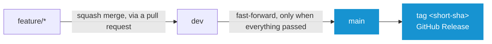
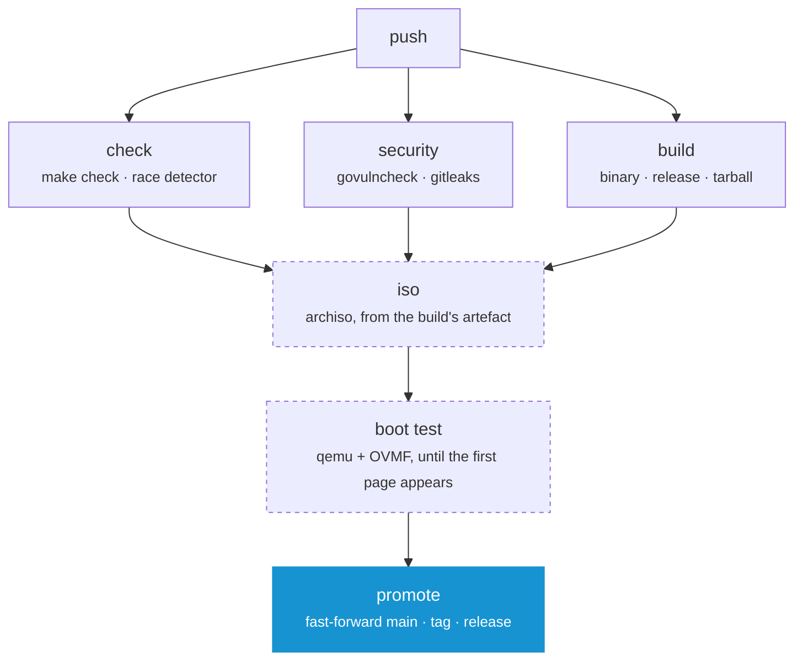

# Contributing

Everything here follows from one rule: **a commit is built once**. The image on the release page is not a rebuild of what was tested, it is the file that was tested, moved. That only works if promoting a commit does not change it, which is why `main` is only ever fast-forwarded.

## Branches



| Branch | Description |
| --- | --- |
| `feature/*` | Where work happens. Every push is checked, nothing else follows from it |
| `dev` | The only branch anything is merged into, by squash, so one change is one commit. A push here builds an image, boots it and promotes if all of that passed |
| `main` | Never written to by hand. CI fast-forwards it onto the `dev` commit that just passed, then tags and releases it |

The fast-forward keeps the commit, so the short SHA is the same on both branches. That short SHA is the version everywhere: inside the binary, on the ISO label, in both filenames and as the tag.

**Note:** _A squash into `main` would create a new SHA and the image built on `dev` would carry a version no branch has._

There is no CI on `main`, because the commit arriving there is the commit that was checked on `dev`, down to the SHA. Branch protection therefore requires a linear history and forbids force pushes, but requires no status checks: a required check on `main` would block the very push that publishes the release.

## What a Push runs



| Job | Where | Description |
| --- | --- | --- |
| `check` | every branch | `make check`, then the tests again under the race detector |
| `security` | every branch | Vulnerabilities in the runtime's imports and a secret scan of the repository |
| `build` | every branch | The binary, the release and the tarball, then unpacks the tarball and loads both modules out of it |
| `iso` | `dev`, `main`, `neo`, on demand | The bootable image, from the artefact `build` produced |
| `boot test` | after `iso` | Boots that image and waits for the first page |
| `promote` | `dev` | Fast-forwards `main`, tags, publishes, signs |

The dashed jobs are the expensive ones. An archiso build takes a quarter of an hour and a work in progress does not need an image, so a feature branch gets everything except those two in about two minutes.

**Note:** _To build an image from a branch, run the workflow on it by hand (Actions ▸ CI ▸ Run workflow)._

`build` is the only job that compiles anything and the tarball is the only thing it hands on. `iso` unpacks that tarball instead of building again, so the image holds the very file the release page offers.

**Note:** _`neo` builds and boots an image on every push, because the rewrite living there changes the image itself. That line comes out of the workflow when the branch is gone._

## Doing the Work

```
make check            # everything that has to pass before a commit
make -C runtime run   # both modules on this machine, MODULE=recovery for one outright
make build            # the release, as a machine runs it: release/runtime
make tarball          # the release, as a stock Arch ISO downloads it
make locales          # every translation template, and every catalog brought up to it
make iso              # the release, as a bootable image
make -C iso smoke     # boot the newest image and wait for its first page
make clean            # all of the above, taken back
```

Install the required packages:

```
sudo pacman -S --needed go shellcheck shfmt staticcheck yamllint actionlint \
    gettext govulncheck gitleaks archiso qemu-base edk2-ovmf tesseract tesseract-data-eng
```

| Command | Needs |
| --- | --- |
| `make check` | `go`, `shellcheck`, `shfmt`, `staticcheck`, `yamllint`, `actionlint`, `gettext` |
| `make iso` | `archiso` and root |
| `make -C iso smoke` | `qemu-base`, `edk2-ovmf`, `tesseract`, `tesseract-data-eng` |

**Note:** _CI installs the same packages and runs the same commands in an Arch container. There is no second definition of green._

### Where a Change belongs

- Packages, tasks and questions: **[modules/installer](modules/installer)**
- Repairing a system already on disk: **[modules/recovery](modules/recovery)**
- The frame around both: **[runtime](runtime)**, for bugs and features, not for a new package
- The bootable image: **[iso](iso)**

**[➜ See AGENTS.md](AGENTS.md)** for the same ground written as rules: the layering, the task contract, what may be edited on an installed system and how everything here is written. It is meant for a coding agent and is the shortest way in for a person too.

## Words on Screen

Every sentence the program shows is translatable and the English sentence is its own key, so writing one is writing the source text and the key at once. Reword it and the old translation is marked fuzzy rather than dropped.

The catalogs are gettext `.po` files. The templates they are filled in from are generated: the runtime's from the Go sources, a module's from the loaded module.

```
make locales   # after adding, rewording or deleting anything on screen
```

**Note:** _`make check` refuses a stale template and a translation that has lost a placeholder._

**[➜ See Translating](TRANSLATING.md)**

## Commits

- Imperative mood (`Add`, `Fix`, `Refactor`), one logical change per commit
- Commits are squashed into `dev`, so the pull request title is what ends up in the history

## Setting the Repository up

Once, with the `gh` CLI:

```
# Pull requests should default to dev, not main
gh repo edit --default-branch dev

# main moves forward, or not at all
gh api -X PUT repos/murkl/arch-os/branches/main/protection --input - <<'EOF'
{
  "required_linear_history": true,
  "allow_force_pushes": false,
  "allow_deletions": false,
  "enforce_admins": false,
  "required_status_checks": null,
  "required_pull_request_reviews": null,
  "restrictions": null
}
EOF
```

**Note:** _Nothing else has to be configured. The workflow signs its releases with the token GitHub already provides and Dependabot opens its pull requests against `dev`._
