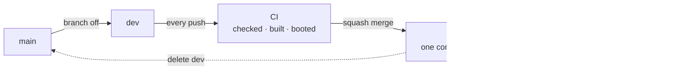

# Contributing

One rule: **a commit is built once**. The ISO on the release page is not a rebuild of what was tested - it is that file, moved.

## Branches

`main` is the released line, one commit per round. Work happens on `dev`.



- **Branch `dev` off `main`**, push as often as you like - CI runs the full pipeline on every push
- **Squash merge** into `main` and delete `dev`. The pull request title becomes the commit
- A pull request from outside is checked and built, not turned into an image

**Note:** _Watched branches: `branches: [main, dev, oak]` in **[ci.yml](../.github/workflows/ci.yml)**._

## The Version

`version:` in **[oak.yaml](../oak.yaml)** is the only place it is written. Everything else is named after it: `dist/arch-os-2.0.0/`, `arch-os-2.0.0-x86_64.iso`, ISO label `ARCH_OS_2_0_0`, tag `v2.0.0`.

**Note:** _`make tag` writes the tag out of `oak.yaml`. `make check` refuses a version that is not `X.Y.Z`. The Release workflow refuses a tag that disagrees with the commit._

## Releasing

1. Raise `version:` in `oak.yaml`, on `dev`
2. Squash merge into `main` - it checks, builds, boots, keeps artefacts 90 days
3. Push the tag:

```
git switch main && git pull
make tag
git push origin v2.0.0
```

The Release workflow finds that commit's run and hangs its artefacts on the release page - `arch-os-2.0.0-x86_64.iso` and `.tar.gz`. GitHub prints each one's SHA-256 beside it there, so the release carries no checksum file of its own.

**Note:** _Nothing is built from a tag. `make tag` refuses an unclean tree, `HEAD` off `main`, or a tag that exists already. A release can also be written on the web page._

## What a Push runs


| Job | Where | Description |
| --- | --- | --- |
| `Check` | every run | `make check` |
| `Build` | every run | Release and tarball |
| `ISO` | watched branches, on demand | The image, from `Build`'s artefact |
| `Smoke test` | after `ISO` | Boots it, waits for the first page |
| `Release` | a tag on `main` | Hangs that commit's artefacts on the release page |

`ISO` unpacks `Build`'s tarball rather than building again, so the image holds the exact file the release page offers. The dashed jobs are the expensive ones (~15 min), so a pull request is judged on the two above them.

**Note:** _No job needs a Go toolchain - every job that needs Oak downloads the release the Makefile pins._

## Doing the Work

```
make check             # everything that has to pass before a commit
make run               # every module, MODULE=recovery for one outright
make run ARGS=--debug  # ...without touching the machine
make inspect           # load every module and print the order they resolve to
make build             # the release, as a machine runs it
make tarball           # the release, as a stock Arch ISO downloads it
make iso               # the release, as a bootable image
make image             # ...only the image, out of a release already in dist/
make smoke             # boot the newest image and wait for its first page
make locales           # every translation template, brought up to date
make glyphs-check      # every module against the glyph table of the console font
make tag               # the release tag, written out of oak.yaml
make oak               # fetch the runtime again, at the release OAK_VERSION names
make clean             # every build output, taken back; the runtime stays
```

```
sudo pacman -S --needed make curl shellcheck shfmt yamllint actionlint \
    gettext gitleaks kbd archiso qemu-base edk2-ovmf tesseract tesseract-data-eng
```

**Note:** _CI installs the same packages and runs the same commands in an Arch container. No second definition of green._

### Where a Change belongs

**Note:** _What Arch OS puts on a disk and why: **[➜ Reference](REFERENCE.md)**._

- Packages, tasks, questions: **[modules/installer](../modules/installer)**
- Repairing a system: **[modules/recovery](../modules/recovery)**
- Writing the boot device: **[modules/imager](../modules/imager)**
- Product name, version, look: **[oak.yaml](../oak.yaml)**
- The bootable image: **[iso](../iso)**
- The interface itself: **[Oak](https://github.com/murkl/oak)**, its own repository

## Translating

**The English sentence is the key.** A catalog with nothing to say shows the English, so a translation is useful from its first line.

| Component | Template | Catalogs |
| --- | --- | --- |
| Installer | `modules/installer/locales/installer.pot` | `modules/installer/locales/<code>.po` |
| Recovery | `modules/recovery/locales/recovery.pot` | `modules/recovery/locales/<code>.po` |
| Imager | `modules/imager/locales/imager.pot` | `modules/imager/locales/<code>.po` |

The frame's own words (buttons, key hints) belong to **[Oak](https://github.com/murkl/oak)**. Both catalogs apply at once.

**Note:** _`.pot` files are generated, never edited by hand - `make locales` rewrites them._

### Adding a Language

```
cp modules/installer/locales/installer.pot modules/installer/locales/fr.po
```

Fill in the `msgstr` lines, open a pull request. Nothing else to declare.

- `msgid "English"` translates to your language's own name: `Deutsch`, `Français`
- `msgstr ""` means not translated yet, not "translate to nothing" - the English shows instead
- `#, fuzzy` means the English changed - check, correct, remove the flag

Keep as-is: `%s`/`%d` (order and kind), `{{ARCH_OS_DISK}}` (braces and name), `⏎ ↑↓ esc` marks in hints, and blank lines between paragraphs.

**Note:** _`make check` runs `msgfmt --check-format` - a dropped `%s` fails the build, not the installation._

### What the Console can draw

Before any desktop exists there is one console font, and it holds one table of glyphs: in practice **ASCII and Latin-1** (`äöüß éèê ñ ç å`).

- Supported: German, French, Spanish, Italian, Portuguese, Dutch, the Nordics
- Not: Polish, Czech, Turkish, Greek, Cyrillic, or any script of its own

**Note:** _`make check` reads every module against that table rather than against a list written down anywhere, so a character that would be a box says so at a desk. The font is the one **[iso/src/usr/local/bin/arch-os](../iso/src/usr/local/bin/arch-os)** loads._

**Note:** _Supporting a script the font has no glyphs for needs another console font shipped on the image, not a catalog change. Open an issue._

## Pictures in the Docs

Both are generated, so neither can quietly outlive the interface it shows. The screenshots are taken from the Installer and the Recovery driven on a real terminal; the banner collages two of them under the wordmark, which is read out of `oak.yaml` rather than redrawn, so the name and the accent on it cannot drift from the ones a run draws.

```
make screenshots   # after any visible change to a page
make banner        # after the screenshots, the wordmark or the accent changed
make docs          # both, in that order
```

They need `chromium`, `imagemagick`, `python-pyte` and `python-yaml`, none of which a build or `make check` needs.

Every run is started with `--debug`, which hands every script `DEBUG=true`: no disk is partitioned, nothing is mounted and nothing restarts. Which pages are taken is `docs/screenshots.yaml`, and every answer is given there rather than left to the machine rendering it; `screenshots.py` beside it is the same file in every project that renders a set this way, as is `banner.py`.

**Note:** _Only `setup.png`, `installer.png`, `installing.png` and `recovery.png` are drawn by the interface. The boot splash, the shell, the fetch and the System Manager are photographs of a running system, taken by hand and left alone by `make screenshots`._

**Note:** _`installing.png` and `recovery.png` catch a run while it is still going, so which task the frame lands on differs from run to run. The others come out the same every time._

## Commits

- Imperative mood (`Add`, `Fix`, `Refactor`), one logical change each
- Squashed into `main` - the pull request title is what remains
- `make locales` in the same change, after anything on screen changes

## Setting the Repository up

Once, with the `gh` CLI:

```
gh api -X PUT repos/murkl/arch-os/branches/main/protection --input - <<'EOF'
{
  "required_linear_history": true,
  "allow_force_pushes": false,
  "allow_deletions": false,
  "enforce_admins": false,
  "required_status_checks": {
    "strict": false,
    "contexts": ["Check", "Build"]
  },
  "required_pull_request_reviews": null,
  "restrictions": null
}
EOF

gh repo edit --enable-merge-commit=false --enable-rebase-merge=false \
    --enable-squash-merge --delete-branch-on-merge
```

**Note:** _`ISO` and `Smoke test` are not required checks - they never run on a pull request. Everything else (signing, Dependabot) needs no setup._
