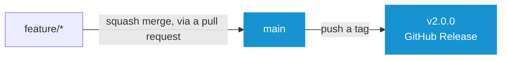
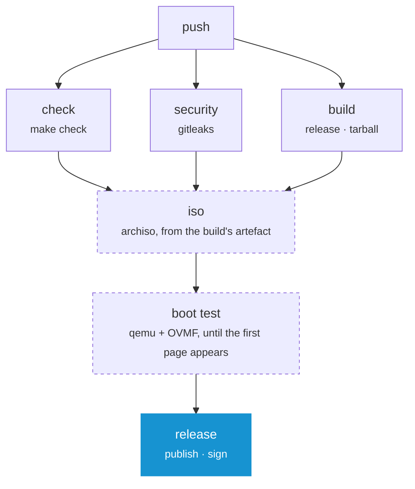

# Contributing

Everything here follows from one rule: **a commit is built once**. The image on the release page is not a rebuild of what was tested, it is the file that was tested, moved.

## Branches



| Branch | Description |
| --- | --- |
| `main` | The one long-lived branch. Everything arrives by squash merge, so one change is one commit and the history stays linear |
| `feature/*` | Where work happens, branched off `main`. Every push is checked, nothing else follows from it |

There is no `dev` branch. A release is a tag, not a branch that reached a state, so `main` never has to *be* the released version: the tag says which commit that was, and nothing has to be held back to keep that true.

**Note:** _One long-lived branch is also one that never has to be pulled straight again. A squash merge rewrites what it merges, so a second branch would diverge from `main` at every release and could only be brought back by force-pushing over it._

## Releasing

A release is a tag on `main`, and pushing it is the whole of it:

```
git switch main && git pull
git tag v2.0.0
git push origin v2.0.0
```

The tag starts a run that checks, builds, boots and only then publishes. What it publishes are that run's own artefacts, so the ISO on the release page is the ISO that booted.

| Step | Description |
| --- | --- |
| Tag `vX.Y.Z` on `main` | Semantic versioning, `v`-prefixed. Nothing else triggers a release |
| CI runs | Everything a push to `main` runs, and the release at the end of it |
| Release published | ISO, tarball, both checksums and signed provenance, with notes generated from the commits since the last tag |

**Note:** _A release can be written on the web page instead. Publishing it creates the tag, the run starts on that, and the files are hung on the release that is already there. It is then the newest release for the three quarters of an hour that run takes, though, and `get.sh` offers whatever the newest one holds. Pushing the tag keeps the release out of sight until it is whole._

The tag is the version everywhere: in `oak.yaml` and so on every page of the interface, in both filenames and, upper-cased, on the ISO label. A build between two tags is named after the last one with the distance and the short commit SHA after it, so any image can be traced back to what it was built from.

**Note:** _Pushing a tag is the only thing that publishes. A push to `main` builds an image and boots it, but releases nothing._

## What a Push runs



| Job | Where | Description |
| --- | --- | --- |
| `check` | every branch | `make check`: every script linted, every module loaded, every catalog checked |
| `security` | every branch | A secret scan of the repository |
| `build` | every branch | The release and the tarball, then unpacks the tarball and loads both modules out of it |
| `iso` | `main`, a tag, on demand | The bootable image, from the artefact `build` produced |
| `boot test` | after `iso` | Boots that image and waits for the first page |
| `release` | a tag | Hangs both artefacts on the release, signs their provenance |

The dashed jobs are the expensive ones. An archiso build takes a quarter of an hour and a work in progress does not need an image, so a feature branch gets everything except those two in about two minutes.

**Note:** _No job here needs a Go toolchain. The runtime is **[Oak](https://github.com/murkl/oak)**, a project of its own, and every job that needs it downloads the release the Makefile pins._

**Note:** _To build an image from a branch, run the workflow on it by hand (Actions ▸ CI ▸ Run workflow)._

`build` is the only job that assembles anything and the tarball is the only thing it hands on. `iso` unpacks that tarball instead of assembling again, so the image holds the very file the release page offers.

## Doing the Work

```
make check            # everything that has to pass before a commit
make run              # both modules on this machine, MODULE=recovery for one outright
make build            # the release, as a machine runs it: release/oak
make tarball          # the release, as a stock Arch ISO downloads it
make locales          # every translation template, and every catalog brought up to it
make iso              # the release, as a bootable image
make -C iso smoke     # boot the newest image and wait for its first page
make oak              # fetch the runtime again, at the release OAK_VERSION names
make clean            # all of the above, taken back
```

Install the required packages:

```
sudo pacman -S --needed make curl shellcheck shfmt yamllint actionlint \
    gettext gitleaks archiso qemu-base edk2-ovmf tesseract tesseract-data-eng
```

| Command | Needs |
| --- | --- |
| `make check` | `curl`, `shellcheck`, `shfmt`, `yamllint`, `actionlint`, `gettext` |
| `make iso` | `archiso` and root |
| `make -C iso smoke` | `qemu-base`, `edk2-ovmf`, `tesseract`, `tesseract-data-eng` |

**Note:** _Every command that runs a module downloads the Oak binary into `.oak/` once and keeps it. The release it comes from is `OAK_VERSION` in the root Makefile; after raising it, `make oak` fetches the new one._

**Note:** _CI installs the same packages and runs the same commands in an Arch container. There is no second definition of green._

### Where a Change belongs

- Packages, tasks and questions: **[modules/installer](../modules/installer)**
- Repairing a system already on disk: **[modules/recovery](../modules/recovery)**
- What the whole thing is called and what it looks like: **[oak.yaml](../oak.yaml)**
- The bootable image: **[iso](../iso)**
- The frame around all of it: **[Oak](https://github.com/murkl/oak)**, which is a repository of its own

**[➜ See AGENTS.md](../AGENTS.md)** for the same ground written as rules: the layering, the task contract, what may be edited on an installed system and how everything here is written. It is meant for a coding agent and is the shortest way in for a person too.

## Words on Screen

Every sentence the program shows is translatable and the English sentence is its own key, so writing one is writing the source text and the key at once. Reword it and the old translation is marked fuzzy rather than dropped.

The catalogs are gettext `.po` files. The template a module's catalogs are filled in from is generated out of the loaded module.

```
make locales   # after adding, rewording or deleting anything on screen
```

**Note:** _`make check` refuses a stale template and a translation that has lost a placeholder._

**[➜ See Translating](TRANSLATING.md)**

## Commits

- Imperative mood (`Add`, `Fix`, `Refactor`), one logical change per commit
- Commits are squashed into `main`, so the pull request title is what ends up in the history

## Setting the Repository up

Once, with the `gh` CLI:

```
# main is linear, moves forward and is never rewritten
gh api -X PUT repos/murkl/arch-os/branches/main/protection --input - <<'EOF'
{
  "required_linear_history": true,
  "allow_force_pushes": false,
  "allow_deletions": false,
  "enforce_admins": false,
  "required_status_checks": {
    "strict": false,
    "contexts": ["Check", "Security", "Build"]
  },
  "required_pull_request_reviews": null,
  "restrictions": null
}
EOF

# Squash is the only way in, and the branch goes when it is merged
gh repo edit --enable-merge-commit=false --enable-rebase-merge=false \
    --enable-squash-merge --delete-branch-on-merge
```

**Note:** _The required checks are the three fast jobs. `iso` and `boot test` do not run on a pull request, and requiring them would leave every one of them waiting for a check that never arrives._

**Note:** _Nothing else has to be configured. The workflow signs its releases with the token GitHub already provides, and Dependabot opens its pull requests against the default branch._
