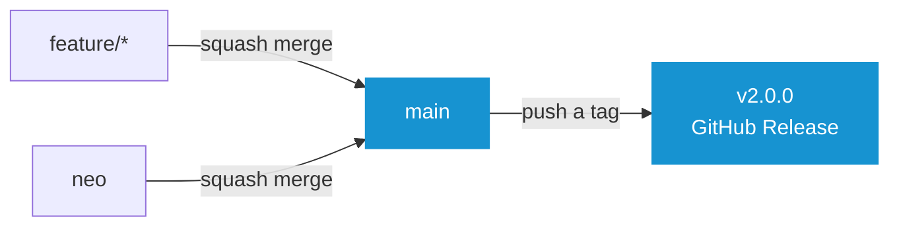
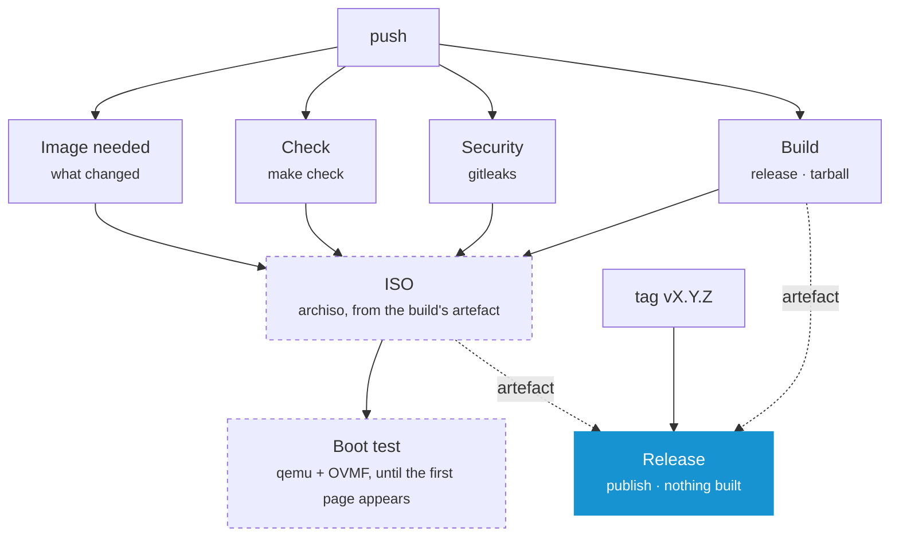

# Contributing

Everything here follows from one rule: **a commit is built once**. The ISO on the release page is not a rebuild of what was tested. It is the file that was tested, moved.

## Branches



| Branch | Description |
| --- | --- |
| `main` | The one long-lived branch. Everything arrives by squash merge, so one change is one commit and the history stays linear |
| `neo` | The integration branch of the current rework. Every push runs the whole pipeline, image and boot test included |
| `feature/*` | Where work happens, branched off `main`. Checked as a pull request |

A release is a tag, not a branch that reached a state. `main` never has to *be* the released version.

**Note:** _Pushes are watched on `main` and `neo` only. Everything else is checked as a pull request, so a branch and its pull request never both run. Dropping `neo` once it is merged is one line in `.github/workflows/ci.yml`._

## The Version

`version:` in **[oak.yaml](../oak.yaml)** is the only place the version is written down. Everything else is named after it.

| Where | Example |
| --- | --- |
| Build output | `dist/arch-os-2.0.0/` |
| Downloads | `arch-os-2.0.0-x86_64.iso`, `arch-os-2.0.0-x86_64.tar.gz` |
| ISO label | `ARCH_OS_2_0_0` |
| Interface | `Arch OS 2.0.0` on every page |
| Git tag | `v2.0.0` |

**Note:** _The `v` belongs to the tag and to nothing else. `make check` refuses a version that is not `X.Y.Z`, and the Release workflow refuses a tag that says anything other than what `oak.yaml` declares._

This is what lets a tag publish without building. The version is decided in the commit, so the run that built that commit on `main` already produced files named after the release they become.

## Releasing

### 1. Raise the Version

On the branch the work is on, before the merge:

```
version: 2.0.0
```

### 2. Merge into main

Squash merge the pull request. The title becomes the commit, so name it after the version.

The run on `main` checks, builds, boots and keeps its artefacts for 90 days. It publishes nothing.

### 3. Create the Tag

```
git switch main && git pull
git tag v2.0.0
git push origin v2.0.0
```

That starts the Release workflow. It finds the run that built this commit, downloads that run's artefacts and hangs them on the release page.

| File | Description |
| --- | --- |
| `arch-os-2.0.0-x86_64.iso` | The bootable image |
| `arch-os-2.0.0-x86_64.iso.sha256` | Its checksum |
| `arch-os-2.0.0-x86_64.tar.gz` | The Oak binary, `oak.yaml` and both modules, for a stock Arch live ISO |
| `arch-os-2.0.0-x86_64.tar.gz.sha256` | Its checksum |

**Note:** _`get.sh` picks both downloads out of the latest release by extension. The ISO is written to a USB device, the tarball is unpacked and started on a booted Arch Linux live image._

**Note:** _A release can be written on the web page instead. Publishing it creates the tag, the workflow starts on that and hangs the files on the release that is already there._

**Note:** _Nothing is built from a tag. If the run on `main` failed, re-run it first, then start the Release workflow by hand (Actions ▸ Release ▸ Run workflow) with the tag._

## What a Push runs



| Job | Where | Description |
| --- | --- | --- |
| `Image needed` | every run | Decides whether this change can reach the image at all |
| `Check` | every run | `make check`: every script linted, every module loaded, every catalog checked |
| `Security` | every run | A secret scan of the repository |
| `Build` | every run | The release and the tarball, then unpacks the tarball and loads both modules out of it |
| `ISO` | `main`, `neo`, on demand | The bootable image, from the artefact `Build` produced |
| `Boot test` | after `ISO` | Boots that image and waits for the first page |
| `Release` | a tag on `main` | Hangs the artefacts of that commit's run on the release page |

`Build` is the only job that assembles anything, and the tarball is the only thing it hands on. `ISO` unpacks that tarball instead of assembling again, so the image holds the very file the release page offers. `Release` builds nothing at all.

The dashed jobs are the expensive ones. An archiso build is a quarter of an hour.

| Where | Image built |
| --- | --- |
| `main` | Always. Every commit there has to be one a tag can publish |
| `neo` | Unless the change is documentation only |
| A pull request | No |
| Run by hand | Always |

**Note:** _To build an image from any branch, run the workflow on it by hand (Actions ▸ CI ▸ Run workflow)._

**Note:** _Every artefact is listed on the run's summary page with its size and its checksum. The boot test keeps the console as a PNG there too, one frame on success and all of them on failure._

**Note:** _No job needs a Go toolchain. The runtime is **[Oak](https://github.com/murkl/oak)**, a project of its own, and every job that needs it downloads the release the Makefile pins._

### Caching

| What | How |
| --- | --- |
| Packages | One pacman cache per job, keyed by its package list and the week. The ordinary run is an exact hit and writes nothing back |
| The tarball | Built once, downloaded by `ISO` and by `Release` |
| The image | Built once, downloaded by `Boot test` and by `Release` |
| Provenance | Signed in the run that made the file, not in the one that publishes it |

## Doing the Work

```
make check            # everything that has to pass before a commit
make run              # both modules on this machine, MODULE=recovery for one outright
make build            # the release, as a machine runs it
make tarball          # the release, as a stock Arch ISO downloads it
make iso              # the release, as a bootable image
make -C iso smoke     # boot the newest image and wait for its first page
make locales          # every translation template, and every catalog brought up to it
make version          # what this build is called
make oak              # fetch the runtime again, at the release OAK_VERSION names
make clean            # all of the above, taken back
```

Everything a build produces lands in one folder:

```
dist/
├── arch-os-2.0.0/                       Arch OS as a machine runs it
│   ├── oak                              the runtime
│   ├── oak.yaml                         the product
│   └── modules/                         Installer and Recovery
├── arch-os-2.0.0-x86_64.tar.gz          the folder above, as one file
├── arch-os-2.0.0-x86_64.tar.gz.sha256
├── arch-os-2.0.0-x86_64.iso             the bootable image
└── arch-os-2.0.0-x86_64.iso.sha256
```

`make build` writes the folder. `make tarball` and `make iso` each turn it into one of the downloads. The folder carries the name the tarball unpacks to, so a download and the build it came from are the same thing under the same name.

Install the required packages:

```
sudo pacman -S --needed make curl shellcheck shfmt yamllint actionlint \
    gettext gitleaks archiso qemu-base edk2-ovmf tesseract tesseract-data-eng
```

| Command | Needs |
| --- | --- |
| `make check` | `curl`, `shellcheck`, `shfmt`, `yamllint`, `actionlint`, `gettext` |
| `make iso` | `archiso` and root |
| `make -C iso smoke` | `qemu-base`, `edk2-ovmf`, `tesseract`, `tesseract-data-eng` |

**Note:** _Every command that runs a module downloads the Oak binary into `.oak/` once and keeps it. The release it comes from is `OAK_VERSION` in the root Makefile, written without the `v` its tag carries. After raising it, `make oak` fetches the new one._

**Note:** _CI installs the same packages and runs the same commands in an Arch container. There is no second definition of green._

### Where a Change belongs

- Packages, tasks and questions: **[modules/installer](../modules/installer)**
- Repairing a system already on disk: **[modules/recovery](../modules/recovery)**
- What the whole thing is called, what it looks like and which version it is: **[oak.yaml](../oak.yaml)**
- The bootable image: **[iso](../iso)**
- The frame around all of it: **[Oak](https://github.com/murkl/oak)**, which is a repository of its own

**[➜ See AGENTS.md](../AGENTS.md)** for the same ground written as rules: the layering, the task contract, what may be edited on an installed system and how everything here is written. It is meant for a coding agent and is the shortest way in for a person too.

## Words on Screen

Every sentence the program shows is translatable and the English sentence is its own key, so writing one is writing the source text and the key at once. Reword it and the old translation is marked fuzzy rather than dropped.

The catalogs are gettext `.po` files. The template a module's catalogs are filled in from is generated out of the loaded module.

```
make locales   # after adding, rewording or deleting anything on screen
```

**Note:** _`make check` refuses a stale template and a translation that has lost a placeholder._

**[➜ See Translating](TRANSLATING.md)**

## Commits

- Imperative mood (`Add`, `Fix`, `Refactor`), one logical change per commit
- Commits are squashed into `main`, so the pull request title is what ends up in the history

## Setting the Repository up

Once, with the `gh` CLI:

```
# main is linear, moves forward and is never rewritten
gh api -X PUT repos/murkl/arch-os/branches/main/protection --input - <<'EOF'
{
  "required_linear_history": true,
  "allow_force_pushes": false,
  "allow_deletions": false,
  "enforce_admins": false,
  "required_status_checks": {
    "strict": false,
    "contexts": ["Check", "Security", "Build"]
  },
  "required_pull_request_reviews": null,
  "restrictions": null
}
EOF

# Squash is the only way in, and the branch goes when it is merged
gh repo edit --enable-merge-commit=false --enable-rebase-merge=false \
    --enable-squash-merge --delete-branch-on-merge
```

**Note:** _The required checks are the three that run everywhere. `ISO` and `Boot test` do not run on a pull request, and requiring them would leave every one of them waiting for a check that never arrives._

**Note:** _Nothing else has to be configured. The workflows sign with the token GitHub already provides, and Dependabot opens its pull requests against the default branch._
