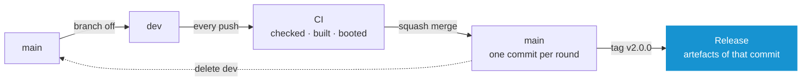
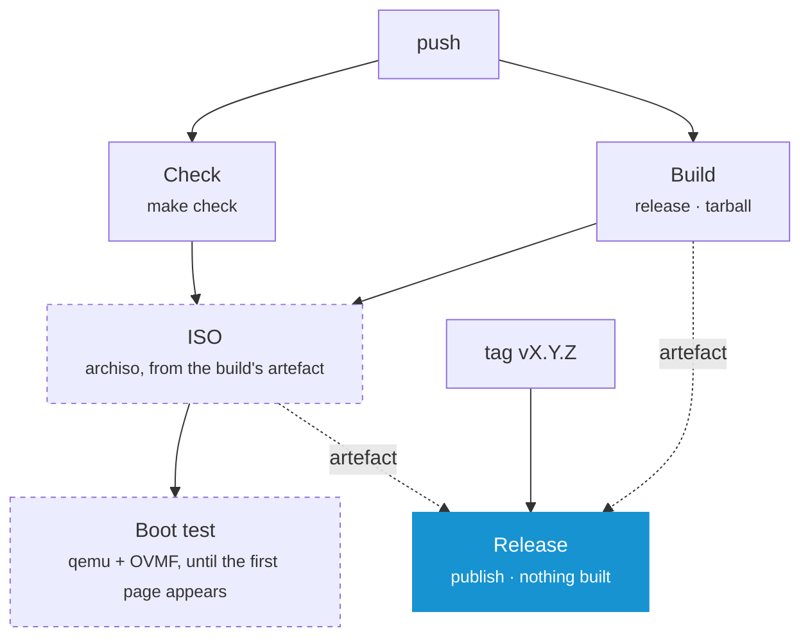

# Contributing

Everything here follows from one rule: **a commit is built once**. The ISO on the release page is not a rebuild of what was tested. It is the file that was tested, moved.

## Branches

`main` is the released line, and it is one straight line: one commit per round of work. The work itself happens on `dev`.



- **Branch `dev` off `main`** when there is work to do
- Push to it as often as you like. CI watches `dev` by itself, just like `main`, so every push runs the whole pipeline — the image and the boot test included — while there is still time to change something
- **Squash merge** it into `main` and delete it. The pull request title is what ends up in the history
- Branch it again next time. Nothing carries over

Anything arriving from outside branches off `main` and comes back as a pull request. That is checked and built, but not turned into an image — see [What a Push runs](#what-a-push-runs).

**Note:** _Which branches are watched is one line: `branches: [main, dev, neo]` in **[ci.yml](../.github/workflows/ci.yml)**. A name added there is under the full run, a name taken out is not._

A release is a tag, not a branch that reached a state. `main` never has to *be* the released version.

## The Version

`version:` in **[oak.yaml](../oak.yaml)** is the only place the version is written down. Everything else is named after it.

| Where | Example |
| --- | --- |
| Build output | `dist/arch-os-2.0.0/` |
| Downloads | `arch-os-2.0.0-x86_64.iso`, `arch-os-2.0.0-x86_64.tar.gz` |
| ISO label | `ARCH_OS_2_0_0` |
| Interface | `Arch OS 2.0.0` on every page |
| Git tag | `v2.0.0` |

**Note:** _The `v` belongs to the tag and to nothing else. `make tag` writes the tag out of `oak.yaml` rather than letting anybody type it, `make check` refuses a version that is not `X.Y.Z`, and the Release workflow refuses a tag that says anything other than what the commit declares._

This is what lets a tag publish without building. The version is decided in the commit, so the run that built that commit on `main` already produced files named after the release they become.

## Releasing

1. **Raise `version:`** in `oak.yaml`, on `dev`
2. **Squash merge** it into `main`. Name it after the version, since the title becomes the commit. The run on `main` checks, builds, boots and keeps its artefacts for 90 days — it publishes nothing
3. **Push the tag:**

```
git switch main && git pull
make tag
git push origin v2.0.0
```

That starts the Release workflow. It finds the run that built this commit, downloads that run's artefacts and hangs them on the release page.

**Note:** _`make tag` reads the version out of `oak.yaml` and writes `v` + it, so a tag naming a version this commit does not declare cannot be made in the first place. It refuses an unclean tree, a `HEAD` that is not on `main`, and a tag that exists already. Pushing it is left as a second decision, because pushing is what publishes._

| File | Description |
| --- | --- |
| `arch-os-2.0.0-x86_64.iso` | The bootable image |
| `arch-os-2.0.0-x86_64.tar.gz` | The Oak binary, `oak.yaml` and every module, for any Linux machine |

Each has a `.sha256` beside it. `get.sh` picks the archive out of the latest release by what its name ends in, and the Imager picks the image out of the release its own version names — so renaming either download stays a change to the Makefile.

**Note:** _A release can be written on the web page instead. Publishing it creates the tag, and the workflow starts on that._

**Note:** _Nothing is built from a tag. If the run on `main` failed, re-run it first, then start the Release workflow by hand (Actions ▸ Release ▸ Run workflow) with the tag._

## What a Push runs



| Job | Where | Description |
| --- | --- | --- |
| `Check` | every run | `make check`: every script linted, the repository scanned for secrets, every module loaded, every catalog checked |
| `Build` | every run | The release and the tarball, then unpacks the tarball and loads the product out of it |
| `ISO` | every watched branch, on demand | The bootable image, from the artefact `Build` produced |
| `Boot test` | after `ISO` | Boots that image and waits for the first page |
| `Release` | a tag on `main` | Hangs the artefacts of that commit's run on the release page |

`Build` is the only job that assembles anything, and the tarball is the only thing it hands on. `ISO` unpacks that tarball instead of assembling again, so the image holds the very file the release page offers. `Release` builds nothing at all.

The dashed jobs are the expensive ones — an archiso build is a quarter of an hour — so a pull request is judged on the two above them.

**Note:** _To build an image from a branch that is not watched, run the workflow on it by hand (Actions ▸ CI ▸ Run workflow)._

**Note:** _Every artefact is listed on the run's summary page with its size and its checksum. The boot test keeps the console as a PNG there too, one frame on success and all of them on failure._

**Note:** _No job needs a Go toolchain. The runtime is **[Oak](https://github.com/murkl/oak)**, a project of its own, and every job that needs it downloads the release the Makefile pins._

## Doing the Work

```
make check            # everything that has to pass before a commit
make run              # every module on this machine, MODULE=recovery for one outright
make run ARGS=--debug # ...without touching the machine
make inspect          # load every module and print the order they resolve to
make build            # the release, as a machine runs it
make tarball          # the release, as a stock Arch ISO downloads it
make iso              # the release, as a bootable image
make image            # ...only the image, out of the release already in dist/
make smoke            # boot the newest image and wait for its first page
make locales          # every translation template, and every catalog brought up to it
make version          # what this build is called
make tag              # the tag that releases it, written out of oak.yaml
make oak              # fetch the runtime again, at the release OAK_VERSION names
make clean            # every build output, taken back; the runtime stays
```

Everything a build produces lands in one folder:

```
dist/
├── arch-os-2.0.0/                       Arch OS as a machine runs it
│   ├── oak                              the runtime
│   ├── oak.yaml                         the product
│   └── modules/                         Installer, Recovery and Imager
├── arch-os-2.0.0-x86_64.tar.gz          the folder above, as one file
├── arch-os-2.0.0-x86_64.iso             the bootable image
└── smoke/                               the console, as the boot test saw it
```

`make build` writes the folder. `make tarball` and `make image` each turn it into one of the downloads, and each writes a `.sha256` beside itself. There is one Makefile and it is at the root: `iso/` holds the two scripts that assemble and boot an image, and nothing else runs from in there.

Install the required packages:

```
sudo pacman -S --needed make curl shellcheck shfmt yamllint actionlint \
    gettext gitleaks archiso qemu-base edk2-ovmf tesseract tesseract-data-eng
```

| Command | Needs |
| --- | --- |
| `make check` | `curl`, `shellcheck`, `shfmt`, `yamllint`, `actionlint`, `gettext`, `gitleaks` |
| `make iso` | `archiso` and root |
| `make smoke` | `qemu-base`, `edk2-ovmf`, `tesseract`, `tesseract-data-eng` |

**Note:** _The first command that needs the runtime downloads it into `.oak/` and keeps it. The release it comes from is `OAK_VERSION` in the Makefile, written without the `v` its tag carries. After raising it, `make oak` fetches the new one._

**Note:** _CI installs the same packages and runs the same commands in an Arch container. There is no second definition of green._

### Where a Change belongs

- Packages, tasks and questions: **[modules/installer](../modules/installer)**
- Repairing a system already on disk: **[modules/recovery](../modules/recovery)**
- What the whole thing is called, what it looks like and which version it is: **[oak.yaml](../oak.yaml)**
- The bootable image: **[iso](../iso)**
- The frame around all of it: **[Oak](https://github.com/murkl/oak)**, which is a repository of its own

**[➜ See AGENTS.md](../AGENTS.md)** for the same ground written as rules. It is meant for a coding agent and is the shortest way in for a person too.

## Translating

Everything on screen can be translated and a translation is useful long before it is finished: **the English sentence is the key**. A message no catalog answers is shown exactly as it was written, so the first line you fill in is the first line somebody reads in their own language.

The catalogs are gettext `.po` files, the format Weblate, Crowdin, Transifex and Pontoon all read. One component per module:

| Component | Template | Catalogs |
| --- | --- | --- |
| Installer | `modules/installer/locales/installer.pot` | `modules/installer/locales/<code>.po` |
| Recovery | `modules/recovery/locales/recovery.pot` | `modules/recovery/locales/<code>.po` |

The frame's own words — buttons, key hints, the labels on a failure report — belong to **[Oak](https://github.com/murkl/oak)** and are translated there. Both catalogs are in use at once and behave as one, with the module's laid over Oak's.

**Note:** _The `.pot` files are generated out of the module itself and never edited by hand. `make locales` rewrites them._

### Adding a Language

Copy the template, fill in the `msgstr` lines, open a pull request:

```
cp modules/installer/locales/installer.pot modules/installer/locales/fr.po
```

Nothing else has to be declared anywhere. The language is offered as soon as the file exists, and a machine whose own locale matches it opens in it.

- `msgid "English"` is not a word on screen. Its translation is the name of your language **in your language** — `Deutsch`, `Français` — and that is what the language picker lists
- `msgstr ""` left empty means *not translated yet*, never *translate this to nothing*. The English is shown instead, which is the right outcome
- `#, fuzzy` means the English changed under an existing translation. It is not shown while the flag is there. Check it, correct it, remove the flag

### What a Translation must keep

| Element | Description |
| --- | --- |
| `%s`, `%d` | Values filled in when the message is printed. Every one in the English has to appear in the translation, of the same kind and in the same order |
| `{{ARCH_OS_DISK}}` | An answer filled in by name. Leave the braces and the name exactly as they are |
| `⏎ ↑↓ esc · …` | Keys and separators in the hint lines. Translate the words around them, keep the marks |
| Line breaks | A blank line between two paragraphs is a blank line on screen. Line breaks inside a paragraph are rewrapped to the terminal |

**Note:** _A message with a placeholder is flagged `#, c-format` and `make check` runs `msgfmt --check-format` over every catalog. A `%s` dropped or changed fails the build rather than the installation._

### What the Console can draw

The Installer runs on the Linux virtual console before any desktop exists, and a console font holds at most 512 glyphs. What is safe is **ASCII and the Latin-1 letters**: `äöüß`, `éèê`, `ñ`, `ç`, `å`, plus the handful of box and arrow marks the interface already uses.

- Supported: German, French, Spanish, Italian, Portuguese, Dutch and the Nordic languages
- Not supported: Polish, Czech, Turkish, Greek, Cyrillic or anything written in a script of its own

**Note:** _Making those languages possible is a change to the image — a console font loaded for the chosen language — not to the catalog. Open an issue if you want to translate into one._

## Commits

- Imperative mood (`Add`, `Fix`, `Refactor`), one logical change per commit
- Commits are squashed into `main`, so the pull request title is what ends up in the history
- After adding, rewording or deleting anything on screen, run `make locales` in the same change

## Setting the Repository up

Once, with the `gh` CLI:

```
# main is linear, moves forward and is never rewritten
gh api -X PUT repos/murkl/arch-os/branches/main/protection --input - <<'EOF'
{
  "required_linear_history": true,
  "allow_force_pushes": false,
  "allow_deletions": false,
  "enforce_admins": false,
  "required_status_checks": {
    "strict": false,
    "contexts": ["Check", "Build"]
  },
  "required_pull_request_reviews": null,
  "restrictions": null
}
EOF

# Squash is the only way in, and the branch goes when it is merged
gh repo edit --enable-merge-commit=false --enable-rebase-merge=false \
    --enable-squash-merge --delete-branch-on-merge
```

**Note:** _The required checks are the two that run everywhere. `ISO` and `Boot test` do not run on a pull request, and requiring them would leave every one of them waiting for a check that never arrives._

**Note:** _Nothing else has to be configured. The workflows sign with the token GitHub already provides, and Dependabot opens its pull requests against the default branch._
