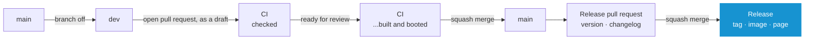
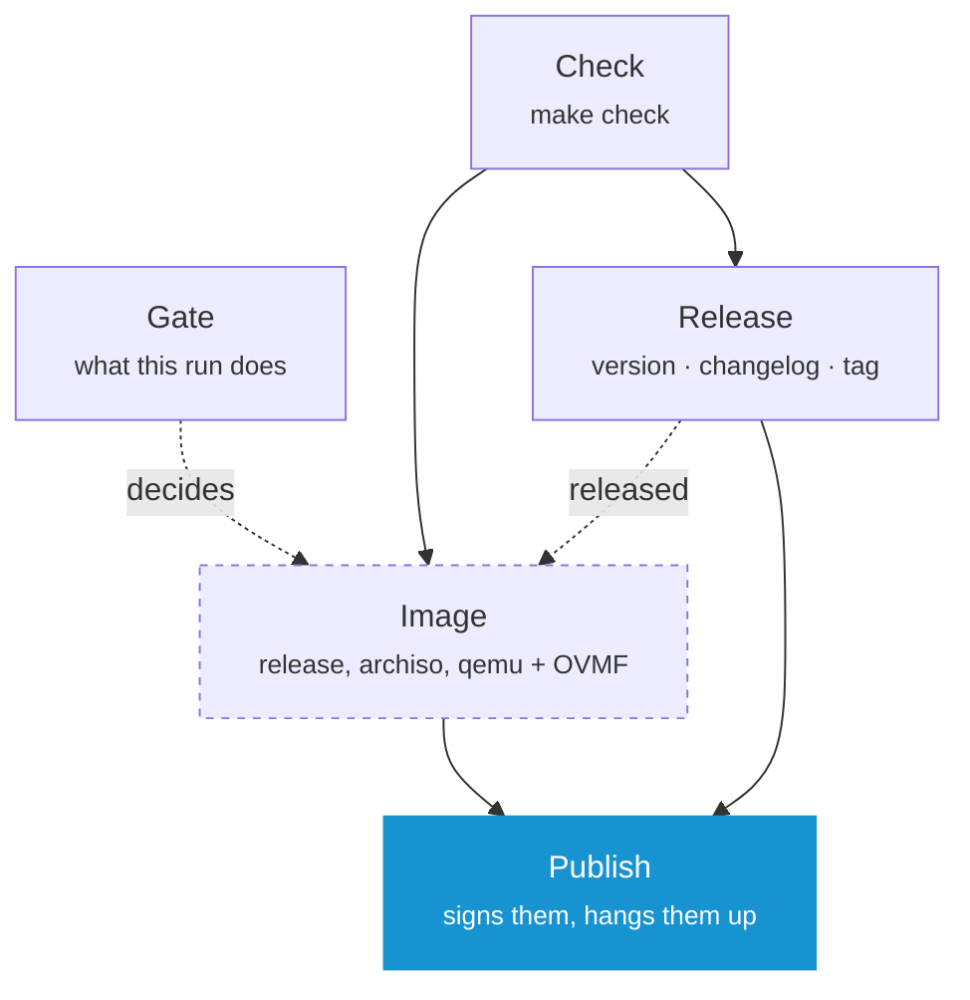

# Contributing

One rule: **a commit is built once**. The ISO on the release page is not a rebuild of what was tested - it is that file, moved.

## Branches

`main` is the released line. Work happens on `dev`.



- **Branch `dev` off `main`.** A push checks nothing on its own - `main` is the only branch a push checks directly
- **Open the pull request right away, as a draft** while there is nothing to read yet. From here every push to `dev` is checked through it
- **Mark it ready** when it should be booted - leaving draft is what adds the image and the smoke test
- **Squash merge** into `main`, which takes it only once `Ready` and `Title` have passed - or switch on auto-merge, and it squashes itself in the moment they have. `dev` is deleted with the merge. The pull request's title becomes the commit, and everything below is read out of that one line
- A pull request from outside is checked, never turned into an image: a privileged container is not something an unreviewed change is handed

**Note:** _A commit is under one run and never two: `main` is the only branch a push triggers a run on, so a run never starts twice for the same commit - once for the push, once for the pull request it sits under. See **[ci.yml](../.github/workflows/ci.yml)**._

## The Title

The title of a pull request is read by a machine, so it is written for one - [Conventional Commits](https://www.conventionalcommits.org): a type, a colon, and what changed.

| A title that reads | Does |
| --- | --- |
| `fix: the Recovery finds a kernel on a separate /boot` | 2.0.0 → 2.0.1, on the page under **Bug Fixes** |
| `feat: join a wireless network before the first download` | 2.0.0 → 2.1.0, under **Features** |
| `feat!: one answer file per module` | 2.0.0 → 3.0.0, and says on the page what to do about it |
| `docs:` `refactor:` `test:` `build:` `ci:` `chore:` | Nothing. Work nobody installing or repairing a machine would notice |

- `!` marks a change somebody has to act on; the reason goes in the body as `BREAKING CHANGE: …`
- A check of its own refuses a title that opens on no type, because a title nothing can read releases nothing. It is the one check that reads the title again when it is corrected - everything else waits for a commit
- The body and the commits inside the branch are written for whoever reads the change, in the same form - see **[Commits](#commits)**

## The Version and the Changelog

Neither is written by hand. `version:` in **[oak.yaml](../oak.yaml)** and **[CHANGELOG.md](../CHANGELOG.md)** are both written by the release run out of the titles that landed since the last release, and everything is named after that version: `dist/arch-os-2.1.0/`, `arch-os-2.1.0-x86_64.iso`, the ISO label `ARCH_OS_2_1_0`, the tag `v2.1.0`.

A version that is chosen rather than counted - 1.9.7 straight to 2.0.0 - is a footer on the commit that decides it:

```
git commit --allow-empty -m "chore: release 2.0.0" -m "Release-As: 2.0.0"
```

**Note:** _`.github/release-please-config.json` says where the version stands, `.github/.release-please-manifest.json` remembers the last one, and the release pull request raises both together. `make check` reads them back against each other, so a version typed into one of them fails at a desk rather than as a download named after a release nobody made._

## Releasing

Two merges, both of them ordinary, and nothing typed:

1. **Squash merge the work into `main`.** The run checks it and opens - or updates - a pull request called `chore(main): release 2.1.0`, which raises `version:` and writes that version's section of the changelog
2. **Merge that pull request.** The run on `main` tags `v2.1.0`, writes the release page out of the changelog, builds the release and the image, boots it, and hangs both files on that page

Several merges collect in the one release pull request until it is merged, and a merge that releases nothing - `docs:`, `chore:` - opens none at all.

The page carries `arch-os-2.1.0-x86_64.iso` and `.tar.gz`, both under signed build provenance, and GitHub prints each one's SHA-256 beside it, so the release carries no checksum file of its own.

**Note:** _The page is written as a draft before the files are on it: the image is half an hour, and the tag is what the run builds from. `Publish` makes it public last, once both files hang on it, so `curl … | bash` and every link to the latest release keep pointing at the one before until then. A run that fails on the way leaves a draft to re-run rather than a version to be taken back - `Image` and `Publish`, once the reason is gone._

**Note:** _No run starts on the release pull request: it touches only `CHANGELOG.md`, the release manifest and the version line in `oak.yaml`, and both workflows leave a pull request of nothing else out with `paths-ignore`. GitHub itself starts runs for what its own token opened since June 2026, and holds each for an approval - one nobody gives fails the moment the pull request is merged. It needs none - it holds what the release run wrote out of a `main` checked a moment before, and its merge is checked on `main` before the tag exists. So the release run itself reports `Ready` and `Title` on the commit it wrote, which is what lets `main` require both of every other pull request. A pull request of anybody else's that changes nothing but `oak.yaml` starts no run either, and is held back by the same two checks - it goes through once it touches one more file, or not at all._

## What a Run does



| Job | Where | Description |
| --- | --- | --- |
| `Title` | a pull request opened, pushed to or renamed | The line the next version is read out of. Its own workflow, so a rename re-reads it and rebuilds nothing |
| `Gate` | every run | What the rest of the run does, decided once |
| `Check` | every run | `make check` |
| `Image` | a pull request out of draft, a release, on demand | The release, the image out of it, and the boot that proves it comes up |
| `Ready` | a pull request | Every job above it needed has passed. Together with `Title`, what `main` requires before a merge |
| `Release` | a push to `main` | The version, the changelog and the tag - or the pull request that will carry them |
| `Publish` | a release | Hangs that run's two files on the release page and makes the page public |

`Image` builds, packs and boots in one job rather than three: the file between those steps is a gigabyte, and handing it from job to job costs more than making it. It is half an hour, which is why the gate decides who gets one.

**Note:** _No job needs a Go toolchain - every job that needs Oak downloads the release the Makefile pins._

## Doing the Work

```
make check             # everything that has to pass before a commit
make fmt               # every script formatted, by shfmt
make run               # every module, MODULE=recovery for one outright
make run ARGS=--debug  # ...without touching the machine
make inspect           # load every module and print the order they resolve to
make build             # the release, as a machine runs it
make tarball           # the release, as a stock Arch ISO downloads it
make iso               # the release, as a bootable image
make image             # ...only the image, out of a release already in dist/
make smoke             # boot the newest image and wait for its first page
make locales           # every translation template, brought up to date
make glyphs-check      # every module against the glyph table of the console font
make data-check        # every module's lookup tables against the system they name
make oak               # fetch the runtime again, at the release OAK_VERSION names
make clean             # every build output, taken back; the runtime stays
```

```
sudo pacman -S --needed make curl shellcheck shfmt zsh yamllint actionlint zizmor \
    gettext gitleaks kbd archiso qemu-base edk2-ovmf tesseract tesseract-data-eng
```

**Note:** _CI installs the same packages and runs the same commands in an Arch container. No second definition of green._

**Note:** _The runtime is kept under the version it is - `.oak/oak-X.Y.Z` - so raising `OAK_VERSION` names a file that is not there and the next build fetches it. Every build then asks the binary what it is before using it: a runtime older than the pin refuses the modules at boot, and an image that does that is only found by booting it._

### Where a Change belongs

**Note:** _What Arch OS puts on a disk and why: **[➜ Reference](REFERENCE.md)**._

- Packages, tasks, questions: **[modules/installer](../modules/installer)**
- Repairing a system: **[modules/recovery](../modules/recovery)**
- Writing the boot device: **[modules/imager](../modules/imager)**
- Product name, version, look: **[oak.yaml](../oak.yaml)**
- What a release changed: **[CHANGELOG.md](../CHANGELOG.md)**
- The bootable image: **[iso](../iso)**
- The interface itself: **[Oak](https://github.com/murkl/oak)**, its own repository

## Translating

**The English sentence is the key.** A catalog with nothing to say shows the English, so a translation is useful from its first line.

| Component | Template | Catalogs |
| --- | --- | --- |
| Installer | `modules/installer/locales/installer.pot` | `modules/installer/locales/<code>.po` |
| Recovery | `modules/recovery/locales/recovery.pot` | `modules/recovery/locales/<code>.po` |
| Imager | `modules/imager/locales/imager.pot` | `modules/imager/locales/<code>.po` |

The frame's own words (buttons, key hints) belong to **[Oak](https://github.com/murkl/oak)**. Both catalogs apply at once.

**Note:** _`.pot` files are generated, never edited by hand - `make locales` rewrites them._

### Adding a Language

```
cp modules/installer/locales/installer.pot modules/installer/locales/fr.po
```

Fill in the `msgstr` lines, open a pull request. Nothing else to declare: the language shows up in the picker as soon as one catalog of it exists.

- `msgid "English"` translates to your language's own name: `Deutsch`, `Français`
- `msgstr ""` means not translated yet, not "translate to nothing" - the English shows instead
- `#, fuzzy` means the English changed - check, correct, remove the flag

Keep as-is: `%s`/`%d` (order and kind), `{{ARCH_OS_DISK}}` (braces and name), `⏎ ↑↓ esc` marks in hints, and blank lines between paragraphs.

**Note:** _A language with catalogs here and none in [Oak](https://github.com/murkl/oak/tree/main/locales) is offered all the same. Its pages are translated and the frame around them - buttons, key hints, the settings - stays English until Oak has a catalog too._

**Note:** _`make check` runs `msgfmt --check-format` - a dropped `%s` fails the build, not the installation._

### What the Console can draw

Before any desktop exists there is one console font, and it holds one table of at most 512 glyphs: **Latin with its accents, Greek and Cyrillic**.

- Supported: every language written in those - German, French, Polish, Czech, Turkish, Romanian, the Baltics, Greek, Russian, Ukrainian, Bulgarian, Serbian and the like
- Not: Arabic, Hebrew, Chinese, Japanese, Korean, Vietnamese or any Indic script. The console has no glyphs for them, and for the first two it could not write right to left anyway

**Note:** _`make check` reads every module against that table rather than against a list written down anywhere, so a character that would be a box says so at a desk. The font is the one **[iso/src/usr/local/bin/arch-os](../iso/src/usr/local/bin/arch-os)** loads._

**Note:** _A script outside that table cannot be drawn on a Linux virtual console at all, so no font shipped on the image would help. Open an issue first._

## Pictures in the Docs

Both are generated, so neither can quietly outlive the interface it shows. The screenshots are taken from the welcome page, the Installer and the Recovery driven on a real terminal; the banner collages two of them under the wordmark, which is read out of `oak.yaml` rather than redrawn, so the name and the accent on it cannot drift from the ones a run draws.

```
make screenshots   # after any visible change to a page
make banner        # after the screenshots, the wordmark or the accent changed
make docs          # both, in that order
```

They need `chromium`, `imagemagick`, `python-pyte` and `python-yaml`, none of which a build or `make check` needs.

Every run is started with `--debug`, under which Oak starts no task: no disk is partitioned, nothing is mounted and nothing restarts. Which pages are taken is `docs/screenshots.yaml`, and every answer is given there rather than left to the machine rendering it; `screenshots.py` beside it is the same file in every project that renders a set this way, as is `banner.py`.

**Note:** _Only `welcome.png`, `setup.png`, `installer.png`, `installing.png` and `recovery.png` are drawn by the interface. The boot splash, the shell, the fetch and the System Manager are photographs of a running system, taken by hand and left alone by `make screenshots`._

**Note:** _`installing.png` and `recovery.png` catch a run while it is still going, so which task the frame lands on differs from run to run. The others come out the same every time._

## Commits

- **[Conventional Commits](https://www.conventionalcommits.org)** in the imperative, the same types as a title: `feat: add …`, `fix: …`, `refactor: …`, a `!` for a change somebody has to act on
- One logical change each, and no trailer
- Squashed into `main` - the pull request title is what remains, so that is the line **[The Title](#the-title)** holds to its rules
- `make locales` in the same change, after anything on screen changes

## Setting the Repository up

What GitHub holds this repository to is kept in **[.github/settings/](../.github/settings)** rather than clicked, and applied with one command by an admin logged in with `gh`:

```
make github
```

| File | Says |
| --- | --- |
| `repository.json` | Squash merges only, under the pull request's title and body; auto-merge on; a merged branch is deleted |
| `ruleset.json` | `main` takes nothing but a pull request, squashed, once `Ready` and `Title` have passed; no force push, no deletion |
| `actions.json` | A workflow's token reads unless it says otherwise, and may open the release pull request |

Run it again after changing one of them - every call sets the whole state, so a second run changes nothing. No workflow does it: a workflow's token may not change the rules it is itself held to. The files and the script are the same in every project released this way.

**Note:** _`Ready` passes a draft, whose `Image` is skipped - a draft cannot be merged anyway, and leaving draft starts the run that decides it. The release pull request starts no run, and the release run reports both checks on it itself - see **[Releasing](#releasing)**. Everything else (signing, Dependabot) needs no setup._
