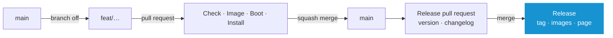

# Contributing

`main` is the only branch that lasts. Every change branches off it and comes back as one commit, and a release is one more pull request.

## Workflow


```mermaid
flowchart LR
    M["main"] -->|branch off| B["feat/…"]
    B -->|pull request| I["Check · Image · Boot · Install"]
    I -->|squash merge| M2["main"]
    M2 --> P["Release pull request<br/>version · changelog"]
    P -->|merge| R["Release<br/>tag · images · page"]

    style R fill:#1793d1,stroke:#1793d1,color:#fff
```

1. **Branch off `main`.** Name it after what it does: `feat/wireless-settings`, `fix/helix-test`. Nothing reads the name
2. **Open a pull request right away**, as a draft while it is not done. A branch is checked through its pull request, never on its own, and every push is built, booted and installed, about 20 minutes
3. **Squash merge**, or switch on auto-merge. `main` takes the pull request once `Ready` and `Title` have passed, as one commit under its title, and deletes the branch

- The commits inside the branch are yours to shape. Only the title reaches `main`
- A draft gets the same run and cannot be merged. Marking it ready starts nothing, since it changes no code
- A pull request that changes nothing but `docs/`, Markdown or `LICENSE` is checked, never built: none of it reaches an image
- A pull request from a fork is checked, never booted: an image needs a privileged container
- Where a pull request changes what the pictures in the docs show, CI renders them onto its branch as a commit of its own. Pull before pushing again
- A pull request that changes nothing but `oak.yaml`, `CHANGELOG.md` or the release manifest starts no run and is never merged: those three are the release pull request's. Change something else with it

## The Title

The title is the one line `main` keeps. The next version and the changelog are read out of it, so it follows **[Conventional Commits](https://www.conventionalcommits.org)**: a type, a colon, what changed.

| Title | Version | On the Release Page |
| --- | --- | --- |
| `fix: the Recovery finds a kernel on a separate /boot` | 2.0.0 → 2.0.1 | Bug Fixes |
| `feat: join a wireless network before the first download` | 2.0.0 → 2.1.0 | Features |
| `feat!: one answer file per module` | 2.0.0 → 3.0.0 | ⚠ BREAKING CHANGES |
| `docs:` `refactor:` `test:` `build:` `ci:` `chore:` | none | nothing |

- Write it for somebody installing or repairing a machine. `Title` refuses one that opens on no type, and reads it again whenever it is edited
- Merging shows the title and an empty description. Leave both as they are, with two exceptions typed into the description:
  - `BREAKING CHANGE: …` says on the release page what somebody has to do
  - `Release-As: 3.0.0` sets a version that is chosen rather than counted

**Note:** _A title that turns out wrong after the merge is corrected in the description of the merged pull request. The next release run reads this instead of the commit:_

```
BEGIN_COMMIT_OVERRIDE
fix: the corrected line
END_COMMIT_OVERRIDE
```

## Releasing

Nothing is typed and nothing is tagged by hand.

1. **Every merge that releases something** opens or updates the pull request `chore(main): release 2.1.0`. It raises `version:` in **[oak.yaml](../oak.yaml)**, writes that version's section of **[CHANGELOG.md](../CHANGELOG.md)** and renders the pictures in the docs at that version
2. **Merging it is the release.** The run on `main` tags `v2.1.0`, builds and boots the images, hangs them on the release page and publishes it

- Merges collect in the release pull request until it is merged. When to release is a decision, not a schedule
- The page carries `arch-os-2.1.0-x86_64.iso`, `arch-os-2.1.0-x86_64.tar.gz` and `arch-os-2.1.0-recovery-x86_64.tar`, all under signed build provenance
- Every other build is named after the next release: `arch-os-2.1.0-dev-x86_64.iso`, as the open release pull request names it, or the next patch where none is open. `make tarball VERSION=2.1.0` names a build after its release, and only on that release's commit
- Neither the version nor the changelog is edited by hand. `make check` fails when `oak.yaml` and the release manifest disagree

**Note:** _The page stays a draft until every file hangs on it, so every link to the latest release points at the one before until then. A run that fails on the way leaves a draft: re-run its failed jobs._

**Note:** _The release pull request starts no run. The run that wrote it renders its pictures and reports `Ready` and `Title` on it, and its merge is checked on `main` before the tag exists. See **[ci.yml](../.github/workflows/ci.yml)**._

## What CI Runs

| Job | When | Does |
| --- | --- | --- |
| `Title` | a pull request opened, pushed to or edited | Reads the title |
| `Check` | every run | `make check` |
| `Image` | a pull request that reaches the image, a release, on demand | Builds the release, the Recovery image and the ISO, boots both, and installs, repairs and boots a Core from the ISO |
| `Ready` | a pull request | Every job it needed has passed. Clears the pictures' commit, which starts no run |
| `Release` | a push to `main` | The release pull request, or once that is merged, the tag and the draft page |
| `Pictures` | a pull request, a push to `main` that leaves a release pull request | Renders the pictures in the docs onto the branch: a pull request's at the release it leads to, where it changes what they show; the release pull request's at its version, and clears it to merge |
| `Publish` | a release | Hangs the files of that run on the page and publishes it |

**Note:** _A commit is built once. The files on the release page are the ones its run booted, never a rebuild._

## Doing the Work

```
make check             # the whole gate, as CI runs it
make fmt               # every script formatted, by shfmt
make run               # every module, MODULE=recovery for one outright
make run ARGS=--debug  # ...without touching the machine
make inspect           # load every module and print the order they resolve to
make build             # the release, as a machine runs it
make tarball           # the release, as a stock Arch ISO downloads it
make iso               # the release, as the Recovery image and the ISO that carries it
make image             # ...only the images, out of a release already in dist/
make smoke             # boot the newest of both and wait for their first page
make e2e               # install the newest ISO, boot it, repair it and boot it again
make locales           # every translation template, brought up to date
make oak               # fetch the runtime again, at the release OAK_VERSION names
make clean             # every build output, taken back; the runtime stays
```

```
sudo pacman -S --needed make curl shellcheck shfmt zsh yamllint actionlint zizmor \
    gettext gitleaks kbd terminus-font archiso systemd-ukify qemu-base edk2-ovmf tesseract tesseract-data-eng openssh libisoburn
```

**Note:** _CI installs the same packages and runs the same commands in an Arch container. There is no second definition of green._

### Where a Change Belongs

- Packages, tasks, questions: **[modules/installer](../modules/installer)**
- Repairing a system: **[modules/recovery](../modules/recovery)**
- Writing the boot device: **[modules/imager](../modules/imager)**
- Product name, look: **[oak.yaml](../oak.yaml)**
- The bootable images, the ISO and the Recovery: **[iso](../iso)**
- The interface itself: **[Oak](https://github.com/murkl/oak)**, its own repository. `OAK_VERSION` in the **[Makefile](../Makefile)** names the release this project runs on

**Note:** _What Arch OS puts on a disk and why: **[➜ Reference](REFERENCE.md)**._

## Translating

**The English sentence is the key.** A catalog with nothing to say shows the English, so a translation is useful from its first line.

| Component | Template | Catalogs |
| --- | --- | --- |
| Installer | `modules/installer/locales/installer.pot` | `modules/installer/locales/<code>.po` |
| Recovery | `modules/recovery/locales/recovery.pot` | `modules/recovery/locales/<code>.po` |
| Imager | `modules/imager/locales/imager.pot` | `modules/imager/locales/<code>.po` |

- `.pot` files are generated. `make locales` runs in the same change as anything reworded on screen
- The frame's own words (buttons, key hints, the settings) are **[Oak's](https://github.com/murkl/oak/tree/main/locales)**. Until Oak has a catalog of a language, the frame around its translated pages stays English
- `make check` runs `msgfmt --check-format`, so a dropped `%s` fails at a desk rather than during an installation

### Adding a Language

```
cp modules/installer/locales/installer.pot modules/installer/locales/fr.po
```

Fill in the `msgstr` lines and open a pull request. The language shows up in the picker as soon as one catalog of it exists.

- `msgid "English"` translates to your language's own name: `Deutsch`, `Français`
- `msgstr ""` means not translated yet. The English shows instead
- `#, fuzzy` means the English changed: check, correct, remove the flag

Keep as-is: `%s`/`%d` (order and kind), `{{ARCH_OS_DISK}}` (braces and name), `⏎ ↑↓ esc` marks in hints, and blank lines between paragraphs.

### What the Console Can Draw

Before any desktop exists there is one console font with at most 512 glyphs: **Latin with its accents, Greek and Cyrillic**. Arabic, Hebrew, Chinese, Japanese, Korean, Vietnamese and the Indic scripts cannot be drawn on a Linux virtual console at all, so open an issue before starting on one.

**Note:** _`make check` reads every module against the glyph tables of the fonts **[iso/font.sh](../iso/font.sh)** builds, so a character that would be a box fails at a desk._

## Pictures in the Docs

Both are generated, so neither outlives the interface it shows. CI renders them onto the branch of a pull request that changes what they show, at the release it leads to, so `main` shows the code it holds. The release pull request renders them again at its version. The commands show them on this machine:

```
make docs          # both
make screenshots   # every page in screenshots.yaml
make banner        # the banner, out of two of them
```

- They need `chromium`, `imagemagick`, `python-pyte`, `python-yaml` and `ttf-firacode-nerd`, none of which a build or `make check` needs, and systemd as PID 1, which `localectl` and `timedatectl` ask. CI renders in an Arch container booted with systemd: **[pictures.sh](../.github/pictures.sh)**
- A pull request's title raises the release the pictures name: a `feat:` on top of pending fixes renders the next minor
- Every run is started with `--debug`, so nothing is partitioned, mounted or restarted. Which pages are taken and every answer given is **[screenshots.yaml](screenshots.yaml)**
- Only `welcome.png`, `setup.png`, `installer.png`, `installing.png` and `recovery.png` are drawn this way. The boot splash, the shell, the fetch and the System Manager are photographs of a running system, taken by hand
- `installing.png` and `recovery.png` catch a run while it is going, so they differ from run to run

## The Repository

What GitHub holds this repository to is kept in **[.github/settings/](../.github/settings)** rather than clicked. An admin logged in with `gh` applies it:

```
make github
```

| File | Says |
| --- | --- |
| `repository.json` | Squash merges only, under the pull request's title alone; auto-merge on; a merged branch is deleted |
| `ruleset.json` | `main` takes nothing but a pull request, squashed, once `Ready` and `Title` have passed; no force push, no deletion |
| `actions.json` | A workflow's token reads unless it says otherwise, and may open the release pull request |
| `code-scanning.json` | No CodeQL: the one language it finds here is the workflows, which are zizmor's, in `make check` |

Run it again after changing one of them. Every call sets the whole state, so a second run changes nothing. The script is the same in every project released this way, and so is every file but `code-scanning.json`.
