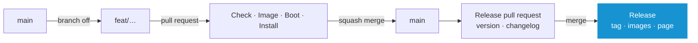

# Contributing

`main` is the only branch that lasts. Every change branches off it and comes back as one commit, and a release is one more pull request.

## Workflow


```mermaid
flowchart LR
    M["main"] -->|branch off| B["feat/…"]
    B -->|pull request| I["Check · Image · Boot · Install"]
    I -->|squash merge| M2["main"]
    M2 --> P["Release pull request<br/>version · changelog"]
    P -->|merge| R["Release<br/>tag · images · page"]

    style R fill:#1793d1,stroke:#1793d1,color:#fff
```

1. **Branch off `main`.** Name it after what it does: `feat/wireless-settings`, `fix/helix-test`. Nothing reads the name
2. **Open a pull request right away**, as a draft while it is not done. A branch is checked through its pull request, never on its own, and every push is built, booted and installed, about 20 minutes
3. **Squash merge**, or switch on auto-merge. `main` takes the pull request once `Check`, `Image` and `Title` have passed, as one commit under its title, and deletes the branch

- The commits inside the branch are yours to shape. Only the title reaches `main`
- A draft gets the same run and cannot be merged. Marking it ready starts nothing, since it changes no code
- A pull request that changes nothing but `docs/`, Markdown or `LICENSE` is checked, never built: none of it reaches an image

## The Title

The title is the one line `main` keeps. The next version and the changelog are read out of it, so it follows **[Conventional Commits](https://www.conventionalcommits.org)**: a type, a colon, what changed.

| Title | Version | On the Release Page |
| --- | --- | --- |
| `fix: the Recovery finds a kernel on a separate /boot` | 2.0.0 → 2.0.1 | Bug Fixes |
| `feat: join a wireless network before the first download` | 2.0.0 → 2.1.0 | Features |
| `feat!: one answer file per module` | 2.0.0 → 3.0.0 | ⚠ BREAKING CHANGES |
| `docs:` `refactor:` `test:` `build:` `ci:` `chore:` | none | nothing |

- Write it for somebody installing or repairing a machine. `Title` refuses one that opens on no type, and reads it again whenever it is edited
- Merging shows the title and an empty description. Leave both as they are, with two exceptions typed into the description:
  - `BREAKING CHANGE: …` says on the release page what somebody has to do
  - `Release-As: 3.0.0` sets a version that is chosen rather than counted

**Note:** _A title that turns out wrong after the merge is corrected in the description of the merged pull request. The next release run reads this instead of the commit:_

```
BEGIN_COMMIT_OVERRIDE
fix: the corrected line
END_COMMIT_OVERRIDE
```

## Releasing

Nothing is typed and nothing is tagged by hand.

1. **Every merge that releases something** opens or updates the pull request `chore(main): release 2.1.0`. It raises the version in `.release-please-manifest.json` and writes that version's section of **[CHANGELOG.md](../CHANGELOG.md)**
2. **Merging it is the release.** It starts no run of its own, so an admin merges it past the checks: `gh pr merge <number> --squash --admin`. The run on `main` tags `v2.1.0`, checks, builds and boots the images as that version, hangs them on the release page and publishes it

- Merges collect in the release pull request until it is merged. When to release is a decision, not a schedule
- The page carries `arch-os-2.1.0-x86_64.iso`, `arch-os-2.1.0-x86_64.tar.gz` and `arch-os-2.1.0-recovery-x86_64.tar`, all under signed build provenance. The ISO leaves the Recovery out, which keeps it under GitHub's 2 GiB a file: its Installer fetches the `.tar`, and an installed Recovery updates itself from it
- Every other build is named after a pre-release of the next patch: `arch-os-2.0.1-dev-x86_64.iso`. `make build VERSION=2.1.0` names one after any version, which the build stamps into `oak.yaml`
- Neither the version nor the changelog is edited by hand

**Note:** _The page stays a draft until every file hangs on it. A run that fails on the way leaves a draft: re-run its failed jobs._

## What CI Runs

| Job | When | Does |
| --- | --- | --- |
| `Title` | a pull request opened, pushed to or edited | Reads the title |
| `Check` | a pull request, a release, every Monday, on demand | `make check` |
| `Image` | as `Check`, where the change reaches the image | Builds the release, the Recovery image and the ISO, boots both, and installs, repairs and boots a Core from the ISO, then starts its Recovery. Every Monday and on demand also a Desktop, booted to its login screen |
| `Release` | a push to `main` | The release pull request, or once that is merged, the tag and the draft page |
| `Publish` | a release | Hangs the files `Image` booted on the page, signed, and publishes it |

- A merge into `main` runs `Release` alone: its pull request has passed `Check` and `Image` already
- A run started by hand offers its images for download: `gh workflow run CI --ref <branch>`

## Doing the Work

```
make check                  # the whole gate, as CI runs it
make fmt                    # every script formatted, by shfmt
make run                    # every module, MODULE=recovery for one outright
make run ARGS=--debug       # ...without touching the machine
make inspect                # load every module and print the order they resolve to
make build                  # the release, as a machine runs it
make tarball                # the release, as a stock Arch ISO downloads it
make iso                    # the release, as the Recovery image and the ISO that carries it
make iso ISO_RECOVERY=false # ...the ISO as a release builds it, which fetches the Recovery
make image                  # ...only the images, out of a release already in dist/
make smoke                  # boot the newest of both and work their first page with the keyboard
make e2e                    # install the newest ISO, boot it, repair it, boot it again and start its Recovery
make e2e START=desktop      # ...a Desktop, booted to its login screen
make locales                # every translation template, brought up to date
make oak                    # fetch the runtime again, at the release OAK_VERSION names
make clean                  # every build output, taken back; the runtime stays
```

```
sudo pacman -S --needed make curl shellcheck shfmt zsh yamllint actionlint zizmor \
    gettext diffutils gitleaks kbd terminus-font archiso systemd-ukify qemu-base edk2-ovmf tesseract tesseract-data-eng openssh libisoburn
```

**Note:** _CI installs the same packages and runs the same commands in an Arch container. There is no second definition of green._

### Where a Change Belongs

- Packages, tasks, questions: **[modules/installer](../modules/installer)**
- Repairing a system: **[modules/recovery](../modules/recovery)**
- Writing the boot device: **[modules/imager](../modules/imager)**
- Product name, look: **[oak.yaml](../oak.yaml)**
- The bootable images, the ISO and the Recovery: **[iso](../iso)**
- The interface itself: **[Oak](https://github.com/murkl/oak)**, its own repository. `OAK_VERSION` in the **[Makefile](../Makefile)** names the release this project runs on

**Note:** _What Arch OS puts on a disk and why: **[➜ Reference](REFERENCE.md)**._

## Translating

**The English sentence is the key.** A catalog with nothing to say shows the English, so a translation is useful from its first line.

| Component | Template | Catalogs |
| --- | --- | --- |
| Installer | `modules/installer/locales/installer.pot` | `modules/installer/locales/<code>.po` |
| Recovery | `modules/recovery/locales/recovery.pot` | `modules/recovery/locales/<code>.po` |
| Imager | `modules/imager/locales/imager.pot` | `modules/imager/locales/<code>.po` |

- `.pot` files are generated. `make locales` runs in the same change as anything reworded on screen
- The frame's own words (buttons, key hints, the settings) are **[Oak's](https://github.com/murkl/oak/tree/main/locales)**. Until Oak has a catalog of a language, the frame around its translated pages stays English
- `make check` runs `msgfmt --check-format`, so a dropped `%s` fails at a desk rather than during an installation

### Adding a Language

```
cp modules/installer/locales/installer.pot modules/installer/locales/fr.po
```

Fill in the `msgstr` lines and open a pull request. The language shows up in the picker as soon as one catalog of it exists.

- `msgid "English"` translates to your language's own name: `Deutsch`, `Français`
- `msgstr ""` means not translated yet. The English shows instead
- `#, fuzzy` means the English changed: check, correct, remove the flag

Keep as-is: `%s`/`%d` (order and kind), `{{ARCH_OS_DISK}}` (braces and name), `⏎ ↑↓ esc` marks in hints, and blank lines between paragraphs.

### What the Console Can Draw

Before any desktop exists there is one console font with at most 512 glyphs: **Latin with its accents, Greek and Cyrillic**. Arabic, Hebrew, Chinese, Japanese, Korean, Vietnamese and the Indic scripts cannot be drawn on a Linux virtual console at all, so open an issue before starting on one.

**Note:** _`make check` reads every module against the glyph tables of the fonts **[iso/font.sh](../iso/font.sh)** builds, so a character that would be a box fails at a desk._

## Pictures in the Docs

Both are generated, so neither outlives the interface it shows. CI never renders them: they are run by hand and committed with the change.

```
docs/screenshots.sh 2.1.0   # every page in screenshots.yaml, showing that version
docs/banner.sh              # the banner, out of two of them
```

- The version defaults to the next patch's pre-release. Name the release the change heads for, so `main` shows it
- They need `chromium`, `imagemagick`, `python-pyte`, `python-yaml` and `ttf-firacode-nerd`, none of which a build or `make check` needs, and systemd as PID 1, which `localectl` and `timedatectl` ask
- Every run is started with `--debug`, so nothing is partitioned, mounted or restarted. Which pages are taken and every answer given is **[screenshots.yaml](screenshots.yaml)**
- Only `welcome.png`, `setup.png`, `installer.png`, `installing.png` and `recovery.png` are drawn this way. The boot splash, the shell, the fetch and the Arch OS Manager are photographs of a running system, taken by hand
- `installing.png` and `recovery.png` catch a run while it is going, so they differ from run to run

## The Repository

What GitHub holds this repository to is kept in **[.github/settings/](../.github/settings)** rather than clicked. An admin logged in with `gh` applies it:

```
make github
```

| File | Says |
| --- | --- |
| `repository.json` | Squash merges only, under the pull request's title alone; auto-merge allowed; a merged branch is deleted |
| `ruleset.json` | `main` takes nothing but a pull request once `Check`, `Image` and `Title` have passed; an admin may merge one past them, which the release pull request needs. No force push, no deletion |
| `actions.json` | A workflow's token reads unless it says otherwise, and may open the release pull request |

Run it again after changing one of them. The script is the same in every project released this way; `ruleset.json` names each project's checks. No CodeQL: the one language it finds here is the workflows, which are zizmor's, in `make check`.
