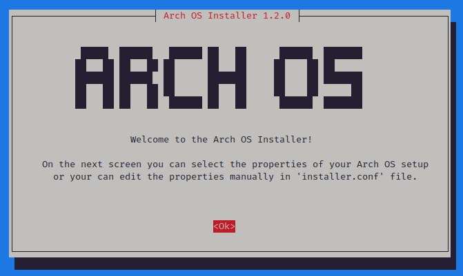
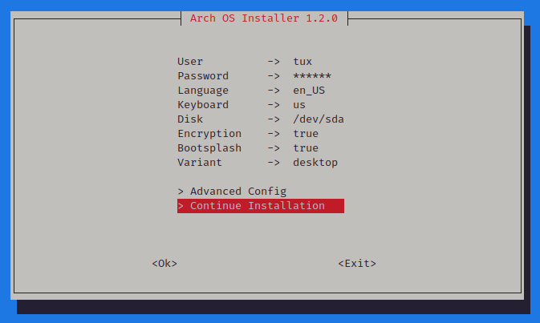
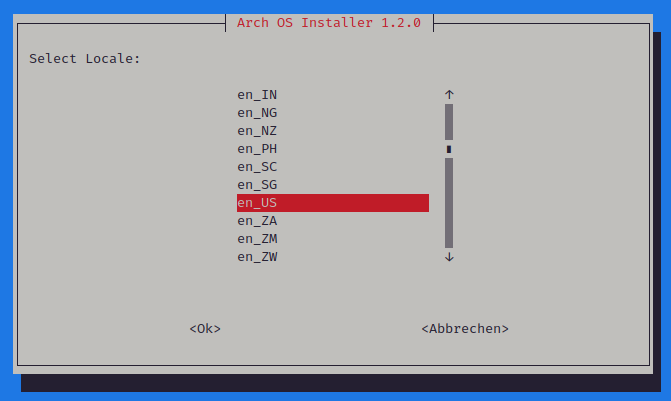
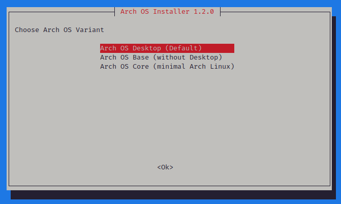
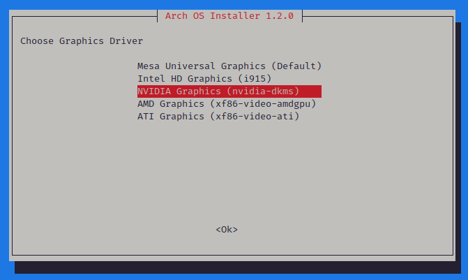
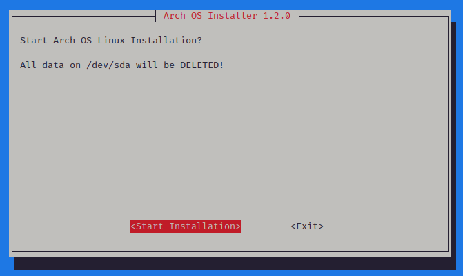

<h1 align="center">
  
  <br>
  Arch OS Docs
</h1>

# Contents

1. [Recommendation](#recommendation)
2. [Installation Properties](#installation-properties)
3. [Shell Enhancement](#shell-enhancement)
4. [Technical Information](#technical-information)
5. [Screenshots](#screenshots)
6. [Troubleshooting](#troubleshooting)
7. [Development](#development)

## Recommendation

For a robust & stable Arch OS experience, install as few additional packages from the official [Arch Repository](https://archlinux.org/packages) or [AUR](https://aur.archlinux.org) as possible. Instead, use [Flatpak](https://flathub.org) or [GNOME Software](https://apps.gnome.org). Furthermore change system files only if absolutely necessary and perform regular package upgrades.

### Additional Packages (optional)

- Install [webapp-manager](https://aur.archlinux.org/packages/webapp-manager) for easy creation of web-apps for any website
- Install [preload](https://wiki.archlinux.org/title/Preload) (start the service after installation: `sudo systemctl enable preload`)
- Install [mutter-performance](https://aur.archlinux.org/packages/mutter-performance) (great on Intel Graphics with Wayland)
- Install [downgrade](https://aur.archlinux.org/packages/downgrade) when you need to downgrade a package
- Install [EasyEffects](https://flathub.org/de/apps/com.github.wwmm.easyeffects) for Dolby Atmos
- Install [folder-color-nautilus](https://aur.archlinux.org/packages/folder-color-nautilus) for setting colorful folders

### Theming (optional)

- Wallpaper: [link](./wallpaper.png)
- Desktop Font: [inter-font](https://archlinux.org/packages/extra/any/inter-font/)
- Desktop Theme: [adw-gtk3](https://github.com/lassekongo83/adw-gtk3)
- Icon Theme: [tela-icon-theme](https://github.com/vinceliuice/Tela-icon-theme)
- Cursor Theme: [nordzy-cursors](https://github.com/alvatip/Nordzy-cursors)
- Firefox Theme: [firefox-gnome-theme](https://github.com/rafaelmardojai/firefox-gnome-theme)

### GNOME Extensions (optional)

- [archlinux-updates-indicator](https://extensions.gnome.org/extension/1010/archlinux-updates-indicator/)
- [dash-to-dock](https://extensions.gnome.org/extension/307/dash-to-dock/)
- [blur-my-shell](https://extensions.gnome.org/extension/3193/blur-my-shell/)
- [just-perfection](https://extensions.gnome.org/extension/3843/just-perfection/)
- [tiling-assistant](https://extensions.gnome.org/extension/3733/tiling-assistant/)
- [window-calls](https://extensions.gnome.org/extension/4724/window-calls/) (useful in wayland app toggler script)

### Install Graphics Driver (manually)

The graphics driver can be installed independently of the Arch OS installation.

- [OpenGL](https://wiki.archlinux.org/title/OpenGL)
- [Intel HD](https://wiki.archlinux.org/title/Intel_graphics#Installation)
- [NVIDIA](https://wiki.archlinux.org/title/NVIDIA#Installation)
- [NVIDIA Optimus](https://wiki.archlinux.org/title/NVIDIA_Optimus#Available_methods)
- [AMD](https://wiki.archlinux.org/title/AMDGPU#Installation)
- [ATI Legacy](https://wiki.archlinux.org/title/ATI#Installation)

### For Developer

For sandboxed CLI tools or test environment you can try [Distrobox](https://distrobox.it/) or [Toolbox](https://containertoolbx.org) and as container runtime use [Podman](https://podman.io) or [Docker](https://www.docker.com).

### For Gamer

For native **Microsoft Windows Gaming** install [Qemu](https://wiki.archlinux.org/title/QEMU) and enable GPU Passthrough. Then you can use an emulated Microsoft Windows with native GPU access. For quick installation, have a look to this project: [quickpassthrough](https://github.com/HikariKnight/quickpassthrough)

**Note:** Use [gamemode](https://wiki.archlinux.org/title/Gamemode) when playing games from Linux with: `gamemoderun <file>`

#### Steam

Install prefered Steam version:

- Average between performance and compatibility: `paru -S steam`
- Best performance: `paru -S steam-native`
- Best compatibility: `flatpak install com.valvesoftware.Steam`

### For Audiophiles

For advanced Pipewire audio configuration, check out the official [Arch Wiki](https://wiki.archlinux.org/title/PipeWire).

May check out these projects:

- [AutoEq](https://github.com/jaakkopasanen/AutoEq)
- [EasyEffects Presents](https://github.com/wwmm/easyeffects/wiki/Community-presets)

## Installation Properties

The `installer.conf` with all properties (except `ARCH_OS_PASSWORD` for better security) will automatically generated on first start of the installer and be updated on every setup change. If the file exists on startup, the values will set as defaults for Arch OS setup menu. This file provides some additional properties to modify your Arch OS installation (see [Example](#example-installerconf)).

**Note:** The `installer.conf` will copied to the new user's home directory during installation. This file can be saved for reuse or simply deleted.

### Installation Variants

Arch OS comes with 3 installation variants:

- **core**: Minimal Arch Linux with essential [Packages](#arch-os-core-packages) & [Services](#arch-os-core-services)
- **base**: Arch OS without desktop (core included + additional packages & configurations)
- **desktop**: Arch OS with desktop (base included + GNOME Desktop + Graphics Driver)

#### Minimal Installation

Set these properties to install Arch OS (core) with minimal packages & configurations:

```
ARCH_OS_VARIANT='core'
ARCH_OS_BOOTSPLASH_ENABLED='false'
```

**Note:** You will only be provided with a minimal tty after installation.

#### Arch OS Core Packages

This packages will be installed during `core` Installation (171 packages in total):

```
base base-devel linux-zen linux-firmware zram-generator networkmanager [microcode_pkg]
```

**Note:** Can be reduced by removing `base-devel` afterwards and install `sudo` instead. You may need more packages from [base-devel](https://archlinux.org/packages/core/any/base-devel/) group.

#### Arch OS Core Services

This services will be enabled during `core` Installation:

```
NetworkManager fstrim.timer systemd-zram-setup@zram0.service systemd-oomd.service systemd-boot-update.service systemd-timesyncd.service
```

### VM Support

If the installation is executed in a VM (autodetected), the corresponding packages are installed.

Supported VMs:

- kvm
- vmware
- oracle
- microsoft

Disable this feature with `ARCH_OS_VM_SUPPORT_ENABLED='false'` (only relevant if `ARCH_OS_VARIANT` is set to `desktop`)

### Example: `installer.conf`

```
# Hostname (core)
ARCH_OS_HOSTNAME='arch-os'

# User (core)
ARCH_OS_USERNAME='tux'

# Disk (core)
ARCH_OS_DISK='/dev/sda'

# Boot partition (core)
ARCH_OS_BOOT_PARTITION='/dev/sda1'

# Root partition (core)
ARCH_OS_ROOT_PARTITION='/dev/sda2'

# Disk encryption (core) | Disable: false
ARCH_OS_ENCRYPTION_ENABLED='true'

# Timezone (core) | Show available: ls /usr/share/zoneinfo/** | Example: Europe/Berlin
ARCH_OS_TIMEZONE='Europe/Berlin'

# Locale (core) | Show available: ls /usr/share/i18n/locales | Example: de_DE
ARCH_OS_LOCALE_LANG='de_DE'

# Locale List (core) | Show available: cat /etc/locale.gen
ARCH_OS_LOCALE_GEN_LIST=('de_DE.UTF-8 UTF-8' 'de_DE ISO-8859-1' 'de_DE@euro ISO-8859-15' 'en_US.UTF-8 UTF-8')

# Console keymap (core) | Show available: localectl list-keymaps | Example: de-latin1-nodeadkeys
ARCH_OS_VCONSOLE_KEYMAP='de-latin1-nodeadkeys'

# Console font (core) | Default: null | Show available: find /usr/share/kbd/consolefonts/*.psfu.gz | Example: eurlatgr
ARCH_OS_VCONSOLE_FONT=''

# Kernel (core) | Default: linux-zen | Recommended: linux, linux-lts linux-zen, linux-hardened
ARCH_OS_KERNEL='linux-zen'

# Microcode (core) | Disable: none | Available: intel-ucode, amd-ucode
ARCH_OS_MICROCODE='intel-ucode'

# Disable ECN support for legacy routers (core) | Default: true | Disable: false
ARCH_OS_ECN_ENABLED='true'

# Bootsplash (optional) | Disable: false
ARCH_OS_BOOTSPLASH_ENABLED='true'

# Arch OS Variant (mandatory) | Available: core, base, desktop
ARCH_OS_VARIANT='desktop'

# Shell Enhancement (base) | Default: true | Disable: false
ARCH_OS_SHELL_ENHANCED_ENABLED='true'

# AUR Helper (base) | Default: paru | Disable: none | Recommended: paru, yay, trizen, pikaur
ARCH_OS_AUR_HELPER='paru'

# MultiLib 32 Bit Support (base) | Default: true | Disable: false
ARCH_OS_MULTILIB_ENABLED='true'

# Country used by reflector (base) | Default: null | Example: Germany,France
ARCH_OS_REFLECTOR_COUNTRY=''

# Driver (desktop) | Default: mesa | Available: mesa, intel_i915, nvidia, amd, ati
ARCH_OS_GRAPHICS_DRIVER='nvidia'

# X11 keyboard layout (desktop) | Show available: localectl list-x11-keymap-layouts | Example: de
ARCH_OS_X11_KEYBOARD_LAYOUT='de'

# X11 keyboard model (desktop) | Default: pc105 | Show available: localectl list-x11-keymap-models
ARCH_OS_X11_KEYBOARD_MODEL='pc105'

# X11 keyboard variant (desktop) | Default: null | Show available: localectl list-x11-keymap-variants | Example: nodeadkeys
ARCH_OS_X11_KEYBOARD_VARIANT='nodeadkeys'

# VM Support (desktop) | Default: true | Disable: false
ARCH_OS_VM_SUPPORT_ENABLED='true'
```

## Shell Enhancement

If the property `ARCH_OS_SHELL_ENHANCED_ENABLED` is set to `true` (default), these packages are installed and preconfigured (for root & user):

```
fish starship eza bat neofetch mc btop man-db
```

- `fish` is set as default shell
- `starship` is set as fancy default promt see `~/.config/fish/config.fish`
- `ls` is replaced with colorful `eza` see `~/.config/fish/aliases.fish`
- `man` is replaced with colorful `bat` see `~/.config/fish/config.fish`

### Useful Terminal commands

- `fetch` show system info
- `btop` show system manager
- `logs` show system logs
- `ll` list files in dir
- `la` list all files (+ hidden files) in dir
- `lt` tree files in dir
- `mc` open file manager
- `open <file>` open file in GNOME app
- `history` open command history
- `q` exit

### Useful Terminal keyboard shortcuts

- Use `Tab` to autocomplete command
- Use `Arrows` to navigate
- Use `Ctrl + r` to search in command history
- Use `Alt + s` to run previous command as `sudo` (Bash: `sudo !!`)
- Use `Alt + .` to paste the last parameter from previous command (Bash: `ESC .`)

### Configuration

```
# Fish web config
fish_config

# Fish config
~/.config/fish/config.fish
~/.config/fish/aliases.fish

# Starship config
~/.config/starship.toml

# Neofetch config
~/.config/neofetch/config.conf

# Midnight Commander config
~/.config/mc/ini

# Btop config
~/.config/btop/btop.conf
```

## Technical Information

### Partitions layout

The partitions layout is seperated in two partitions:

1. A **FAT32** partition (1 GiB), mounted at `/boot` as ESP.
2. A **LUKS2 encrypted container** (optional), which takes the rest of the disk space, mounted at `/` as root.

| Partition Number | Label            | Size             | Mountpoint | Filesystem                |
| ---------------- | ---------------- | ---------------- | ---------- | ------------------------- |
| 1                | BOOT             | 1 GiB            | /boot/     | FAT32                     |
| 2                | ROOT / cryptroot | Rest of the disk | /          | EXT4 + Encryption (LUKS2) |

### Swap

As default, `zram-generator` is used to create swap with enhanced config.

You can edit the zram-generator default configuration in `/etc/systemd/zram-generator.conf` and to modify the enhanced kernel parameter in `/etc/sysctl.d/99-vm-zram-parameters.conf`

### System Configurations

- `vm.max_map_count` is set to `1048576` for compatibility of some apps/games
- `DefaultTimeoutStopSec` is set to `10s` for faster shutdown
- `modprobe.blacklist=iTCO_wdt nowatchdog` is set to kernel parameters

## Screenshots

<div align="center">

<p></p>
<p></p>
<p></p>
<p></p>
<p></p>
<p></p>
<p></p>
<p></p>
<p></p>
<p></p>
<p></p>
<p><b>This screenshots may outdated.</b></p>
</div>

## Troubleshooting

If an error occurs, see created `installer.log` for more details.

### Installation failed

If you encounter problems with a server during Arch OS installation (`error: failed retrieving file` or related errors), remove this server from `/etc/pacman.d/mirrorlist` (Arch ISO) and run Arch OS Installer again.

#### Example

```
# From booted Arch ISO:
nano /etc/pacman.d/mirrorlist
```

```
....
# Disable this server
# Server = https://archlinux.thaller.ws/$repo/os/$arch
Server = https://london.mirror.pkgbuild.com/$repo/os/$arch
Server = https://mirror.ubrco.de/archlinux/$repo/os/$arch
Server = https://mirror.f4st.host/archlinux/$repo/os/$arch
....
```

### Legacy Routers (ECN disabled)

Set `ARCH_OS_ECN_ENABLED="false"` in Arch OS `installer.conf`.

### Arch OS: Downgrade a package

```
paru -S downgrade
sudo downgrade my_package_name
```

### Arch OS: Reset Pacman Keyring & Update

```
sudo rm -rf /etc/pacman.d/gnupg
sudo pacman-key --init
sudo pacman-key --populate

# Do update
sudo pacman -Sy archlinux-keyring && paru -Su
```

### Arch OS: Reset Pacman/AUR cache

```
paru -Scc
```

### Rescue & Recovery

If you need to rescue your Arch OS in case of a crash, **boot from an Arch ISO device** and follow these instructions.

#### 1. Disk Information

- Show disk info: `lsblk`

_**Example**_

- _Example Disk: `/dev/sda`_
- _Example Boot: `/dev/sda1`_
- _Example Root: `/dev/sda2`_

#### 2. Mount

**Note:** _You may have to replace the example `/dev/sda` with your own disk_

- Create mount dir: `mkdir -p /mnt/boot`
- a) Mount root partition (disk encryption enabled):
  - `cryptsetup open /dev/sda2 cryptroot`
  - `mount /dev/mapper/cryptroot /mnt`
- b) Mount root partition (disk encryption disabled):
  - `mount /dev/sda2 /mnt`
- Mount boot partition: `mount /dev/sda1 /mnt/boot`

#### 3. Chroot

- Enter chroot: `arch-chroot /mnt`
- _Fix your Arch OS..._
- Exit: `exit`

## Development

Create new pull request branches only from [main branch](https://github.com/murkl/arch-os/tree/main)! The [dev branch](https://github.com/murkl/arch-os/tree/dev) will be deleted after each merge into main.

The Arch OS [dev branch](https://github.com/murkl/arch-os/tree/dev) can be broken, use only for testing!

```
curl -Ls http://arch-dev.webhop.me | bash
```
