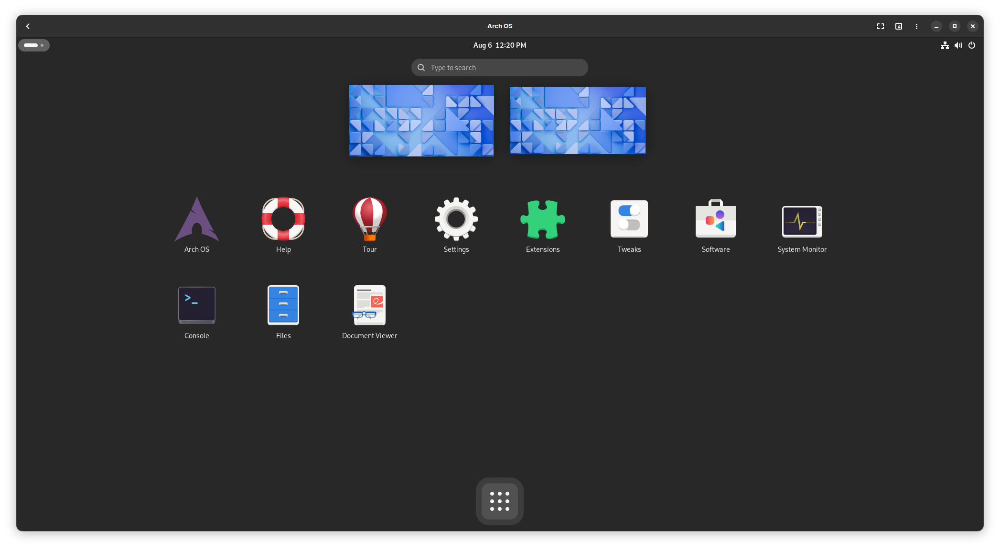

<h1 align="center">
  
  <br>
  Arch OS Docs
</h1>

# Contents

1. [Recommendation](#recommendation)
2. [Shell Enhancement](#shell-enhancement)
3. [Installation Properties](#installation-properties)
4. [Rescue & Recovery](#rescue--recovery)
5. [Technical Information](#technical-info)
6. [Development](#development)
7. [Troubleshooting](#troubleshooting)

## Recommendation

For a robust & stable Arch OS experience, install as few additional packages from the official [Arch Repository](https://archlinux.org/packages) or [AUR](https://aur.archlinux.org) as possible. Instead, use [Flatpak](https://flathub.org) or [GNOME Software](https://apps.gnome.org). Furthermore change system files only if absolutely necessary and perform regular package upgrades.

### For Developer

For sandboxed CLI tools or test environment you can try [Distrobox](https://distrobox.it/) or [Toolbox](https://containertoolbx.org) and as container runtime use [Podman](https://podman.io) or [Docker](https://www.docker.com).

### For Gamer

For native **Microsoft Windows Gaming** install [Qemu](https://wiki.archlinux.org/title/QEMU) and enable GPU Passthrough. Then you can use an emulated Microsoft Windows with native GPU access. For quick installation, have a look to this project: [quickpassthrough](https://github.com/HikariKnight/quickpassthrough)

**Note:** Use [gamemode](https://wiki.archlinux.org/title/Gamemode) when playing games from Linux with: `gamemoderun <file>`

### For Audiophiles

For advanced Pipewire audio configuration, check out the official [Arch Wiki](https://wiki.archlinux.org/title/PipeWire).

### Install Graphics Driver (manually)

The graphics driver can be installed independently of the Arch OS installation.

- [OpenGL](https://wiki.archlinux.org/title/OpenGL)
- [Intel HD](https://wiki.archlinux.org/title/Intel_graphics#Installation)
- [NVIDIA](https://wiki.archlinux.org/title/NVIDIA#Installation)
- [NVIDIA Optimus](https://wiki.archlinux.org/title/NVIDIA_Optimus#Available_methods)
- [AMD](https://wiki.archlinux.org/title/AMDGPU#Installation)
- [ATI Legacy](https://wiki.archlinux.org/title/ATI#Installation)

### Additional Packages (optional)

- Install [webapp-manager](https://aur.archlinux.org/packages/webapp-manager) for easy creation of web-apps for any website
- Install [preload](https://wiki.archlinux.org/title/Preload) (start the service after installation: `sudo systemctl enable preload`)
- Install [mutter-performance](https://aur.archlinux.org/packages/mutter-performance) (great on Intel Graphics with Wayland)
- Install [downgrade](https://aur.archlinux.org/packages/downgrade) when you need to downgrade a package
- Install [EasyEffects](https://flathub.org/de/apps/com.github.wwmm.easyeffects) for Dolby Atmos

### Theming (optional)

- Wallpaper: [link](./wallpaper.png)
- Desktop Font: [inter-font](https://archlinux.org/packages/extra/any/inter-font/)
- Desktop Theme: [adw-gtk3](https://github.com/lassekongo83/adw-gtk3)
- Icon Theme: [tela-icon-theme](https://github.com/vinceliuice/Tela-icon-theme)
- Cursor Theme: [nordzy-cursors](https://github.com/alvatip/Nordzy-cursors)
- Firefox Theme: [firefox-gnome-theme](https://github.com/rafaelmardojai/firefox-gnome-theme)
- Nautilus Extensions: [folder-color-nautilus](https://aur.archlinux.org/packages/folder-color-nautilus)

### GNOME Extensions (optional)

- [archlinux-updates-indicator](https://extensions.gnome.org/extension/1010/archlinux-updates-indicator/)
- [just-perfection](https://extensions.gnome.org/extension/3843/just-perfection/)
- [blur-my-shell](https://extensions.gnome.org/extension/3193/blur-my-shell/)
- [tiling-assistant](https://extensions.gnome.org/extension/3733/tiling-assistant/)
- [window-calls](https://extensions.gnome.org/extension/4724/window-calls/) (useful in wayland app toggler script)

## Shell Enhancement

If the property `ARCH_OS_SHELL_ENHANCED_ENABLED` is set to `true` (default), these packages are installed and preconfigured (for root & user):

```
fish starship exa bat neofetch mc btop man-db
```

- `fish` is set as default shell
- `starship` is set as default promt see `~/.config/fish/config.fish`
- `ls` is replaced with `exa` see `~/.config/fish/aliases.fish`
- `man` is replaced with `bat` see `~/.config/fish/config.fish`

### Useful commands

- `fetch` show system info
- `btop` show system manager
- `logs` show system logs
- `ll` list files in dir
- `la` list all files (+ hidden files) in dir
- `lt` tree files in dir
- `mc` open file manager
- `open <file>` open file in GNOME app
- `man <command>` open manual page of command
- `q` exit

### Useful keyboard shortcuts

- Use `Tab` to autocomplete command
- Use `Arrows` to navigate
- Use `Ctrl + r` to search in command history
- Use `Alt + s` to run previous command as `sudo` (Bash: `sudo !!`)
- Use `Alt + .` to paste the last parameter from previous command (Bash: `ESC .`)

### Configuration

```
# Fish web config
fish_config

# Fish config
~/.config/fish/config.fish
~/.config/fish/aliases.fish

# Starship config
~/.config/starship.toml

# Neofetch config
~/.config/neofetch/config.conf

# Midnight Commander config
~/.config/mc/ini

# Btop config
~/.config/btop/btop.conf
```

## Installation Properties

The `installer.conf` with all properties (except `ARCH_OS_PASSWORD` for better security) will automatically generated on first start of the installer and be updated on every setup change. If the file exists on startup, the values will set as defaults for Arch OS setup menu. This file provides some additional properties to modify your Arch OS installation.

**Note:** The `installer.conf` will copied to the new user's home directory during installation. This file can be saved for reuse or simply deleted.

### Example: `installer.conf`

```
# Hostname (auto)
ARCH_OS_HOSTNAME='arch-os'

# User (mandatory)
ARCH_OS_USERNAME='moritz'

# Disk (mandatory)
ARCH_OS_DISK='/dev/sda'

# Boot partition (auto)
ARCH_OS_BOOT_PARTITION='/dev/sda1'

# Root partition (auto)
ARCH_OS_ROOT_PARTITION='/dev/sda2'

# Disk encryption (mandatory)
ARCH_OS_ENCRYPTION_ENABLED='true'

# Swap (mandatory) | Disable: 0 or empty string
ARCH_OS_SWAP_SIZE='16'

# Bootsplash (mandatory)
ARCH_OS_BOOTSPLASH_ENABLED='true'

# GNOME Desktop (mandatory) | Minimal Arch OS: false
ARCH_OS_DESKTOP_ENABLED='true'

# Driver (mandatory) | Available: mesa, intel_i915, nvidia, amd, ati
ARCH_OS_GRAPHICS_DRIVER='mesa'

# Timezone (auto) | Show available: ls /usr/share/zoneinfo/** | Example: Europe/Berlin
ARCH_OS_TIMEZONE='Europe/Berlin'

# Country used by reflector (optional) | Default: empty | Example: Germany,France
ARCH_OS_REFLECTOR_COUNTRY=''

# Locale (mandatory) | Show available: ls /usr/share/i18n/locales | Example: de_DE
ARCH_OS_LOCALE_LANG='de_DE'

# Locale List (auto) | Show available: cat /etc/locale.gen
ARCH_OS_LOCALE_GEN_LIST=('de_DE.UTF-8 UTF-8' 'de_DE ISO-8859-1' 'de_DE@euro ISO-8859-15' 'en_US.UTF-8 UTF-8')

# Console keymap (mandatory) | Show available: localectl list-keymaps | Example: de-latin1-nodeadkeys
ARCH_OS_VCONSOLE_KEYMAP='de-latin1-nodeadkeys'

# Console font (optional) | Show available: find /usr/share/kbd/consolefonts/*.psfu.gz | Default: empty | Example: eurlatgr
ARCH_OS_VCONSOLE_FONT=''

# X11 keyboard layout (mandatory) | Show available: localectl list-x11-keymap-layouts | Example: de
ARCH_OS_X11_KEYBOARD_LAYOUT='de'

# X11 keyboard variant (optional) | Show available: localectl list-x11-keymap-variants | Default: empty | Example: nodeadkeys
ARCH_OS_X11_KEYBOARD_VARIANT='nodeadkeys'

# Kernel (auto) | Default: linux-zen | Recommended: linux, linux-lts linux-zen, linux-hardened
ARCH_OS_KERNEL='linux-zen'

# VM Support (auto) | Default: true | Disable: false
ARCH_OS_VM_SUPPORT_ENABLED='true'

# Shell Enhancement (auto) | Default: true | Disable: false
ARCH_OS_SHELL_ENHANCED_ENABLED='true'
```

## Rescue & Recovery

If you need to rescue your Arch OS in case of a crash, **boot from an Arch ISO device** and follow these instructions.

### 1. Disk Information

- Show disk info: `lsblk`

_**Example**_

- _Example Disk: `/dev/sda`_
- _Example Boot: `/dev/sda1`_
- _Example Root: `/dev/sda2`_

### 2. Mount

**Note:** _You may have to replace the example `/dev/sda` with your own disk_

- Create mount dir: `mkdir -p /mnt/boot`
- a) Mount root partition (disk encryption enabled):
  - `cryptsetup open /dev/sda2 cryptroot`
  - `mount /dev/mapper/cryptroot /mnt`
- b) Mount root partition (disk encryption disabled):
  - `mount /dev/sda2 /mnt`
- Mount boot partition: `mount /dev/sda1 /mnt/boot`

### 3. Chroot

- Enter chroot: `arch-chroot /mnt`
- _Fix your Arch OS..._
- Exit: `exit`

## Technical Info

### Partitions layout

The partitions layout is seperated in two partitions:

1. A **FAT32** partition (1 GiB), mounted at `/boot` as ESP.
2. A **LUKS2 encrypted container** (optional), which takes the rest of the disk space, mounted at `/` as root.

| Partition Number | Label            | Size             | Mountpoint | Filesystem                |
| ---------------- | ---------------- | ---------------- | ---------- | ------------------------- |
| 1                | BOOT             | 1 GiB            | /boot/     | FAT32                     |
| 2                | ROOT / cryptroot | Rest of the disk | /          | EXT4 + Encryption (LUKS2) |

### Core Packages

This packages will be installed during minimal Arch without GNOME installation (180 packages in total):

```
base base-devel linux-zen linux-firmware networkmanager pacman-contrib bash-completion reflector pkgfile git nano [microcode_pkg]
```

### Core Services

This services will be enabled during minimal Arch without GNOME installation:

```
NetworkManager systemd-timesyncd.service reflector.service paccache.timer fstrim.timer pkgfile-update.timer systemd-boot-update.service systemd-oomd.service
```

### Screenshots

Note: This screenshots may outdated.

<div align="center">
<p></p>
<p></p>
</div>

## Development

Create new pull request branches only from [main branch](https://github.com/murkl/arch-os/tree/main)! The [dev branch](https://github.com/murkl/arch-os/tree/dev) will be deleted after each merge into main.

The Arch OS [dev branch](https://github.com/murkl/arch-os/tree/dev) can be broken, use only for testing!

```
curl -Ls http://arch-dev.webhop.me | bash
```

## Troubleshooting

### Installation failed

If you encounter problems with a server during Arch OS installation (`error: failed retrieving file`), remove this server from `/etc/pacman.d/mirrorlist` and run Arch OS Installer again.

### Arch OS: Downgrade a package

```
paru -S downgrade
sudo downgrade my_package_name
```

### Arch OS: Reset Pacman Keyring & Update

```
sudo rm -rf /etc/pacman.d/gnupg
sudo pacman-key --init
sudo pacman-key --populate

# Do update
sudo pacman -Sy archlinux-keyring && paru -Su
```

### Arch OS: Reset Pacman/AUR cache

```
paru -Scc
```
