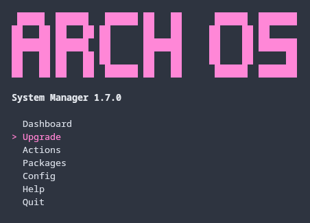

<h1 align="center">
  
  <br>
  Arch OS Docs
</h1>

# Contents

1. [Recommendation](#recommendation)
2. [Advanced Installation](#advanced-installation)
3. [Housekeeping](#housekeeping)
4. [Core Tweaks](#core-tweaks)
5. [Shell Enhancement](#shell-enhancement)
6. [Arch OS Manager](#arch-os-manager)
7. [Technical Information](#technical-information)
8. [Troubleshooting](#troubleshooting)
9. [Development](#development)
10. [Screenshots](#screenshots)
11. [Credits](#credits)

## Recommendation

<p></p>

For a robust & stable Arch OS experience, install as few additional packages from the official [Arch Repository](https://archlinux.org/packages) or [AUR](https://aur.archlinux.org) as possible. Instead, use [Flatpak](https://flathub.org) or [GNOME Software](https://apps.gnome.org). Furthermore change system files only if absolutely necessary and perform regular package upgrades.

- Arch OS System Manager: **`arch-os`**
- System information: **`fetch`**
- Update system: **`paru -Syu`**
- Search package: **`paru -Ss <my search string>`**
- Install package: **`paru -S <my package>`**
- List installed packages: **`paru -Qe`**
- Show package info: **`paru -Qi <my package>`**
- Remove package: **`paru -Rsn <my package>`**

### Additional Packages (optional)

- Install [Pika Backup](https://flathub.org/apps/details/org.gnome.World.PikaBackup) for backup and restore home files
- Install [Extension Manager](https://flathub.org/apps/com.mattjakeman.ExtensionManager) for manage GNOME Extensions
- Install [webapp-manager](https://aur.archlinux.org/packages/webapp-manager) for easy creation of web-apps for any website
- Install [preload](https://wiki.archlinux.org/title/Preload) on older machines (start the service after installation: `sudo systemctl enable preload`)
- Install [mutter-performance](https://aur.archlinux.org/packages/mutter-performance) (great on older Intel Graphics with Wayland)
- Install [downgrade](https://aur.archlinux.org/packages/downgrade) when you need to downgrade a package
- Install [EasyEffects](https://flathub.org/de/apps/com.github.wwmm.easyeffects) for Dolby Atmos
- Install [folder-color-nautilus](https://aur.archlinux.org/packages/folder-color-nautilus) for setting colorful folders
- Install [Flatseal](https://flathub.org/apps/com.github.tchx84.Flatseal) to manage Flatpak Permissions
- Install [Warehouse](https://flathub.org/apps/io.github.flattool.Warehouse) to Manage Flatpak Packages
- Install [LocalSend](https://flathub.org/de/apps/org.localsend.localsend_app) to simply share files in same network
- Install [MissionCenter](https://flathub.org/de/apps/io.missioncenter.MissionCenter) as system monitor
- Install [Parabolic](https://flathub.org/de/apps/org.nickvision.tubeconverter) as download manager

### Theming (optional)

- Desktop Font: [inter-font](https://archlinux.org/packages/extra/any/inter-font/)
- Desktop Theme: [adw-gtk3](https://github.com/lassekongo83/adw-gtk3)
- Icon Theme: [tela-icon-theme](https://github.com/vinceliuice/Tela-icon-theme), [tela-circle-icon-theme](https://github.com/vinceliuice/Tela-circle-icon-theme)
- Cursor Theme: [capitaine-cursors](https://archlinux.org/packages/extra/any/capitaine-cursors), [nordzy-cursors](https://github.com/alvatip/Nordzy-cursors)
- Firefox Theme: [firefox-gnome-theme](https://github.com/rafaelmardojai/firefox-gnome-theme)

### GNOME Extensions (optional)

- [archlinux-updates-indicator](https://extensions.gnome.org/extension/1010/archlinux-updates-indicator/)
- [app-indicator-support](https://extensions.gnome.org/extension/615/appindicator-support/)
- [lilypad](https://extensions.gnome.org/extension/7266/lilypad/)
- [just-perfection](https://extensions.gnome.org/extension/3843/just-perfection/)
- [dash-to-dock](https://extensions.gnome.org/extension/307/dash-to-dock/)
- [dash-to-panel](https://extensions.gnome.org/extension/1160/dash-to-panel/)
- [blur-my-shell](https://extensions.gnome.org/extension/3193/blur-my-shell/)
- [weather-oclock](https://extensions.gnome.org/extension/5470/weather-oclock/)
- [tiling-assistant](https://extensions.gnome.org/extension/3733/tiling-assistant/)
- [system-monitor](https://extensions.gnome.org/extension/6807/system-monitor/)
- [vitals](https://extensions.gnome.org/extension/1460/vitals/)
- [caffeine](https://extensions.gnome.org/extension/517/caffeine/)
- [light-style](https://extensions.gnome.org/extension/6198/light-style/)
- [gamemode-indicator](https://extensions.gnome.org/extension/6340/gamemode-indicator-in-system-settings/)

#### Tweak Extensions

- [fullscreen-to-empty-workspace](https://extensions.gnome.org/extension/6072/fullscreen-to-empty-workspace/) (open fullscreen apps on new workspace)
- [disable-unredirect-fullscreen](https://extensions.gnome.org/extension/1873/disable-unredirect-fullscreen-windows/) (fix some issues)
- [window-calls](https://extensions.gnome.org/extension/4724/window-calls/) (alternative to wmctrl in wayland)

### For Developer

For sandboxed CLI tools or test environment you can try [Distrobox](https://distrobox.it/) or [Toolbox](https://containertoolbx.org) and as container runtime use [Podman](https://podman.io) or [Docker](https://www.docker.com).

#### Useful Tools

- [GNOME Boxes](https://archlinux.org/packages/extra/x86_64/gnome-boxes/)
- [Podman Desktop](https://flathub.org/apps/io.podman_desktop.PodmanDesktop)
- [Pods](https://flathub.org/apps/com.github.marhkb.Pods)
- [BoxBuddy](https://flathub.org/apps/io.github.dvlv.boxbuddyrs)

### For Gamer

For native **Microsoft Windows Gaming** install [Qemu](https://wiki.archlinux.org/title/QEMU) and enable GPU Passthrough. Then you can use an emulated Microsoft Windows with native GPU access. For quick installation, have a look to this project: [quickpassthrough](https://github.com/HikariKnight/quickpassthrough)

**Note:** Use [gamemode](https://wiki.archlinux.org/title/Gamemode) when playing games from Linux with: `gamemoderun <file>`

#### Steam

Install prefered Steam version:

- Average between performance and compatibility: `paru -S steam`
- Best performance: `paru -S steam-native`
- Best compatibility: `flatpak install com.valvesoftware.Steam`

#### Other Tools

- [Lutris](https://archlinux.org/packages/extra/any/lutris/)
- [Bottles](https://aur.archlinux.org/packages/bottles)
- [RetroDeck](https://flathub.org/apps/net.retrodeck.retrodeck)
- [Cartridges](https://flathub.org/de/apps/page.kramo.Cartridges)
- [Sunshine Streaming Server](https://docs.lizardbyte.dev/projects/sunshine/en/latest/about/setup.html#install)
- [Moonlight Streaming Client](https://flathub.org/apps/com.moonlight_stream.Moonlight)
- [Wine](https://archlinux.org/packages/multilib/x86_64/wine/), [Winetricks](https://archlinux.org/packages/multilib/x86_64/winetricks/)
- [Proton](https://aur.archlinux.org/packages/proton-ge-custom-bin), [Protontricks](https://aur.archlinux.org/packages/protontricks)
- [Gamescope](https://archlinux.org/packages/extra/x86_64/gamescope/)

### For Audiophiles

For advanced Pipewire audio configuration, check out the official [Arch Wiki](https://wiki.archlinux.org/title/PipeWire).

May check out these projects:

- [AutoEq](https://github.com/jaakkopasanen/AutoEq)
- [EasyEffects Presents](https://github.com/wwmm/easyeffects/wiki/Community-presets)

## Advanced Installation

The `installer.conf` with all properties (except `ARCH_OS_PASSWORD` for better security) will automatically generated on first start of the installer and be updated on every setup change. If the file exists on startup, the values will set as preset for the installer properties. This file provides some additional properties to customize your Arch OS installation (see [Example](#example-installerconf)).

**Note:** The `installer.conf` & `installer.log` will copied to the new user's home directory during installation. This files can be saved for reuse or simply deleted.

### Minimal Installation

Set these properties to install Arch OS Core only with minimal packages & configurations:

```
ARCH_OS_CORE_TWEAKS_ENABLED='false'
ARCH_OS_BOOTSPLASH_ENABLED='false'
ARCH_OS_DESKTOP_ENABLED='false'
ARCH_OS_MULTILIB_ENABLED='false'
ARCH_OS_HOUSEKEEPING_ENABLED='false'
ARCH_OS_SHELL_ENHANCEMENT_ENABLED='false'
ARCH_OS_AUR_HELPER='none'
```

If you want to disable VM support add `ARCH_OS_VM_SUPPORT_ENABLED='false'`

**Note:** You will only be provided with a minimal tty after installation.

### Install Graphics Driver (manually)

Set the property `ARCH_OS_DESKTOP_GRAPHICS_DRIVER='none'` and install your graphics driver manually:

- [OpenGL](https://wiki.archlinux.org/title/OpenGL)
- [Intel HD](https://wiki.archlinux.org/title/Intel_graphics#Installation)
- [NVIDIA](https://wiki.archlinux.org/title/NVIDIA#Installation)
- [NVIDIA Optimus](https://wiki.archlinux.org/title/NVIDIA_Optimus#Available_methods)
- [AMD](https://wiki.archlinux.org/title/AMDGPU#Installation)
- [ATI Legacy](https://wiki.archlinux.org/title/ATI#Installation)

### VM Support

If the installation is executed in a VM (autodetected), the corresponding packages are installed.

Supported VMs:

- kvm
- vmware
- oracle
- microsoft

Disable this feature with `ARCH_OS_VM_SUPPORT_ENABLED='false'`

### Example: `installer.conf`

```
ARCH_OS_HOSTNAME='arch-os' # Hostname
ARCH_OS_USERNAME='tux' # User
ARCH_OS_DISK='/dev/sda' # Disk
ARCH_OS_BOOT_PARTITION='/dev/sda1' # Boot partition
ARCH_OS_ROOT_PARTITION='/dev/sda2' # Root partition
ARCH_OS_ENCRYPTION_ENABLED='true' # Disk encryption | Disable: false
ARCH_OS_TIMEZONE='Europe/Berlin' # Timezone | Show available: ls /usr/share/zoneinfo/** | Example: Europe/Berlin
ARCH_OS_LOCALE_LANG='de_DE' # Locale | Show available: ls /usr/share/i18n/locales | Example: de_DE
ARCH_OS_LOCALE_GEN_LIST=('de_DE.UTF-8 UTF-8' 'de_DE ISO-8859-1' 'de_DE@euro ISO-8859-15' 'en_US.UTF-8 UTF-8') # Locale List | Show available: cat /etc/locale.gen
ARCH_OS_REFLECTOR_COUNTRY='' # Country used by reflector | Default: null | Example: Germany,France
ARCH_OS_VCONSOLE_KEYMAP='de-latin1-nodeadkeys' # Console keymap | Show available: localectl list-keymaps | Example: de-latin1-nodeadkeys
ARCH_OS_VCONSOLE_FONT='' # Console font | Default: null | Show available: find /usr/share/kbd/consolefonts/*.psfu.gz | Example: eurlatgr
ARCH_OS_KERNEL='linux-zen' # Kernel | Default: linux-zen | Recommended: linux, linux-lts linux-zen, linux-hardened
ARCH_OS_MICROCODE='intel-ucode' # Microcode | Disable: none | Available: intel-ucode, amd-ucode
ARCH_OS_CORE_TWEAKS_ENABLED='true' # Arch OS Core Tweaks | Disable: false
ARCH_OS_MULTILIB_ENABLED='true' # MultiLib 32 Bit Support | Disable: false
ARCH_OS_AUR_HELPER='paru' # AUR Helper | Default: paru | Disable: none | Recommended: paru, yay, trizen, pikaur
ARCH_OS_BOOTSPLASH_ENABLED='true' # Bootsplash | Disable: false
ARCH_OS_SHELL_ENHANCEMENT_ENABLED='true' # Shell Enhancement | Disable: false
ARCH_OS_SHELL_ENHANCEMENT_FISH_ENABLED='true' # Enable fish shell | Default: true | Disable: false
ARCH_OS_HOUSEKEEPING_ENABLED='true' # Housekeeping | Disable: false
ARCH_OS_MANAGER_ENABLED='true' # Arch OS Manager | Disable: false
ARCH_OS_DESKTOP_ENABLED='true' # Arch OS Desktop (caution: if disabled, only a minimal tty will be provied)| Disable: false
ARCH_OS_DESKTOP_EXTRAS_ENABLED='true' # Enable desktop extra packages (caution: if disabled, only core + gnome + git packages will be installed) | Disable: false
ARCH_OS_DESKTOP_SLIM_ENABLED='true' # Enable Sim Desktop (only GNOME Core Apps) | Default: false
ARCH_OS_DESKTOP_GRAPHICS_DRIVER='nvidia' # Graphics Driver | Disable: none | Available: mesa, intel_i915, nvidia, amd, ati
ARCH_OS_DESKTOP_KEYBOARD_LAYOUT='de' # X11 keyboard layout | Show available: localectl list-x11-keymap-layouts | Example: de
ARCH_OS_DESKTOP_KEYBOARD_MODEL='pc105' # X11 keyboard model | Default: pc105 | Show available: localectl list-x11-keymap-models
ARCH_OS_DESKTOP_KEYBOARD_VARIANT='nodeadkeys' # X11 keyboard variant | Default: null | Show available: localectl list-x11-keymap-variants | Example: nodeadkeys
ARCH_OS_SAMBA_SHARE_ENABLED='true' # Enable Samba public (anonymous) & home share (user) | Disable: false
ARCH_OS_VM_SUPPORT_ENABLED='true' # VM Support | Default: true | Disable: false
ARCH_OS_ECN_ENABLED='true' # Disable ECN support for legacy routers | Default: true | Disable: false
```

## Core Tweaks

Enable this feature with `ARCH_OS_CORE_TWEAKS_ENABLED='true'`:

- `vm.max_map_count` is set to `1048576` for compatibility of some apps/games (default)
- `quiet splash vt.global_cursor_default=0` is set to kernel parameters for silent boot
- Pacman parallel downloads is set to `5`
- Pacman colors and eyecandy is enabled
- Sudo password feedback is enabled
- Debug packages are disabled in `/etc/makepkg.conf`
- Watchdog is disabled with kernel arg `nowatchdog` and blacklist: `/etc/modprobe.d/blacklist-watchdog.conf`

Disable this featuree with `ARCH_OS_CORE_TWEAKS_ENABLED='false'`

## Housekeeping

This feature will install and configure:

| Package        | Service              | Config                            | Description                                                            |
| -------------- | -------------------- | --------------------------------- | ---------------------------------------------------------------------- |
| reflector      | reflector.service    | /etc/xdg/reflector/reflector.conf | Rank & update the mirrorlist on every boot                             |
| pacman-contrib | paccache.timer       | none                              | Weekly clear the pacman cache                                          |
| pkgfile        | pkgfile-update.timer | none                              | Missing command suggestion and daily database update                   |
| smartmontools  | smartd               | none                              | Monitor storage devices                                                |
| irqbalance     | irqbalance.service   | none                              | Distribute hardware interrupts across processors on a multicore system |

Disable this feature with `ARCH_OS_HOUSEKEEPING_ENABLED='false'`

## Shell Enhancement

<p></p>

If the property `ARCH_OS_SHELL_ENHANCEMENT_ENABLED` is set to `true`, the following packages are installed and preconfigured (for root & user). To keep `bash` as default shell, set `ARCH_OS_SHELL_ENHANCEMENT_FISH_ENABLED='false'`:

```
fish starship eza bat fastfetch mc btop nano man-db bash-completion
```

- `fish` is set as default shell
- `starship` is set as fancy default promt see `~/.config/fish/config.fish`
- `ls` is replaced with colorful `eza` see `~/.aliases`
- `man` is replaced with colorful `bat` see `~/.config/fish/config.fish`
- `nano` is set as default editor
- `fastfetch` is preconfigured as system info

### Useful Terminal commands

- `fetch` show system info
- `btop` show system manager
- `logs` show system logs
- `ll` list files in dir
- `la` list all files (+ hidden files) in dir
- `lt` tree files in dir
- `mc` open file manager
- `open <file>` open file in GNOME app
- `history` open command history
- `q` exit

**Note:** See `~/.aliases` for all command aliases

### Useful Terminal keyboard shortcuts

- Use `Tab` to autocomplete command
- Use `Arrows` to navigate
- Use `Ctrl + r` to search in command history
- Use `Alt + s` to run previous command as `sudo` (Bash: `sudo !!`)
- Use `Alt + .` to paste the last parameter from previous command (Bash: `ESC .`)

### Configuration

```
# Aliases
~/.aliases

# Fish web config
fish_config

# Fish config
~/.config/fish/config.fish

# Starship config
~/.config/starship.toml

# Fastfetch config
~/.config/fastfetch/config.jsonc

# Midnight Commander config
~/.config/mc/ini

# Btop config
~/.config/btop/btop.conf
```

## Arch OS Manager

**GitHub Project ➜ [github.com/murkl/arch-os-manager](https://github.com/murkl/arch-os-manager)**

<p></p>

Install **➜ [archlinux-updates-indicator](https://extensions.gnome.org/extension/1010/)** and set this in extension options to integrate [Arch OS Manager](https://github.com/murkl/arch-os-manager):

- Check command: `/usr/bin/arch-os check`
- Update command: `arch-os --kitty upgrade`
- Package Manager (optional): `arch-os --kitty`

## Technical Information

Here are some technical information regarding the Arch OS Core installation.

### Partitions layout

The partitions layout is seperated in two partitions:

1. **FAT32** partition (1 GiB), mounted at `/boot` as ESP
2. **EXT4** partition (rest of disk) optional with **LUKS2 encrypted container**, mounted at `/` as root

| Partition | Label            | Size         | Mount | Filesystem                |
| --------- | ---------------- | ------------ | ----- | ------------------------- |
| 1         | BOOT             | 1 GiB        | /boot | FAT32                     |
| 2         | ROOT / cryptroot | Rest of disk | /     | EXT4 + Encryption (LUKS2) |

### Swap

As default, `zram-generator` is used to create swap with enhanced config.

You can edit the zram-generator default configuration in `/etc/systemd/zram-generator.conf` and to modify the enhanced kernel parameter in `/etc/sysctl.d/99-vm-zram-parameters.conf`

### Packages

This packages will be installed during Arch OS Core Installation (~150 packages in total):

```
base linux-firmware zram-generator networkmanager sudo [kernel_pkg] [microcode_pkg]
```

### Services

This services will be enabled during Arch OS Core Installation:

```
NetworkManager fstrim.timer systemd-zram-setup@zram0.service systemd-oomd.service systemd-boot-update.service systemd-timesyncd.service
```

### Configuration

This configuration will be set during Arch OS Core Installation:

- Bootloader timeout is set to `0`
- User is added to group `wheel` to use `sudo`

**Note:** The password (`ARCH_OS_PASSWORD`) is used for encryption (optional), root and user login and can be changed afterwards with `passwd` if necessary.

## Troubleshooting

If an error occurs, see created `installer.log` for more details.

### Installation failed

If you encounter problems with a server during Arch OS installation (`error: failed retrieving file` or related errors), remove this server from `/etc/pacman.d/mirrorlist` (Arch ISO) and run Arch OS Installer again.

#### Example

```
# From booted Arch ISO:
nano /etc/pacman.d/mirrorlist
```

```
....
# Disable this server
# Server = https://archlinux.thaller.ws/$repo/os/$arch
Server = https://london.mirror.pkgbuild.com/$repo/os/$arch
Server = https://mirror.ubrco.de/archlinux/$repo/os/$arch
Server = https://mirror.f4st.host/archlinux/$repo/os/$arch
....
```

### Device is busy

Try terminate all processes with:

```
fuser -km /mnt
```

### Legacy Routers (ECN disabled)

Set `ARCH_OS_ECN_ENABLED="false"` in Arch OS `installer.conf`.

### Downgrade a package

```
paru -S downgrade
sudo downgrade my_package_name
```

### Reset Pacman Keyring & Update

```
sudo rm -rf /etc/pacman.d/gnupg
sudo pacman-key --init
sudo pacman-key --populate

# Do update
sudo pacman -Sy archlinux-keyring && paru -Su
```

### Reset Pacman/AUR cache

```
paru -Scc
```

### Rescue & Recovery

If you need to rescue your Arch OS in case of a crash, **boot from an Arch ISO device** and follow these instructions.

#### 1. Disk Information

- Show disk info: `lsblk`

_**Example**_

- _Example Disk: `/dev/sda`_
- _Example Boot: `/dev/sda1`_
- _Example Root: `/dev/sda2`_

#### 2. Mount

**Note:** _You may have to replace the example `/dev/sda` with your own disk_

- Create mount dir: `mkdir -p /mnt/boot`
- a) Mount root partition (disk encryption enabled):
  - `cryptsetup open /dev/sda2 cryptroot`
  - `mount /dev/mapper/cryptroot /mnt`
- b) Mount root partition (disk encryption disabled):
  - `mount /dev/sda2 /mnt`
- Mount boot partition: `mount /dev/sda1 /mnt/boot`

#### 3. Chroot

- Enter chroot: `arch-chroot /mnt`
- _Fix your Arch OS..._
- Exit: `exit`

## Development

Create new pull request branches only from [main branch](https://github.com/murkl/arch-os/tree/main)! The [dev branch](https://github.com/murkl/arch-os/tree/dev) will be deleted after each merge into main.

The Arch OS [dev branch](https://github.com/murkl/arch-os/tree/dev) can be broken, use only for testing!

```
curl -Ls bit.ly/arch-os-dev | bash
```

### Parameter

```
# Custom gum:
GUM=/usr/bin/gum ./installer.sh

# Debug simulator:
MODE=debug ./installer.sh
```

<div align="center">

## Screenshots

<sub><b>This screenshots may outdated.</b></sub>

### Arch OS Desktop

<p></p>

### GNOME Core Apps

<p></p>

### Shell Enhancement

<p></p>

### Arch OS Installer

<p></p>
<p></p>
<p></p>
<p></p>
<p></p>
<p></p>
<p></p>
<p></p>

</div>

## Credits

Many thanks for these projects and the people behind them!

- Arch Linux
- GNOME
- Gum by charm
