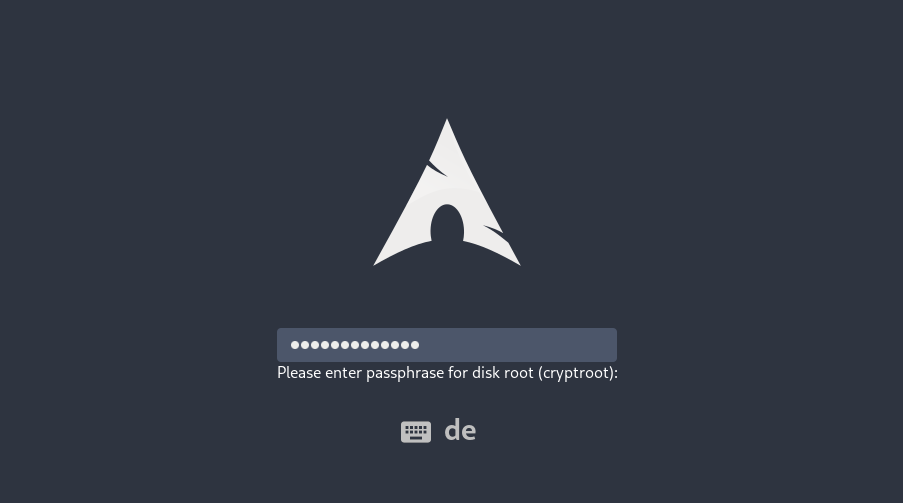
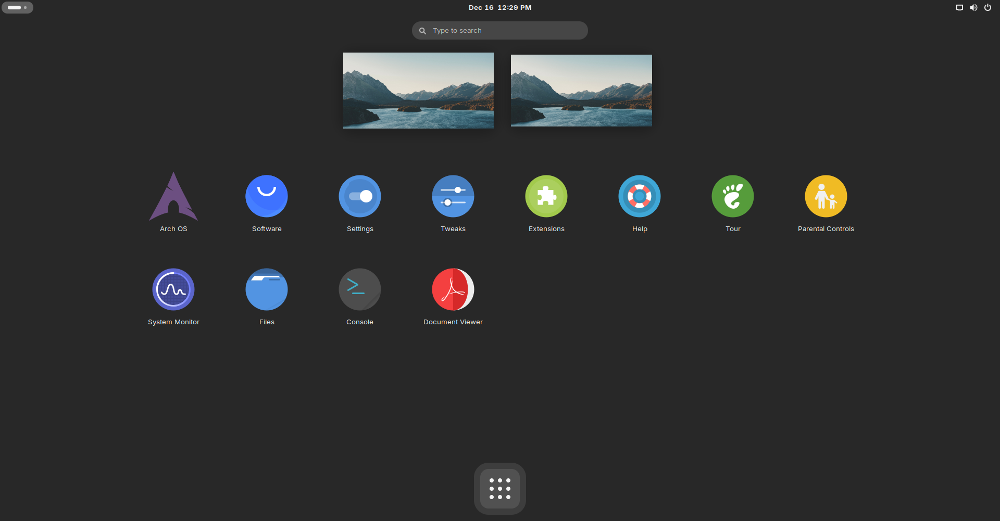
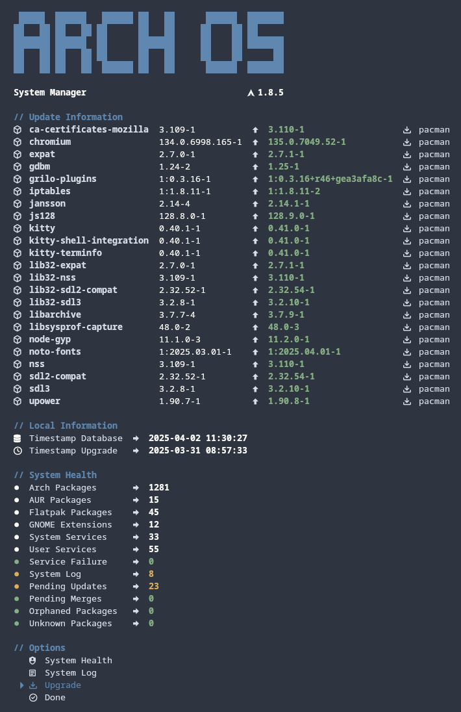
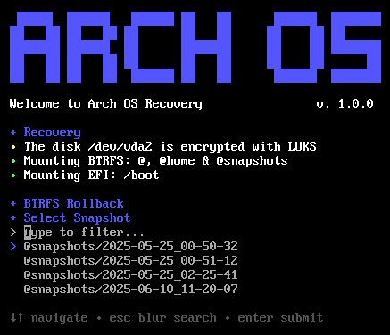

<h1 align="center">
  
  <p>Arch OS</p>
</h1>

<div align="center">

<p><strong>Boot from latest <a target="_blank" href="https://github.com/murkl/arch-os/releases/latest">Arch OS ISO</a> to launch the Installer automatically.</strong></p>

 <p>Alternatively boot from official <a target="_blank" href="https://archlinux.org/download/">Arch Linux ISO</a> and run</p>

**`curl -Ls bit.ly/arch-os | bash`**

<p><b>

[➜ Step by Step Installation Guide](#arch-os-installation)

</b></p>

<p></p>

<p><b>

[➜ More Screenshots](#screenshots)

</b></p>

<p>Optimized for <b>Gaming, Emulation, Audio & Development</b></p>

<p>
This project aims to provide a mostly automized, minimal and robust Arch Linux base (minimal tty core or desktop), along with an easy-to-use and fast properties-file-based installer with error handling. Install a minimal Arch Linux core with optional features such as GNOME Desktop with Graphics Driver, Automatic Housekeeping, Zen Kernel, Fancy Shell Enhancement, preinstalled Paru as AUR Helper, enabled MultiLib, Bootsplash, System Manager and some more...</p>

## More Information

<p>
  
  
</p>

**[➜ Arch OS Documentation](DOCS.md)**<br>
<b><a about="_blank" href="https://t.me/archos_community">➜ t.me/archos_community</a></b>

<p><sub>100% shellcheck approved</sub></p>

</div>

## Core Features

-   [Minimal Arch Linux](DOCS.md#minimal-installation) (~150 packages)
-   [Zen Kernel](DOCS.md#advanced-installation) (configurable)
-   [Swap](DOCS.md#swap) with zram-generator (zstd)
-   [Sole OS](DOCS.md#partitions-layout)
-   BTRFS Snapshot Support (Snapper, OverlayFS)
-   All-in-One password (encryption, root & user)
-   Multilingual Support
-   Filesystem btrfs or ext4
-   Bootloader: grub or systemd (auto updated)
-   Silent Boot (optional)
-   Systemd OOM (out-of-memory killer)
-   Pacman parallel downloads & eyecandy (optional)
-   Network Manager
-   SSD Support (fstrim)
-   Microcode Support (Intel & AMD)
-   Disabled Watchdog (optional)
-   UEFI only supported
-   [More Information...](DOCS.md#technical-information)

## Desktop Features

-   [GNOME Desktop Environment](DOCS.md#recommendation) (optional with additional packages)
-   [Arch OS Slim Version](DOCS.md#example-installerconf) (GNOME Core Apps only)
-   [Graphics Driver](DOCS.md#install-graphics-driver-manually) (Mesa, Intel i915, NVIDIA, AMD, ATI)
-   [Pipewire Audio](DOCS.md#for-audiophiles) (Dolby Atmos supported)
-   Flatpak Support + Auto Update (GNOME Software)
-   Samba, Networking Protocol Libs, Git, Utils & Codecs included
-   GNOME Power Profiles Support (tuned-ppd)
-   VPN Support
-   Basic Fonts
-   Wayland optimized
-   Auto GNOME Login enabled
-   Printer Support (cups)
-   SSH Agent (gcr)
-   Gamemode preinstalled
-   No Xorg included

## Additional Features

-   [Arch OS Core Tweaks](DOCS.md#core-tweaks)
-   [Arch OS Bootsplash](https://github.com/murkl/plymouth-theme-arch-os)
-   [Arch OS System Manager](DOCS.md#arch-os-manager)
-   [Arch OS Shell Enhancement](DOCS.md#shell-enhancement)
-   [Arch OS Starship Theme](https://github.com/murkl/starship-theme-arch-os)
-   [Arch OS Automatic Housekeeping](DOCS.md#housekeeping)
-   [AUR Helper](DOCS.md#advanced-installation) (configurable)
-   [VM Support](DOCS.md#vm-support) (optional)
-   32 Bit Support (Multilib)
-   Disk Encryption (LUKS2)

## Arch OS Installation

To install Arch OS, an internet connection is required, as many packages will be downloaded during the installation process.

### 1. Prepare bootable USB Device

-   Download latest Arch OS ISO from **[GitHub](https://github.com/murkl/arch-os/releases/latest)**
    -   Alternatively, download official Arch Linux ISO from **[archlinux.org](https://www.archlinux.org/download)** or **[archlinux.de](https://www.archlinux.de/download)**
-   Use **[Ventoy](https://www.ventoy.net/en/download.html)** or your prefered iso writer tool to create a bootable USB device
-   Alternatively (Linux only): **[➜ Arch OS Creator](https://github.com/murkl/arch-os-creator)**

### 2. Configure BIOS / UEFI Settings

-   Disable Secure Boot
-   Set Boot Mode to UEFI

### 3. Boot from USB Device

-   Load prefered keyboard layout (optional): `loadkeys de`
-   Connect to WLAN (optional): `iwctl station wlan0 connect 'SSID'`

#### 3.1. Run Arch OS Installer

```
curl -Ls bit.ly/arch-os | bash
```

**Note:** _Cancel the Arch OS Installer with `Ctrl + c`. The properties will be restored upon the next execution._

**[➜ See Advanced Installation](DOCS.md#advanced-installation)**

## System Maintenance

<p></p>

After installing Arch OS with the default properties preset, most maintenance tasks are performed automatically. However, the following steps must be executed manually on a regular basis:

-   Regularly upgrade your system packages (Pacman/AUR & Flatpak)
-   Regularly read the **[Arch Linux News](https://www.archlinux.org/news)** (preferably before upgrading your system)
-   Regularly check & merge new configurations with `pacdiff` (preferably after each system upgrade)
-   Consult the **[Arch Linux Wiki](https://wiki.archlinux.org)** (if you need help)

To streamline this process, you can use the preinstalled **[➜ Arch OS System Manager](https://github.com/murkl/arch-os-manager)**

If you need to rescue your Arch OS in case of a crash, boot from an **[Arch ISO Device](#1-prepare-bootable-usb-device)** and start the **[➜ Arch OS Recovery](https://github.com/murkl/arch-os-recovery)** with:

```
curl -Ls bit.ly/arch-os-recovery | bash
```

<details>

<summary><h2 style="display: inline;" id="screenshots">Screenshots</h2></summary>

<div align="center">
  <p><div></div><sub><i>Desktop Demo</i></sub></p>
  <p><div></div><sub><i>Bootsplash Demo</i></sub></p>
  <p><div></div><sub><i>Starship Demo</i></sub></p>
  <p><div></div><sub><i>Fetch Demo</i></sub></p>
  <p><div></div><sub><i>Desktop Core Apps Demo</i></sub></p>
  <p><div></div><sub><i>System Manager Demo</i></sub></p>
  <p><div></div><sub><i>BTRFS Recovery Demo</i></sub></p>
</div>

</details>
