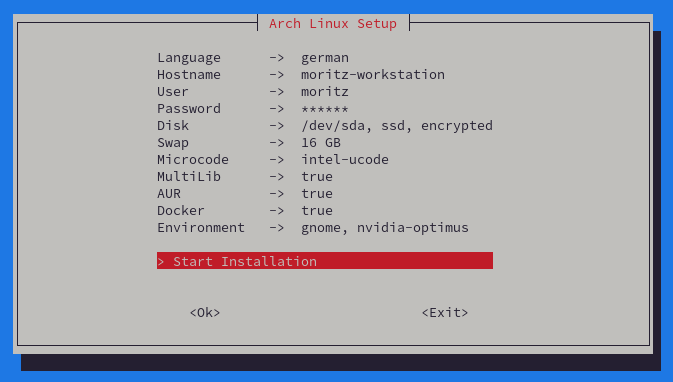

<h1 align="center">Arch Linux Distro</h1>

<div align="center">
  <p></p>
  <p>
    
    
  </p>
</div>

This script installs an encrypted and minimal version of Arch Linux with optionally paru preinstalled as AUR Helper and Multilib enabled. In addition, you can select GNOME as Desktop Environment.

# Features

- 100% TUI Installation
- Bootable Arch USB Creator
- Recovery Support
- Configurable Install Properties
- Minimal Arch Linux Installation
- GNOME Desktop Environment (optional)
- Bootloader (systemd-boot)
- Network Manager (WiFi & Ethernet)
- Reflector & Pacman Parallel Downloads
- Disk Encryption (optional)
- Multilib & Paru AUR Helper (optional)
- User Scripts Support (optional)
- Only UEFI Support

# Step by Step Installation

- Create bootable Arch USB Device from latest [Arch ISO](https://www.archlinux.de/download)
  - `curl -Ls http://arch.webhop.me | bash`
  - Alternatively use [Etcher](https://www.balena.io/etcher)
- Disable Secure Boot
- Set Boot Mode to UEFI
- Boot from Arch USB Device...
  - Load Keyboard Layout (use prefered language)
    - `loadkeys de-latin1`
  - If you are using WLAN, run `iwctl` and type into console
    - `station wlan0 connect "SSID"`
  - Install Arch Linux or open Recovery
    - `curl -Ls http://arch.webhop.me | bash`
  - Boot into new Arch Linux System
    - `reboot`

# Additional Customization

<p></p>

If you prefer, you can make these customizations manually. This is not part of the installation.

## GNOME Shell Extensions

- https://extensions.gnome.org/extension/1160/dash-to-panel/
- https://extensions.gnome.org/extension/615/appindicator-support/
- https://extensions.gnome.org/extension/1010/archlinux-updates-indicator/
- https://extensions.gnome.org/extension/19/user-themes/
- https://extensions.gnome.org/extension/3843/just-perfection/
- https://extensions.gnome.org/extension/5237/rounded-window-corners/
- https://extensions.gnome.org/extension/5612/focus-indicator/
- https://extensions.gnome.org/extension/3733/tiling-assistant/
- https://extensions.gnome.org/extension/3193/blur-my-shell/

## Theming

- Icon Theme: https://github.com/vinceliuice/Tela-icon-theme
- Firefox Theme: https://github.com/rafaelmardojai/firefox-gnome-theme
- Libadwaita GTK Theme: https://github.com/lassekongo83/adw-gtk3
- Libadwaita GTK Colors: https://github.com/lassekongo83/adw-colors
- Libadwaita Customization Tool: https://github.com/GradienceTeam/Gradience

# Manual Usage

<p></p>

The script `arch-install.sh` must be executed after booting from latest [Arch ISO](https://www.archlinux.de/download).

If the given config or script in arguments starts with `http://` or `https://`, the regarding file will automatically downloaded by the script. You can optionally use multiple user scripts which will invoked in the last installation step. Add the `-f` argument to prevent the script from asking to continue the installation (useful when used by an auto installer script).

```
./arch-install.sh -c <config> [-f] [ -s <script1> -s <script2> ...]
```

### Examples

```
# Force execute with local config file location
./arch-install.sh -c install.conf -f

# Execute with remote location of config and the additional script file
./arch-install.sh -c http://domain.com/install.conf -s http://domain.com/install-gnome.sh

# Execute with mixed locations of config and additional script files
./arch-install.sh -c install.conf -s install-driver.sh -s http://domain.com/install-gnome.sh
```

## Configuration

Each property is required and will be checked before installation. If one of these properties is missing, the installation will be aborted. Here you can see an example configuration with all required properties:

```
ARCH_HOSTNAME="virt" # Hostname
ARCH_USERNAME="moritz" # Username
ARCH_PASSWORD="secret" # User password & encryption
ARCH_DISK="/dev/vda" # Disk
ARCH_BOOT_PARTITION="/dev/vda1" # Boot partition
ARCH_ROOT_PARTITION="/dev/vda2" # Root partition
ARCH_FSTRIM_ENABLED="false" # SSD support
ARCH_ENCRYPTION_ENABLED="true" # Encrypt
ARCH_SWAP_SIZE="8" # Swap (0 = disabled)
ARCH_MICROCODE="none" # intel-ucode | amd-ucode
ARCH_MULTILIB_ENABLED="true" # 32 Bit support
ARCH_AUR_ENABLED="true" # Install paru
ARCH_TIMEZONE="Europe/Berlin" # Timezone
ARCH_LOCALE_LANG="de_DE.UTF-8" # Language
ARCH_LOCALE_GEN_LIST=("de_DE.UTF-8 UTF-8" "de_DE ISO-8859-1" "de_DE@euro ISO-8859-15" "en_US.UTF-8 UTF-8") # Language
ARCH_VCONSOLE_KEYMAP="de-latin1-nodeadkeys" # Console keymap
ARCH_VCONSOLE_FONT="eurlatgr" # Console font
ARCH_DOCKER_ENABLED="true" # Enable docker
ARCH_PKGFILE_ENABLED="true" # Enable package suggestion
ARCH_WATCHDOG_ENABLED="false" # Disable watchdog
ARCH_SHUTDOWN_TIMEOUT_SEC="5s" # Shutdown timeout
```

### Additional Properties

These additional array property is not necessary, but can be used to install additional packages. For example:

```
ARCH_OPT_PACKAGE_LIST=("terminus-font" "iw" "wpa_supplicant")
```

If you need an additional property in your user script file, simply add it to this configuration file. For example:

```
...
ENVIRONMENT_DESKTOP="gnome"
ENVIRONMENT_DRIVER="nvidia"
```

**Note:** This additional properties will not be checked from install script.

## User Scripts

Scripts are optional and can be passed to the install script with `-s user_script1.sh -s user_script2.sh ...`. If multiple scripts are used, execution occurs in the order in which the arguments are passed. Each script will executed at the end of the Arch Linux installation with user rights and without asking for the root password (if `sudo` is used). You should use exit codes in your script. In case of your script return with `exit 1`, the installation fails. When install AUR packages in your scripts, you have to use `makepkg` instead of `paru`. In your script you have access to all properties of the config file. Here are some examples:

```
#!/usr/bin/env bash

# Install package (sudo will executed without promting for password)
sudo pacman -S --noconfirm --needed <package_name> || exit 1

# Install AUR package
git clone https://aur.archlinux.org/<aur_package_name>.git || exit 1
cd <aur_package_name> || exit 1
yes | LC_ALL=en_US.UTF-8 makepkg -sif || exit 1

# Check additional property
[ "$ENVIRONMENT_DESKTOP" = "gnome" ] || exit 1

# Finished
exit 0
```

## Technical Info

<p></p>

### Packages

This packages will be installed during Arch installation:

```
base base-devel linux linux-firmware networkmanager reflector git nano bash-completion [docker docker-compose] [pkgfile] [microcode_pkg]
```

### Services

This services will be enabled during Arch installation:

```
NetworkManager systemd-timesyncd.service reflector.service [docker.service] [fstrim.timer] [pkgfile-update.timer]
```
