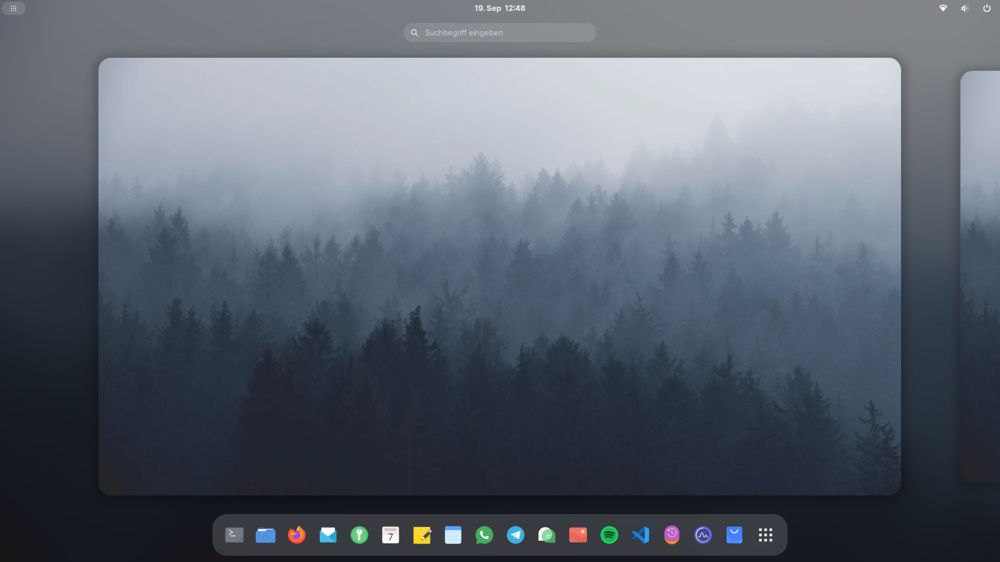
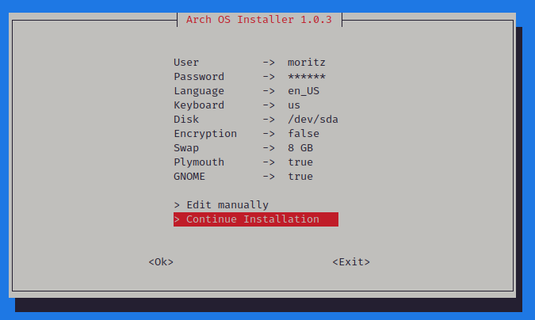

<h1 align="center">
  
  <p>Arch OS</p>
</h1>

<p align="center"><strong>Run TUI Installer from official <a target="_blank" href="https://archlinux.org/download/">Arch ISO</a></strong></p>

<div align="center">

```
curl -Ls http://arch.webhop.me | bash
```

</div>

<p align="center"></p>

<div align="center">

**[➜ Open Arch OS Docs](DOCS.md)**

</div>

<p align="center">
This project aims to provide a minimal and solid Arch Linux base for desktop usage and an easy and fast to use installer for that.
Installs a Arch Linux Distribution with automatic housekeeping, Zen Kernel, optional GNOME as desktop with graphics driver, preinstalled Paru as AUR Helper, enabled MultiLib, Pipewire Audio and some more features...
</p>

<p align="center"><strong>Sole OS on a single disk</strong></p>

<p align="center">
  
  
</p>

<p align="center">
  <strong>Test successful</strong>
  <br>
  <a target="_blank" href="https://www.archlinux.de/releases/2024.01.01">archlinux-2024.01.01-x86_64.iso</a>
</p>

## Features

- 100% Intuitive TUI Installation
- Advanced Installer Properties (see Arch OS Docs)
- Minimal Arch Linux Base (Zen Kernel)
- Automatic Arch Linux Housekeeping (except updates)
- Minimal Vanilla GNOME Desktop + Autologin (optional)
- Graphics Driver & Gamemode (Mesa, Intel i915, NVIDIA, AMD)
- Pipewire Audio (Dolby Atmos supported)
- Wayland optimized
- AUR Helper & Multilib included
- Flatpak Support + Auto Update (GNOME Software)
- Disk Encryption (optional)
- Designed as the only OS on the disk
- UEFI only supported
- Systemd Bootloader (auto updated)
- Systemd OOM (out-of-memory killer)
- Preconfigured fish shell (optional)
- Preconfigured neofetch to show system info (optional)
- Preconfigured starship for fancy Shell promt (optional)
- Preconfigured exa as colorful ls replacement (optional)
- Preconfigured bat as colorful man replacement (optional)
- Missing package suggestion for commands
- Automatic Pacman mirrorlist update (on every startup)
- Pacman parallel downloads
- Pacman automatic cache optimization (weekly)
- Pacman & nano colors
- Network Manager
- Microcode Support (Intel/AMD)
- SSD Support
- Firmware Update Tool preinstalled
- GNOME Power Profiles Support
- Samba, Networking Protocol Libs, Git, Utils & Codecs included
- Printer Support
- VM Support (tested in GNOME Boxes)
- Installer Error Handling
- Shellcheck approved
- [Arch OS Bootsplash](https://github.com/murkl/plymouth-theme-arch-os) (optional)

## Installation

<p></p>

### 1. Prepare bootable USB Device

- Download latest Arch Linux ISO from **[archlinux.org](https://www.archlinux.org/download)** or **[archlinux.de](https://www.archlinux.de/download)**
- Use **[Ventoy](https://www.ventoy.net/en/download.html)** or your prefered iso writer tool to create bootable Device
- Alternatively (Linux only): `sudo dd bs=4M if=archlinux-*.iso of=/dev/sdX status=progress`

### 2. Configure BIOS Settings

- Disable Secure Boot
- Set Boot Mode to UEFI
- Set Real Time Clock to **[UTC](https://time.is/de/UTC)**

### 3. Boot from USB Device

- Load prefered keyboard layout (optional): `loadkeys de`
- Connect to WLAN (optional): `iwctl station wlan0 connect "SSID"`
- Run **Arch OS Installer**: `curl -Ls http://arch.webhop.me | bash`
- Installation finished

## Usage

For a robust & stable Arch OS experience, install as few additional packages from the official [Arch Repository](https://archlinux.org/packages) or [AUR](https://aur.archlinux.org) as possible. Instead, use [Flatpak](https://flathub.org) or [GNOME Software](https://apps.gnome.org). For CLI tools you can try [Distrobox](https://distrobox.it/) or [Toolbox](https://containertoolbx.org) and as [Container Runtime](https://hub.docker.com) use [Podman](https://podman.io) or [Docker](https://www.docker.com). Furthermore change system files only if absolutely necessary and perform regular package upgrades.

### For Gamer

For native **Microsoft Windows Gaming** install [Qemu](https://wiki.archlinux.org/title/QEMU) and enable GPU Passthrough. Then you can use an emulated Microsoft Windows with native GPU access. For quick installation, have a look to this project: [quickpassthrough](https://github.com/HikariKnight/quickpassthrough)

These are the general commands to maintain your Arch OS:

### Show system info

```
fetch
```


### Update system

```
paru -Syu
```

### Search package

```
paru -Ss <my search string>
```

### Install package

```
paru -S <my package>
```

### List installed packages

```
paru -Qe
```

### Remove package

```
paru -Rsn <my package>
```

## More Information

**[➜ Open Arch OS Docs](DOCS.md)**
