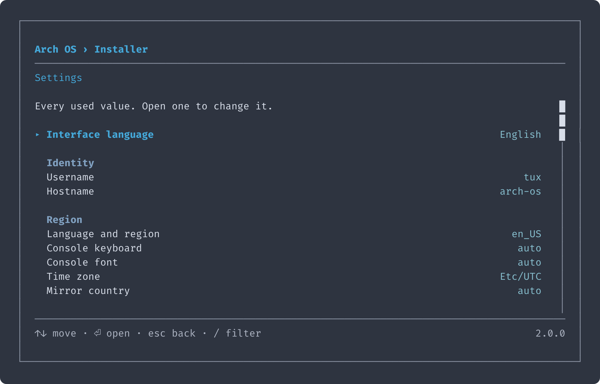
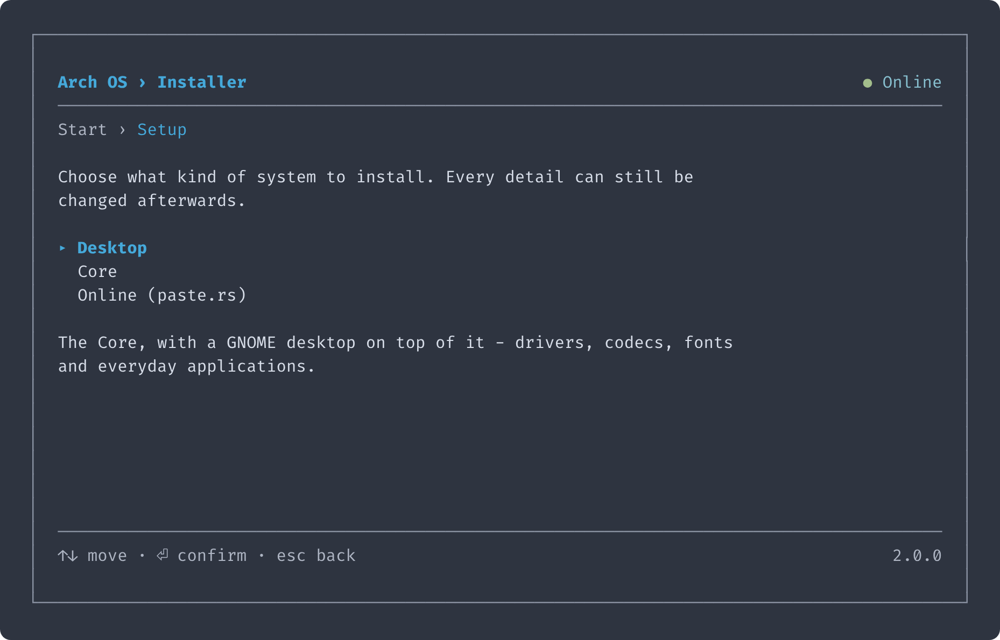
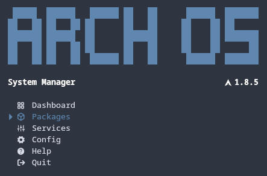
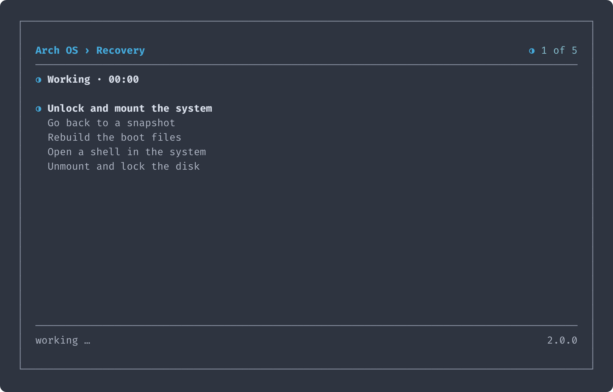
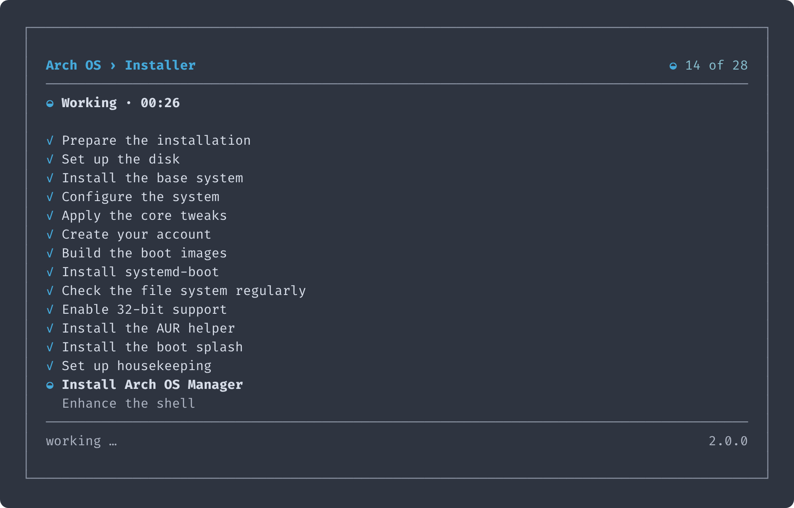
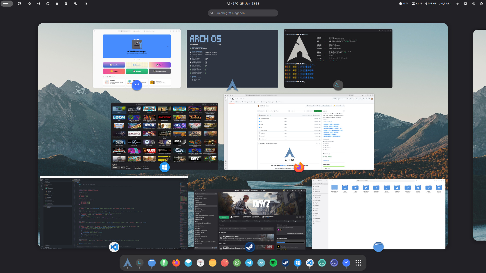
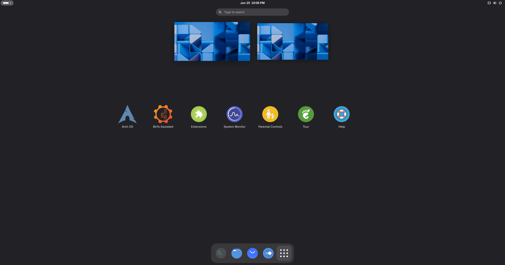
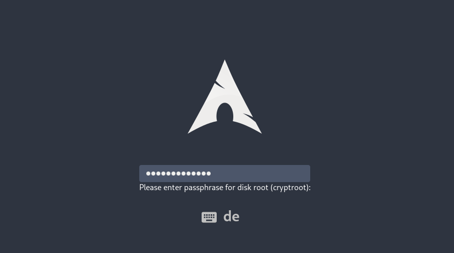
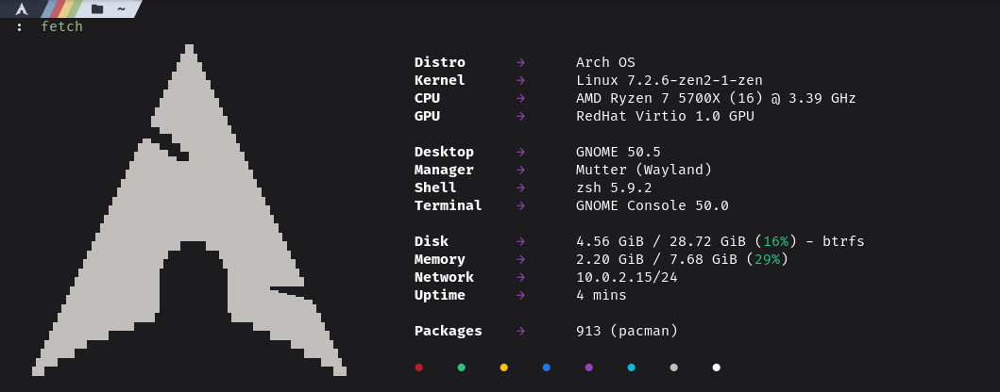
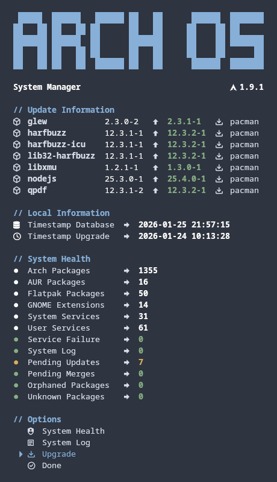

<h1 align="center">
  
  <p>Arch OS</p>
</h1>

<div align="center">

<p><strong>A minimal, reproducible Arch Linux base — tty-only or with a full GNOME desktop.</strong></p>

<p><code>curl -Ls bit.ly/arch-os | bash</code></p>

<p>
  
  
</p>

<p></p>

</div>

## What you get

- Minimal Arch Linux base, GNOME desktop optional — full or slim
- LUKS2 disk encryption, btrfs or ext4
- Btrfs snapshots (Snapper), taken before every package transaction
- Secure Boot with your own keys and a signed unified kernel image, re-signed on
  every kernel update
- Your choice of bootloader (systemd-boot or GRUB) and kernel
- Dual boot aware partitioning
- Graphics drivers (Mesa, Intel, NVIDIA, AMD), Plymouth boot splash
- AUR helper, 32-bit support, automatic housekeeping timers
- Shell enhancement (bash, zsh or fish) and a system manager TUI
- Samba sharing, mirrors ranked by country
- English and German interface — a tree can add its own language
- A recovery on the same image that rolls a broken system back, without a network

## Installing

You need a UEFI machine with Secure Boot switched off and an internet
connection. Run the same command twice — where it runs decides what it does:

```sh
curl -Ls bit.ly/arch-os | bash
```

1. **On your own machine** it fetches the latest image, verifies its checksum
   and writes it to a USB device you pick.
   ([Ventoy](https://www.ventoy.net) or `dd` work just as well.)
2. **Boot the target machine from that device.** The installer starts on its
   own — no keymap or network step first.
3. **Answer the questions.** Every answer is saved as it is given, so an
   interrupted run picks up where it left off.

On a stock [Arch Linux ISO](https://archlinux.org/download/) the same command
starts an installation instead: it fetches the latest release, unpacks it and
runs it. `MODE=install|create` picks a half by hand, `DEBUG=true` keeps both off
the hardware.

<p></p>

## Maintenance

<p></p>

The preinstalled system manager handles the routine: package and Flatpak
updates, `pacdiff`, Snapper housekeeping. Worth doing yourself:

- Read the [Arch Linux news](https://www.archlinux.org/news) before a big upgrade
- Roll back with Btrfs Assistant (or `snapper`) when an update goes wrong
- Boot the installation image and type **`recovery`** when the system no longer
  starts at all: it unlocks the disk, puts a snapshot back in place of the root
  subvolume, rebuilds the kernel images from the package cache and hands you a
  shell inside the repaired system — no network needed

<p></p>

## How it is built

Four parts, deliberately kept apart — see
[CONTRIBUTING.md](../CONTRIBUTING.md).

| | |
|---|---|
| [`runtime/`](../runtime) | a Go binary that draws the interface, asks the questions and runs shell in order. It knows nothing about Arch, disks or packages — there is not one of those words in it. |
| [`installer/`](../installer) | everything that does: one `installer.yaml`, the questions it asks, and a folder per step of the installation. |
| [`recovery/`](../recovery) | the same shape again, for repairing a system that is already on a disk: its own `recovery.yaml`, its own steps, its own answers. |
| [`iso/`](../iso) | turns a build of the three into a bootable image that starts the installer on boot. |

The two trees are **data, not programs**: one binary runs either of them, and
which one is a folder it is pointed at. That is why the image carries two
commands — `installer` and `recovery` — and one executable. Adding a question is
a few lines of YAML; adding a step is a folder with two files in it; neither is a
change to the runtime, and the runtime cannot break Arch-specific behaviour it
has never heard of.

<details>
<summary><h2 style="display: inline;" id="screenshots">More screenshots</h2></summary>

<div align="center">
  <p><div></div><sub><i>Installing</i></sub></p>
  <p><div></div><sub><i>Desktop</i></sub></p>
  <p><div></div><sub><i>Desktop core apps</i></sub></p>
  <p><div></div><sub><i>Boot splash</i></sub></p>
  <p><div></div><sub><i>Shell prompt</i></sub></p>
  <p><div></div><sub><i>System info</i></sub></p>
  <p><div></div><sub><i>System manager</i></sub></p>
</div>

</details>
