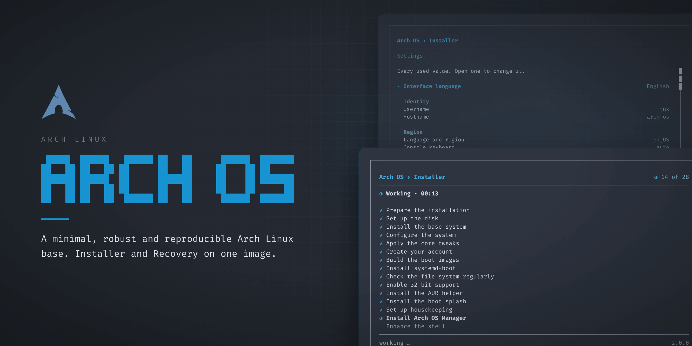
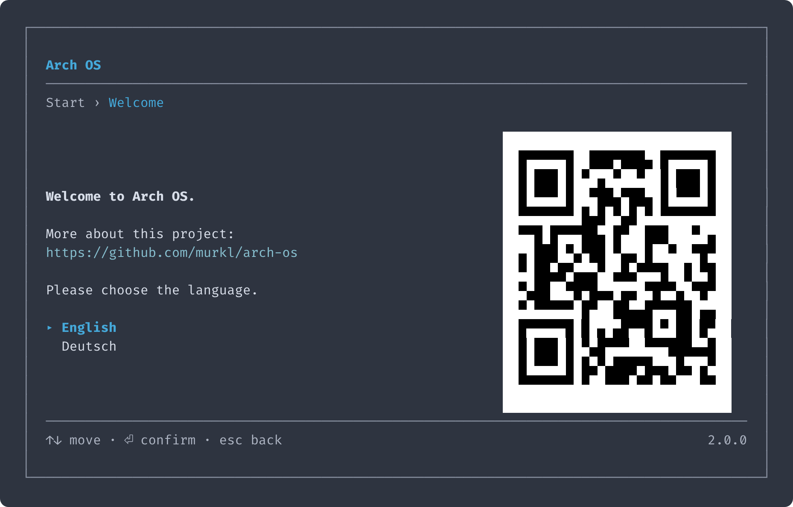

<div align="center">



<p>
  
  
  
</p>

<p><b>Install Arch Linux with ease — as a desktop or a TTY system.</b></p>

<p>A GNOME desktop or a bare text console, the same minimal base underneath. Boot the latest <b><a href="https://github.com/murkl/arch-os/releases/latest">Arch OS ISO</a></b> and Arch OS starts on its own.</p>

<p>Or run this on any Linux machine. An ordinary desktop writes the ISO to a USB device; a booted <a href="https://archlinux.org/download/">Arch Linux ISO</a> installs or repairs.</p>

**`curl -Ls https://bit.ly/archos | bash`**

<p><b>

[➜ Installation](#installation) · [➜ Screenshots](#screenshots) · [➜ Reference](REFERENCE.md) · [➜ Contributing](CONTRIBUTING.md) · [➜ t.me/archos_community](https://t.me/archos_community)

</b></p>

</div>

## Features

- Minimal Arch Linux base, UEFI only: linux-zen, btrfs and systemd-boot on a disk of its own - the same on every machine
- Disk encryption (LUKS2) and Secure Boot with your own keys
- One password for encryption, root and user; automatic login behind an encrypted disk
- Btrfs snapshots before every package change (Snapper), rolled back with the Recovery
- GNOME on Wayland, or a bare text console; the graphics driver for every Intel, AMD and NVIDIA card is detected
- Desktop extras: codecs, fonts, printing, Samba and `.local` discovery, Extension Manager and GNOME Firmware; or a slim install with GNOME core apps only
- Flatpak with Flathub, managed from Bazaar
- Zram swap, fstrim, microcode, NetworkManager, mirrors ranked by country
- Tuned rather than left at the defaults - see the **[➜ Reference](REFERENCE.md)**
- AUR helper, 32-bit support, container engine, firewall, SSH server, automatic housekeeping
- The text editor of your choice - nano, vim, neovim, micro or helix - with a small configuration of its own: a theme close to the system's palette, line numbers, the mouse, and tabs of four spaces
- [Bootsplash](https://github.com/murkl/plymouth-theme-arch-os), System Manager, Shell Enhancement (zsh)
- Recovery in the boot menu and on the same image, works without a network - and opens straight on its menu, in your language, where a wireless network can be joined whenever something has to be fetched
- Wireless network joined from the Installer itself, before the first download, and whether this machine is online always in the corner of the screen
- Create boot medium: writes the USB device from any Linux machine, no root needed but for the write itself - and the password for that is typed into the interface like any other
- Virtual machines both ways: guest tools inside a VM on their own, libvirt and QEMU on real hardware if you want them
- Two starting points, **Core** and **Desktop** - everything else stays a row in the settings
- English and German interface, chosen on the first page or named outright: `installer --language=de`

## Installation

An internet connection is required. Without a cable, the Installer offers the wireless networks in range and joins one.

### 1. Prepare a bootable USB device

- Download the latest ISO from **[the release page](https://github.com/murkl/arch-os/releases/latest)** and write it with **[Ventoy](https://www.ventoy.net/en/download.html)** or any ISO writer. GitHub prints each file's SHA-256 beside it there, and both carry signed build provenance — the command is in the release notes
- Or let **Create boot medium** do it, on any Linux machine. It checks the ISO against the published checksum before it writes anything:

```
curl -Ls https://bit.ly/archos | bash
```

**Note:** _Runs as you, not root - only the write itself asks for a password. The program lands in `XDG_DOWNLOAD_DIR` or `~/Downloads` (`… | DOWNLOAD_DIR=<dir> bash` for another), the ISO wherever you answer, and an ISO already there is used rather than fetched again._

### 2. Set the firmware up

- Boot mode: UEFI
- Secure Boot: off for now - the Installer prepares it, switching it on is **[step 5](#5-switch-secure-boot-on)**

### 3. Boot from the USB device

Arch OS starts on its own and asks the language first:

<p></p>

Then, under the same wordmark, Installer or Recovery - and a starting point:

<p></p>

| Starting point | What it is |
| --- | --- |
| **Core** | A minimal Arch Linux on the text console, nothing graphical |
| **Desktop** | The Core, with GNOME on top |

Every value it sets is an ordinary answer, changeable afterwards. What is left to ask: account, region, disk.

**Note:** _From an official **[Arch Linux ISO](https://archlinux.org/download/)** the same command downloads Arch OS and starts it here instead. `… | bash -s -- --language=de` skips the first page, and so does `installer --language=de` from the prompt of the Arch OS ISO._

### 4. Reuse your answers

Every answer lands in `installer.conf` as it is given, so an interrupted run resumes. The password never does.

- **Share it:** upload to **[paste.rs](https://paste.rs)** at the end of a run, get a code back. The next installation can start from it, and asks only for its disk
- **Copy it:** put `installer.conf` beside the Installer on another machine. The disk it names is checked against that machine's own before anything is written

### 5. Switch Secure Boot on

Only if you left it on. The Installer signs the boot chain with keys of its own; switching Secure Boot on is the one step only the firmware can take.

```
sbctl status
```

| It says | Do |
| --- | --- |
| `✓` | Restart, switch Secure Boot on in the firmware |
| `✗` | Clear the Secure Boot keys in the firmware (setup mode), then `sudo sbctl enroll-keys -m`, restart, switch it on |

**Note:** _Until then the system boots as before. `sbctl verify` lists `/boot/vmlinuz-*` as not signed on purpose - **[➜ Secure Boot](REFERENCE.md#secure-boot)**._

## Recovery

<p></p>

Every installation carries it on a small partition of its own. Hold **space** while the machine starts and choose **Arch OS Recovery** - or boot the ISO and choose **Recovery**:

- Unlocks and mounts it at `/mnt`
- Rolls back to a Btrfs snapshot
- Rebuilds the kernel images from the local package cache
- Opens a shell inside it

From the ISO it asks two questions - keyboard and disk - and reads the rest off the machine. From its partition it asks none: it starts in the language and on the keyboard the system was installed with, on the disk it was started from, straight on its menu. No network needed either way - one can be joined from its menu for whatever is to be fetched.

There it is the only thing the machine runs, and there is no prompt behind it. Leaving it offers **Reset** where the ISO offers **Exit**: every answer is forgotten and the Recovery starts over. The shell inside the repaired system stays one of its steps, opening on **no**.

**Note:** _The one on the disk starts with Secure Boot on. For the ISO, switch it off in the firmware and on again afterwards - the Recovery signs what it rebuilds with the machine's own keys._

## Maintenance

<p></p>

Mostly automatic through the preinstalled **Arch OS System Manager**. By hand:

- Read the **[Arch Linux News](https://www.archlinux.org/news)** before upgrading
- Roll back with the **[Recovery](#recovery)** if an update breaks something - see **[➜ Rolling Back](REFERENCE.md#rolling-back)** for why only there
- Consult the **[Arch Linux Wiki](https://wiki.archlinux.org)**

<details>

<summary><h2 style="display: inline;" id="screenshots">Screenshots</h2></summary>

<div align="center">
  <p><div></div><sub><i>Welcome</i></sub></p>
  <p><div></div><sub><i>Installer</i></sub></p>
  <p><div></div><sub><i>Bootsplash</i></sub></p>
  <p><div></div><sub><i>Shell Enhancement</i></sub></p>
  <p><div></div><sub><i>Fetch</i></sub></p>
  <p><div></div><sub><i>System Manager</i></sub></p>
</div>

</details>

## Development

Five parts, kept apart:

| Part | What it does |
| --- | --- |
| **[`oak`](https://github.com/murkl/oak)** | Draws the interface, asks the questions, runs the shell |
| **[`modules/installer`](../modules/installer)** | Installs Arch Linux |
| **[`modules/recovery`](../modules/recovery)** | Repairs an installation already on disk |
| **[`modules/imager`](../modules/imager)** | Writes the device the other two boot from |
| **[`iso`](../iso)** | Turns a build of those into the bootable images: the ISO, and the Recovery the Installer writes beside the system |

Oak is the runtime, a repository of its own, and knows nothing about Arch Linux. Modules are data, not programs. A release is Oak with `oak.yaml` and `modules/` beside it. Which module a machine can open is that module's own `requires:` - nothing else holds a list.

**[➜ Reference](REFERENCE.md)** for what is put on the disk and why. **[➜ Changelog](../CHANGELOG.md)** for what each release changed. **[➜ Contributing](CONTRIBUTING.md)** for branches, releases, how a commit becomes an image.

## License

GPL-3.0. See **[LICENSE](../LICENSE)**.

## Credits

- **[Arch Linux](https://archlinux.org)**
- **[GNOME](https://www.gnome.org)**
- **[Oak](https://github.com/murkl/oak)**
