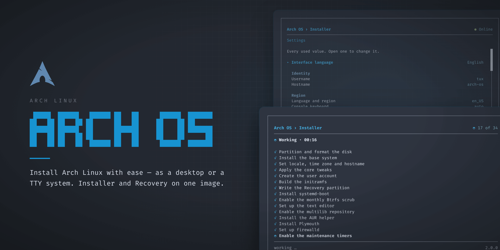
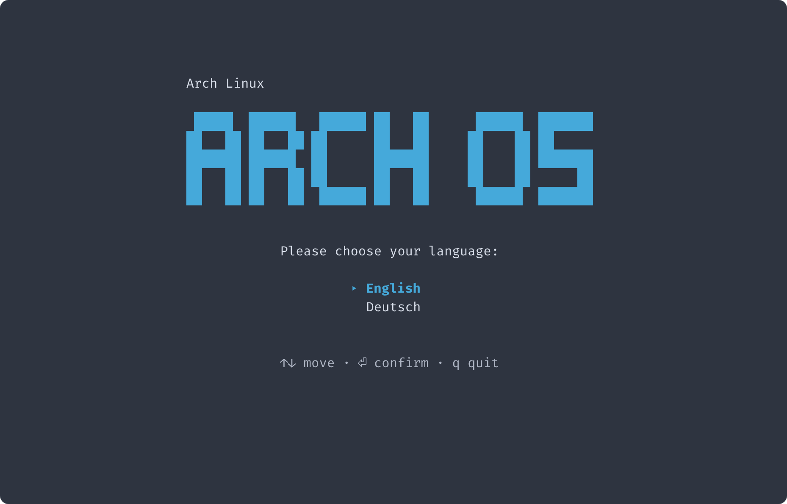
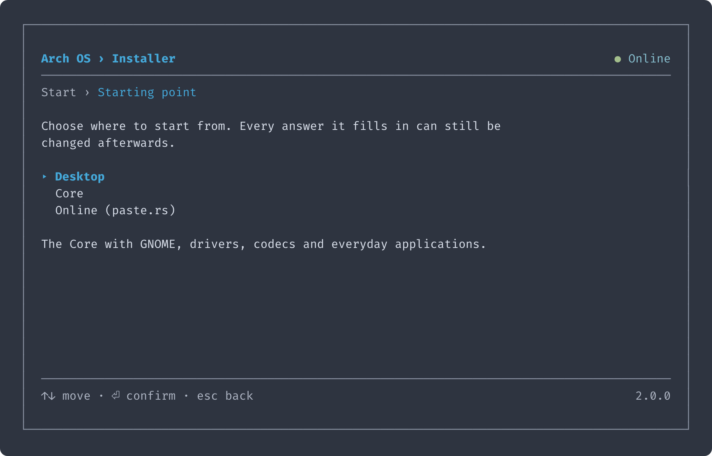
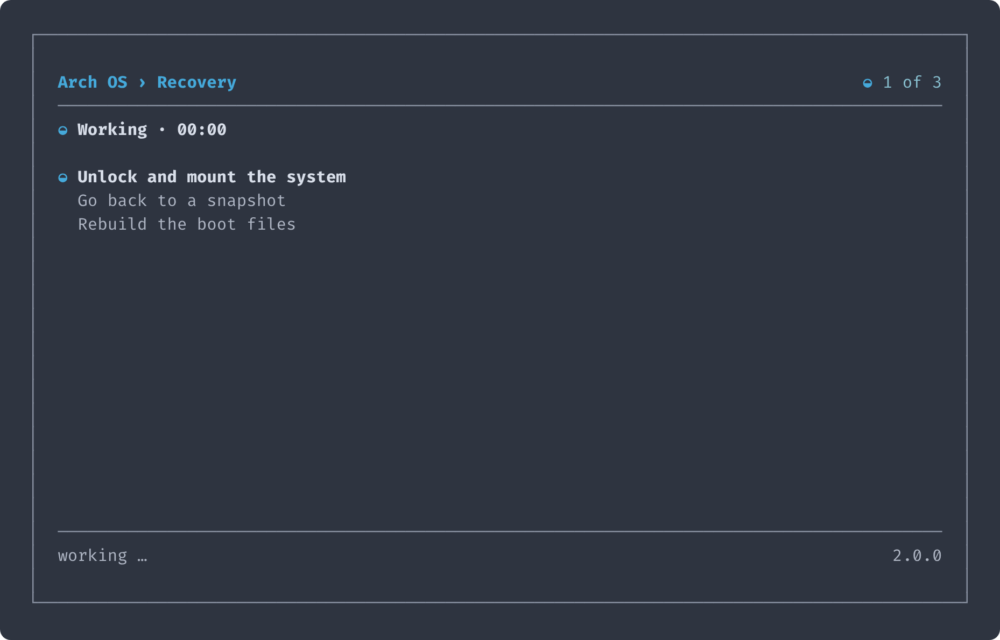
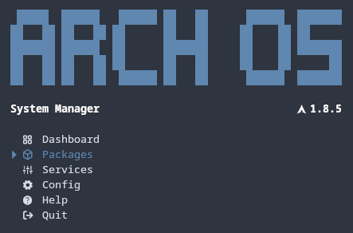
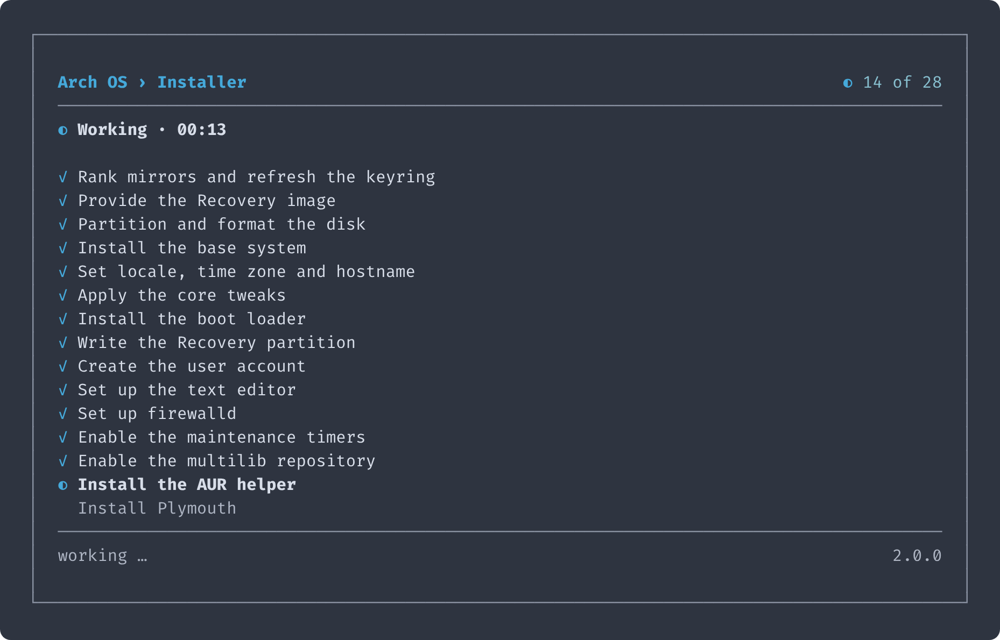
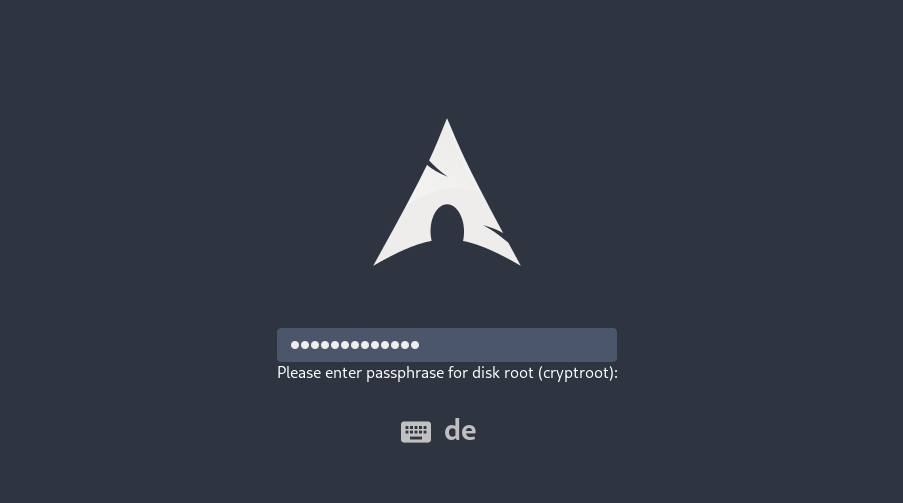
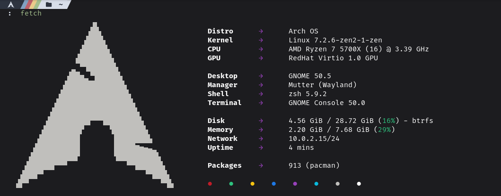
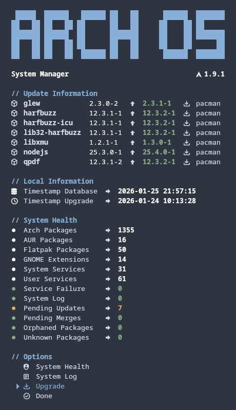

<div align="center">



<p>
  
  
  
</p>

<p><b>Install Arch Linux with ease - as a desktop or a TTY system.</b></p>

<p>Boot the latest <b><a href="https://github.com/murkl/arch-os/releases/latest">Arch OS ISO</a></b> and Arch OS starts on its own. Or run this on a booted <a href="https://archlinux.org/download/">Arch Linux ISO</a> to install or repair, and on any other Linux machine to write the ISO to a USB device.</p>

**`curl -Ls https://bit.ly/archos | bash`**

<p><b>

[➜ Installation](#installation) · [➜ Screenshots](#screenshots) · [➜ Reference](REFERENCE.md) · [➜ Contributing](CONTRIBUTING.md) · [➜ t.me/archos_community](https://t.me/archos_community)

</b></p>

</div>

## Features

- Minimal Arch Linux base, UEFI only: linux-zen, btrfs, systemd-boot
- Disk encryption (LUKS2) and Secure Boot with your own keys
- One password for disk and account, or a disk password of its own for a shared machine
- Btrfs snapshots before every package change, rolled back with the Recovery
- GNOME on Wayland or a bare text console, graphics drivers detected
- Desktop extras or a slim GNOME, Flatpak
- Browser and backup app of your choice
- Zram, fstrim, microcode, NetworkManager, mirrors ranked by country
- AUR helper, 32-bit support, containers, firewall, SSH, housekeeping
- Text editor of your choice: nano, vim, neovim, micro or helix
- [Bootsplash](https://github.com/murkl/plymouth-theme-arch-os), System Manager, Shell Enhancement (zsh)
- Recovery in the boot menu and on the ISO
- Create boot medium on any Linux machine
- Wireless network in the Installer and the Recovery
- Virtual machine guest tools, or QEMU and libvirt on hardware
- Starting points **Core** and **Desktop**, or a shared configuration
- English and German interface
- Tuned defaults - see the **[➜ Reference](REFERENCE.md)**

## Installation

An internet connection is required: a cable, or a wireless network joined in the Installer.

### 1. Prepare a USB Device

- Download the latest ISO from **[the release page](https://github.com/murkl/arch-os/releases/latest)** and write it with **[Ventoy](https://www.ventoy.net/en/download.html)** or any ISO writer
- Or let **Create boot medium** do it on any Linux machine:

```
curl -Ls https://bit.ly/archos | bash
```

### 2. Set the Firmware Up

- Boot mode: UEFI
- Secure Boot: off for now, see **[step 4](#4-switch-secure-boot-on)**

### 3. Install

Boot from the USB device. Arch OS starts on its own and asks the language first:

<p></p>

Then the **Installer** and a starting point:

<p></p>

| Starting point | What it is |
| --- | --- |
| **Core** | A minimal Arch Linux on the text console |
| **Desktop** | The Core with GNOME |

Left to ask: account, region, disk. Every value stays changeable in **Setup**, and **Start** installs.

### 4. Switch Secure Boot On

Only if you left it on in **Setup**: switch it on in the firmware after the first start. **[➜ Switching It On](REFERENCE.md#switching-it-on)**

## Recovery

<p></p>

On a partition of every installation. Hold **space** while the machine starts and choose **Arch OS Recovery**, or open **Recovery** among the applications:

- Unlocks and mounts the system at `/mnt`
- Rolls back to a Btrfs snapshot
- Rebuilds the kernel images from the package cache
- Opens a shell inside it

**[➜ The Recovery](REFERENCE.md#the-recovery)**

## Maintenance

<p></p>

Mostly automatic through the **Arch OS System Manager**. By hand:

- Read the **[Arch Linux News](https://www.archlinux.org/news)** before upgrading
- Roll back with the **[Recovery](#recovery)** - **[➜ Rolling Back](REFERENCE.md#rolling-back)**
- Consult the **[Arch Linux Wiki](https://wiki.archlinux.org)**

<details>

<summary><h2 style="display: inline;" id="screenshots">Screenshots</h2></summary>

<div align="center">
  <p><div></div><sub><i>Welcome</i></sub></p>
  <p><div></div><sub><i>Installer</i></sub></p>
  <p><div></div><sub><i>Bootsplash</i></sub></p>
  <p><div></div><sub><i>Shell Enhancement</i></sub></p>
  <p><div></div><sub><i>Fetch</i></sub></p>
  <p><div></div><sub><i>System Manager</i></sub></p>
</div>

</details>

## Development

| Part | What it does |
| --- | --- |
| **[`oak`](https://github.com/murkl/oak)** | The runtime: draws, asks, runs the shell |
| **[`modules/installer`](../modules/installer)** | Installs Arch Linux |
| **[`modules/recovery`](../modules/recovery)** | Repairs an installation |
| **[`modules/imager`](../modules/imager)** | Writes the boot medium |
| **[`iso`](../iso)** | Builds the ISO and the Recovery image |

Oak knows nothing about Arch Linux. Modules are data: YAML, and shell beside it in `oak.sh`.

**[➜ Reference](REFERENCE.md)** · **[➜ Changelog](../CHANGELOG.md)** · **[➜ Contributing](CONTRIBUTING.md)**

## License

GPL-3.0. See **[LICENSE](../LICENSE)**.

## Credits

- **[Arch Linux](https://archlinux.org)**
- **[GNOME](https://www.gnome.org)**
- **[Oak](https://github.com/murkl/oak)**
