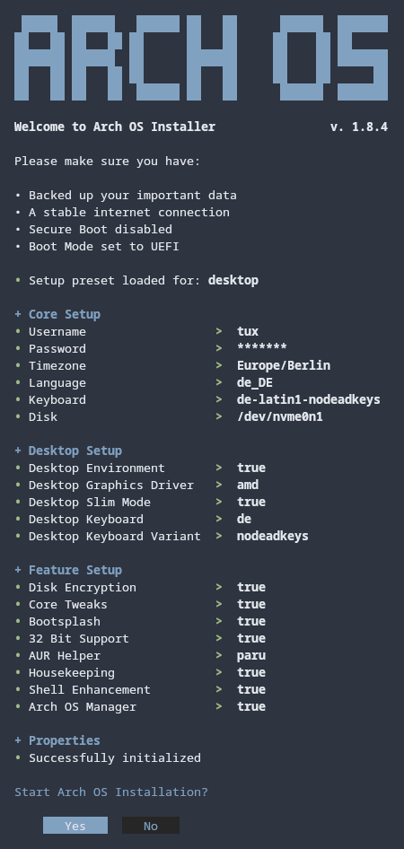

<h1 align="center">
  
  <br>
  Arch OS
</h1>

<p align="center">
  <strong>Run TUI Installer from booted Arch ISO</strong>
</p>

<div align="center">

```
curl -Ls http://arch.webhop.me | bash
```

</div>

<p align="center"></p>

<p align="center">
This project aims to provide a minimal and solid Arch Linux base for desktop users and an easy and fast to use installer for that.
Installs a Arch Linux Distribution including GNOME, preinstalled Paru as AUR Helper, enabled MultiLib and some more features. 
</p>

<p align="center"><strong>Sole OS on a single disk</strong></p>

<p align="center">
  
  
</p>

<p align="center">
  <strong>Test successful</strong>
  <br>
  <a target="_blank" href="https://www.archlinux.de/releases/2023.10.14">archlinux-2023.10.14-x86_64.iso</a>
</p>

# Contents

1. [Features](#features)
2. [Installation](#installation)
3. [Recommendation](#recommendation)
4. [Rescue & Recovery](#rescue--recovery)
5. [Information](#technical-info)

## Features

- 100% TUI Installation
- VM Support
- Minimal GNOME Desktop + Autologin (optional)
- Disk Encryption (optional)
- Systemd Bootloader (auto updated)
- Wayland optimized
- Network Manager
- Pipewire Audio
- AUR Helper & Multilib
- Microcode Support
- SSD Support
- Automatic mirrorlist update (on every startup)
- Missing package suggestion
- Pacman parallel downloads
- Pacman automatic cache optimization (weekly)
- Printer Support
- Pacman & nano colors
- Networking, Utils & Codecs included
- Installer Error Handling
- Tested in GNOME Boxes
- Shellcheck approved
- [Bootsplash](https://github.com/murkl/plymouth-theme-arch-elegant)

## Installation

<p></p>

### 1. Prepare bootable USB Device

- Download latest Arch Linux ISO from **[here](https://www.archlinux.de/download)**
- Show disk info with `lsblk`
- Write to device: `sudo dd bs=4M if=archlinux-*.iso of=/dev/sdX status=progress`
- Alternatively use **[Ventoy](https://www.ventoy.net/en/download.html)**

### 2. Configure BIOS Settings

- Disable Secure Boot
- Set Boot Mode to UEFI
- Set Real Time Clock to **[UTC](https://time.is/de/UTC)**

### 3. Boot from USB Device

- Load Keyboard Layout:
  - `loadkeys de-latin1` (use prefered language)
- Connect to WLAN (optional), run `iwctl` and type into console:
  - `station wlan0 connect "SSID"`
  - `exit`
- Run **Arch OS Installer** with:
  - `curl -Ls http://arch.webhop.me | bash`
- Installation finished

### Installation Properties (optional)

If the file `installer.conf` exists in the same dir as the script, it will sourced automatically on startup and the values will set as defaults for Arch Linux installation setup menu. After pressing `> Generate Config`, the `installer.conf` will be generated from the setup menu properties (except `ARCH_PASSWORD` for better security).

#### Add another Language

If you want to add another language, set `ARCH_LANGUAGE='custom'` and modify the desired properties. (see example of [installer.conf](#example-of-installerconf))

#### Example of `installer.conf`

```
# System Setup
ARCH_HOSTNAME='arch-desktop'
ARCH_USERNAME='my_user'
ARCH_DISK='/dev/sda'
ARCH_BOOT_PARTITION='/dev/sda1'
ARCH_ROOT_PARTITION='/dev/sda2'
ARCH_ENCRYPTION_ENABLED='false'
ARCH_SWAP_SIZE='8' # 0 or null = disable
ARCH_GNOME='true' # false = minimal arch

# Change to 'custom' to use custom language properties
ARCH_LANGUAGE='german'

# ls /usr/share/zoneinfo/
ARCH_TIMEZONE='Europe/Berlin'

# Country used by reflector. Leave empty to disable
ARCH_REFLECTOR_COUNTRY='Germany,France'

# ls /usr/share/i18n/locales
ARCH_LOCALE_LANG='de_DE.UTF-8'

# cat /etc/locale.gen
ARCH_LOCALE_GEN_LIST=('de_DE.UTF-8 UTF-8' 'de_DE ISO-8859-1' 'de_DE@euro ISO-8859-15' 'en_US.UTF-8 UTF-8')

# localectl list-keymaps
ARCH_VCONSOLE_KEYMAP='de-latin1-nodeadkeys'

# find /usr/share/kbd/consolefonts/*.psfu.gz
ARCH_VCONSOLE_FONT='eurlatgr'

# localectl list-x11-keymap-layouts
ARCH_KEYBOARD_LAYOUT='de'

# localectl list-x11-keymap-variants
ARCH_KEYBOARD_VARIANT='nodeadkeys'
```

## Recommendation

For a robust & stable Arch Linux experience, install as few additional packages from the main repository or AUR as possible. Instead, use Flatpak or Distrobox/Toolbox (Podman/Docker). Furthermore change system files only if absolutely necessary. And perform regular updates with `paru -Syu`

### Install Graphics Driver

- [OpenGL](https://wiki.archlinux.org/title/OpenGL)
- [Intel HD](https://wiki.archlinux.org/title/Intel_graphics#Installation)
- [NVIDIA](https://wiki.archlinux.org/title/NVIDIA#Installation)
- [NVIDIA Optimus](https://wiki.archlinux.org/title/NVIDIA_Optimus#Available_methods)
- [AMD](https://wiki.archlinux.org/title/AMDGPU#Installation)
- [ATI Legacy](https://wiki.archlinux.org/title/ATI#Installation)

### Additional Optimization (optional)

- Install [preload](https://wiki.archlinux.org/title/Preload) (start the service after installation: `sudo systemctl enable preload`)
- Install [mutter-performance](https://aur.archlinux.org/packages/mutter-performance) (great on Intel Graphics with Wayland)
- Use [downgrade](https://aur.archlinux.org/packages/downgrade) when you need to downgrade a package
- Use [starship](https://starship.rs/) for fancy Bash promt
- Use [exa](https://archlinux.org/packages/extra/x86_64/exa/) as colorful `ls` replacement
- Use [bat](https://archlinux.org/packages/extra/x86_64/bat/) as colorful `man` replacement
- Use [gamemode](https://wiki.archlinux.org/title/Gamemode) when playing games

### GNOME Shell Extensions (optional)

- https://extensions.gnome.org/extension/3843/just-perfection/
- https://extensions.gnome.org/extension/3193/blur-my-shell/
- https://extensions.gnome.org/extension/1010/archlinux-updates-indicator/
- https://extensions.gnome.org/extension/1873/disable-unredirect-fullscreen-windows/ (may fix some issues)

### Desktop Customization (optional)

- Icon Theme: https://github.com/vinceliuice/Tela-icon-theme
- Cursor Theme: https://github.com/alvatip/Nordzy-cursors
- Desktop Font: https://archlinux.org/packages/extra/any/inter-font/
- Firefox Theme: https://github.com/rafaelmardojai/firefox-gnome-theme
- Nautilus Folder Color: https://aur.archlinux.org/packages/folder-color-nautilus
- Libadwaita GTK Theme: https://github.com/lassekongo83/adw-gtk3

## Rescue & Recovery

If you need to rescue your Arch Linux in case of a crash, **boot from an Arch ISO device** and follow these instructions.

### 1. Disk Information

- Show disk info: `lsblk`

_**Example**_

- _Example Disk: `/dev/sda`_
- _Example Boot: `/dev/sda1`_
- _Example Root: `/dev/sda2`_

### 2. Mount

**Note:** _You may have to replace the example `/dev/sda` with your own disk_

- Create mount dir: `mkdir -p /mnt/boot`
- a) Mount root partition (disk encryption enabled):
  - `cryptsetup open /dev/sda2 cryptroot`
  - `mount /dev/mapper/cryptroot /mnt`
- b) Mount root partition (disk encryption disabled):
  - `mount /dev/sda2 /mnt`
- Mount boot partition: `mount /dev/sda1 /mnt/boot`

### 3. Chroot

- Enter chroot: `arch-chroot /mnt`
- _Fix your Arch Linux..._
- Exit: `exit`

## Technical Info

<div align="center">
<p></p>
<p></p>
</div>

### Core Packages

This packages will be installed during minimal Arch without GNOME installation (180 packages in total):

```
base base-devel linux linux-firmware networkmanager pacman-contrib reflector git nano bash-completion pkgfile [microcode_pkg]
```

### Core Services

This services will be enabled during minimal Arch without GNOME installation:

```
NetworkManager systemd-timesyncd.service reflector.service paccache.timer fstrim.timer pkgfile-update.timer systemd-boot-update.service
```
