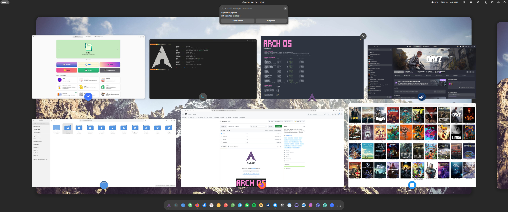

<h1 align="center">
  
  <p>Arch OS</p>
</h1>

<div align="center">

<p><strong>Boot from official <a target="_blank" href="https://archlinux.org/download/">Arch ISO</a> and run</strong></p>

**`curl -Ls bit.ly/arch-os | bash`**

<p><b>

[➜ Open Arch OS Docs](DOCS.md)

</b></p>

<p></p>

<p><b>

[➜ More Screenshots](DOCS.md#screenshots)

</b></p>

<p>
This project aims to provide a robust Arch Linux base for desktop usage, along with an easy-to-use and fast properties-file-based installer with error handling. Install a minimal Arch Linux core with optional features such as Automatic Housekeeping, Zen Kernel, GNOME Desktop with Graphics Driver, preinstalled Paru as AUR Helper, enabled MultiLib, Pipewire Audio, and some more....
</p>

<p>
  
  
</p>

<p>
  <strong>Test successful</strong>
  <br>
  <a target="_blank" href="https://www.archlinux.de/releases/2024.09.01">archlinux-2024.09.01-x86_64.iso</a>
  <br>
  <sub>100% shellcheck approved</sub>
</p>

</div>

## Arch OS Core Features

- [Minimal Arch Linux](DOCS.md#minimal-installation) (~150 packages)
- [Zen Kernel](DOCS.md#advanced-installation) (configurable)
- [Swap](DOCS.md#swap) with zram-generator (zstd)
- [Sole OS](DOCS.md#partitions-layout)
- Multilingual Support
- Filesystem ext4
- Silent Boot
- Systemd Bootloader (auto updated)
- Systemd OOM (out-of-memory killer)
- Pacman parallel downloads & eyecandy
- Network Manager
- SSD Support (fstrim)
- Microcode Support (Intel & AMD)
- Disabled Watchdog
- UEFI only supported
- [More Information ...](DOCS.md#technical-information)

## Additional Features (optional)

- [Arch OS Manager](DOCS.md#arch-os-manager)
- [Arch OS Core Tweaks](DOCS.md#core-tweaks)
- [Arch OS Bootsplash](https://github.com/murkl/plymouth-theme-arch-os)
- [Arch OS Shell Enhancement](DOCS.md#shell-enhancement)
- [Arch OS Automatic Housekeeping](DOCS.md#housekeeping)
- [AUR Helper](DOCS.md#advanced-installation) (configurable)
- [GNOME Desktop Environment](#desktop-features) (optional with enhanced packages)
- [Graphics Driver](DOCS.md#install-graphics-driver-manually) (Mesa, Intel i915, NVIDIA, AMD, ATI)
- [VM Support](DOCS.md#vm-support)
- 32 Bit Support (Multilib)
- Disk Encryption

## Desktop Features (optional)

- [Arch OS Slim Version](DOCS.md#example-installerconf) (GNOME Core Apps only)
- [Pipewire Audio](DOCS.md#for-audiophiles) (Dolby Atmos supported)
- Flatpak Support + Auto Update (GNOME Software)
- Samba, Networking Protocol Libs, Git, Utils & Codecs included
- Wayland optimized
- GNOME Power Profiles Support
- Auto Login enabled
- Printer Support (cups)
- Gamemode preinstalled
- Firmware Update Tool preinstalled

## Installing Arch OS

To install Arch OS, an internet connection is required, as many packages will be downloaded during the installation process.

### 1. Prepare bootable USB Device

- Download latest Arch Linux ISO from **[archlinux.org](https://www.archlinux.org/download)** or **[archlinux.de](https://www.archlinux.de/download)**
- Use **[Ventoy](https://www.ventoy.net/en/download.html)** or your prefered iso writer tool to create a bootable USB device
- Alternatively (Linux only): `sudo dd bs=4M if=archlinux-*.iso of=/dev/sdX status=progress`

### 2. Configure BIOS Settings

- Disable Secure Boot
- Set Boot Mode to UEFI

### 3. Boot from USB Device

- Load prefered keyboard layout (optional): `loadkeys de`
- Connect to WLAN (optional): `iwctl station wlan0 connect 'SSID'`

#### Run Arch OS Installer

```
curl -Ls bit.ly/arch-os | bash
```

_Cancel the Arch OS Installer with `CTRL + c`_

**[➜ See Advanced Installation](DOCS.md#advanced-installation)**

## More Information

Further information can be found in the documentation.

**[➜ Open Arch OS Docs](DOCS.md)**

<br>

<div align="center">

<p></p>

_Arch OS Demo Desktop_

</div>
