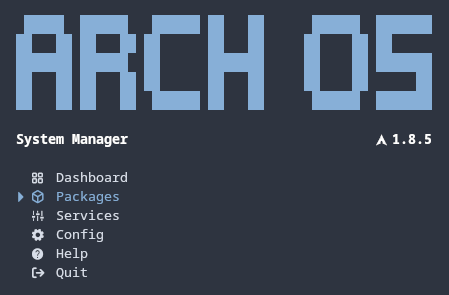
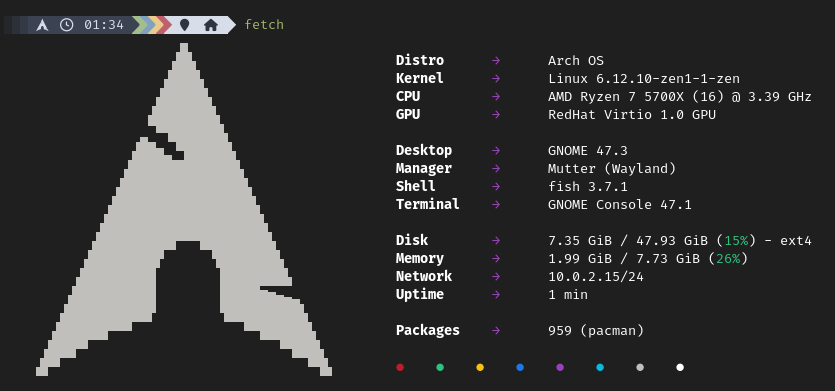

<h1 align="center">
  
  <p>Arch OS</p>
</h1>

<div align="center">

<p><strong>Boot from official <a target="_blank" href="https://archlinux.org/download/">Arch ISO</a> and run</strong></p>

**`curl -Ls bit.ly/arch-os | bash`**

<p><b>

[➜ Step by Step Installation Guide](#arch-os-installation)

</b></p>

<p></p>

<p><b>

[➜ More Screenshots](#screenshots)

</b></p>

<p>Optimized for <b>Gaming, Emulation, Audio & Development</b></p>

<p>
This project aims to provide a mostly automized, minimal and robust Arch Linux base (minimal tty core or desktop), along with an easy-to-use and fast properties-file-based installer with error handling. Install a minimal Arch Linux core with optional features such as GNOME Desktop with Graphics Driver, Automatic Housekeeping, Zen Kernel, Fancy Shell Enhancement, preinstalled Paru as AUR Helper, enabled MultiLib, Bootsplash, System Manager and some more...</p>

<sub><i>Setup takes less than 60 seconds...</i></sub>

## More Information

**[➜ Arch OS Docs](DOCS.md)**<br>
<strong><a about="_blank" href="https://t.me/archos_community">➜ t.me/archos_community</a></strong>

<p>
  
  
</p>

<p>
  <strong>Test successful</strong>
  <br>
  <a target="_blank" href="https://www.archlinux.de/releases/2024.12.01">archlinux-2024.12.01-x86_64.iso</a>
  <br>
  <sub>100% shellcheck approved</sub>
</p>

</div>

## Core Features

- [Minimal Arch Linux](DOCS.md#minimal-installation) (~150 packages)
- [Zen Kernel](DOCS.md#advanced-installation) (configurable)
- [Swap](DOCS.md#swap) with zram-generator (zstd)
- [Sole OS](DOCS.md#partitions-layout)
- All-in-One password (encryption, root & user)
- Multilingual Support
- Filesystem ext4
- Silent Boot (optional)
- Systemd Bootloader (auto updated)
- Systemd OOM (out-of-memory killer)
- Pacman parallel downloads & eyecandy (optional)
- Network Manager
- SSD Support (fstrim)
- Microcode Support (Intel & AMD)
- Disabled Watchdog (optional)
- UEFI only supported
- [More Information...](DOCS.md#technical-information)

## Desktop Features

- [GNOME Desktop Environment](DOCS.md#recommendation) (optional with additional packages)
- [Arch OS Slim Version](DOCS.md#example-installerconf) (GNOME Core Apps only)
- [Graphics Driver](DOCS.md#install-graphics-driver-manually) (Mesa, Intel i915, NVIDIA, AMD, ATI)
- [Pipewire Audio](DOCS.md#for-audiophiles) (Dolby Atmos supported)
- Flatpak Support + Auto Update (GNOME Software)
- Samba, Networking Protocol Libs, Git, Utils & Codecs included
- Wayland optimized
- GNOME Power Profiles Support
- Auto Login enabled
- Printer Support (cups)
- SSH Agent (gcr)
- Gamemode preinstalled
- Firmware Update Tool preinstalled

## Additional Features

- [Arch OS Core Tweaks](DOCS.md#core-tweaks)
- [Arch OS Bootsplash](https://github.com/murkl/plymouth-theme-arch-os)
- [Arch OS System Manager](DOCS.md#arch-os-manager)
- [Arch OS Shell Enhancement](DOCS.md#shell-enhancement)
- [Arch OS Automatic Housekeeping](DOCS.md#housekeeping)
- [AUR Helper](DOCS.md#advanced-installation) (configurable)
- [VM Support](DOCS.md#vm-support) (optional)
- 32 Bit Support (Multilib)
- Disk Encryption (LUKS2)

## Arch OS Installation

To install Arch OS, an internet connection is required, as many packages will be downloaded during the installation process.

### 1. Prepare bootable USB Device

- Download latest Arch Linux ISO from **[archlinux.org](https://www.archlinux.org/download)** or **[archlinux.de](https://www.archlinux.de/download)**
- Use **[Ventoy](https://www.ventoy.net/en/download.html)** or your prefered iso writer tool to create a bootable USB device
- Alternatively (Linux only): **[➜ Arch OS Creator](https://github.com/murkl/arch-os-creator)**

### 2. Configure BIOS / UEFI Settings

- Disable Secure Boot
- Set Boot Mode to UEFI

### 3. Boot from USB Device

- Load prefered keyboard layout (optional): `loadkeys de`
- Connect to WLAN (optional): `iwctl station wlan0 connect 'SSID'`

#### 3.1. Run Arch OS Installer

```
curl -Ls bit.ly/arch-os | bash
```

Select one of these presets to install your individual Arch Linux base:

- **`desktop`:** GNOME Desktop Environment + Graphics Driver + Extras + Core (default)
- **`core`:** Minimal Arch Linux TTY Environment (~150 packages in total)
- **`none`:** All properties are queried (customize)


_Cancel the Arch OS Installer with `CTRL + c`_

**Note:** If the `installer.conf` exists in the working dir (auto-detected), all properties are loaded as preset (except the password).

**[➜ See Advanced Installation](DOCS.md#advanced-installation)**

## System Maintenance

<p></p>

After installing Arch OS with the default properties preset, most maintenance tasks are performed automatically. However, the following steps must be executed manually on a regular basis:

- Regularly upgrade your system packages (Pacman/AUR & Flatpak)
- Regularly read the **[Arch Linux News](https://www.archlinux.org/news)** (preferably before upgrading your system)
- Regularly check & merge new configurations with `pacdiff` (preferably after each system upgrade)
- Consult the **[Arch Linux Wiki](https://wiki.archlinux.org)** (if you need help)

To streamline this process, you can use the preinstalled **[➜ Arch OS System Manager](https://github.com/murkl/arch-os-manager)**

<div align="center">

## Screenshots

<p><div></div><sub><i>Arch OS Desktop Demo</i></sub></p>
<p><div></div><sub><i>Arch OS Bootsplash</i></sub></p>
<p><div></div><sub><i>Arch OS Shell Enhancement</i></sub></p>
<p><div></div><sub><i>Arch OS Manager - System Upgrade Demo</i></sub></p>
<p><div></div><sub><i>Arch OS Desktop Core Apps </i></sub></p>
</div>
