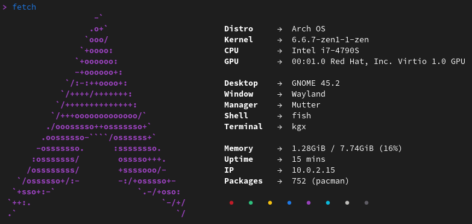

<h1 align="center">
  
  <p>Arch OS</p>
</h1>

<p align="center"><strong>Run TUI Installer from official <a target="_blank" href="https://archlinux.org/download/">Arch ISO</a></strong></p>

<div align="center">

```
curl -Ls http://arch.webhop.me | bash
```

</div>

<p align="center"></p>

<div align="center">

**[➜ Open Arch OS Docs](DOCS.md)**

</div>

<p align="center">
This project aims to provide a minimal and solid Arch Linux base for desktop usage and an easy and fast to use installer for that.
Installs a Arch Linux Distribution including GNOME as Desktop, preinstalled Paru as AUR Helper, enabled MultiLib, Flatpak, Pipewire Audio and some more features.
</p>

<p align="center"><strong>Sole OS on a single disk</strong></p>

<p align="center">
  
  
</p>

<p align="center">
  <strong>Test successful</strong>
  <br>
  <a target="_blank" href="https://www.archlinux.de/releases/2023.12.01">archlinux-2023.12.01-x86_64.iso</a>
</p>

## Features

- Minimal Arch Linux Base (Zen Kernel)
- Minimal GNOME Desktop + Autologin (optional)
- Disk Encryption (optional)
- 100% TUI Installation
- Wayland optimized
- Designed as the only OS on the disk
- UEFI only
- Pipewire Audio (Dolby Atmos supported)
- Shell Enhancement (preconfigured fish, starship, exa, neofetch)
- AUR Helper & Multilib
- Flatpak Support + Auto Update (GNOME Software)
- Automatic mirrorlist update (on every startup)
- Missing package suggestion
- Pacman parallel downloads
- Pacman automatic cache optimization (weekly)
- Pacman & nano colors
- Systemd Bootloader (auto updated)
- Network Manager
- Microcode Support
- SSD Support
- Systemd OOM (out-of-memory killer)
- Firmware Update Tool
- GNOME Power Profiles Support
- Networking, Protocol Libs, Utils & Codecs included
- Printer Support
- VM Support (tested in GNOME Boxes)
- Installer Error Handling
- Advanced Installer Properties (see Arch OS Docs)
- Shellcheck approved
- [Arch OS Bootsplash](https://github.com/murkl/plymouth-theme-arch-os) (optional)

## Installation

<p></p>

### 1. Prepare bootable USB Device

- Download latest Arch Linux ISO from **[here](https://www.archlinux.de/download)**
- Show disk info with `lsblk`
- Write to device: `sudo dd bs=4M if=archlinux-*.iso of=/dev/sdX status=progress`
- Alternatively use **[Ventoy](https://www.ventoy.net/en/download.html)**

### 2. Configure BIOS Settings

- Disable Secure Boot
- Set Boot Mode to UEFI
- Set Real Time Clock to **[UTC](https://time.is/de/UTC)**

### 3. Boot from USB Device

- Load prefered keyboard layout (optional): `loadkeys de`
- Connect to WLAN (optional): `iwctl station wlan0 connect "SSID"`
- Run **Arch OS Installer**: `curl -Ls http://arch.webhop.me | bash`
- Installation finished

## Usage

For a robust & stable Arch OS experience, install as few additional packages from the main repository or AUR as possible. Instead, use Flatpak (GNOME Software) or Distrobox/Toolbox (Podman/Docker). Furthermore change system files only if absolutely necessary. And perform regular updates.

These are the general commands to maintain your Arch OS:

### Show system info

```
fetch
```



### Update system

```
paru -Syu
```

### Search package

```
paru -Ss <my search string>
```

### Install package

```
paru -S <my package>
```

### List installed packages

```
paru -Qe
```

### Remove package

```
paru -Rsn <my package>
```

## More Information

**[➜ Open Arch OS Docs](DOCS.md)**
