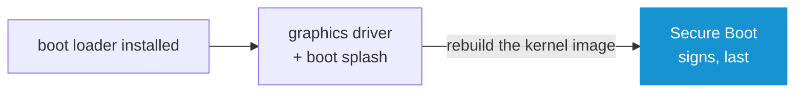

# Reference

What Arch OS puts on a disk, and why. The scripts say *what*; this says *why*, so a comment never has to.

**Note:** _What a module's YAML may declare is the **[➜ Oak Reference](https://github.com/murkl/oak/blob/main/docs/REFERENCE.md)**. This file is about Arch Linux._

## Partitions

UEFI only, GPT, two partitions - more only with dual boot.

| Partition | Size | Type | Label | Mounted |
| --- | --- | --- | --- | --- |
| 1 | 1 GiB | EFI system (`ef00`) | `BOOT` | `/boot` |
| 2 | the rest | Linux (`8300`) | `ROOT` / `BTRFS` | `/` |

Always in that order, so the Recovery finds an installation from the disk alone. `/boot` is `fmask=0077,dmask=0077`: it holds the kernel and the signed image, root's business only.

- **Encryption**: LUKS2 on partition 2, opened as `cryptroot`. One password for disk, root and account
- **Dual boot**: nothing is partitioned. The existing EFI partition is reused, only a boot entry added. It has to have **512 MiB free** - the kernel, its ram disk and the fallback one that carries every module do not fit in the 100 or 260 MB Windows makes - and it must not already hold a kernel of its own. Both are read before the first partition is touched. A second Linux that keeps `vmlinuz-*` on the shared EFI partition is refused there: the names collide, and pacman would stop the installation an hour later with `conflicting files`

## Btrfs Subvolumes

| Subvolume | Mounted | Why it is its own |
| --- | --- | --- |
| `@` | `/` | The system. What a rollback replaces |
| `@home` | `/home` | Your files - a rollback must not touch them |
| `@snapshots` | `/.snapshots` | Where the snapshots live |
| `@log` | `/var/log` | Says *why* a rollback was needed |
| `@cache` | `/var/cache` | The package cache - large, and nothing reads it back |
| `@tmp` | `/var/tmp` | Scratch space, not worth restoring |

A snapshot of `@` skips a subvolume mounted inside it, so a rollback keeps all six untouched.

Mounted `defaults,noatime,compress=zstd`. Written once in `modules/installer/module.sh` and once in `modules/recovery/module.sh` - **the two must not drift apart**. The Recovery mounts whichever a disk actually has, so an older layout still opens.

**Note:** _`/var/tmp` is `chmod 1777` right after it is made, before systemd-tmpfiles would get to it._

## The Boot Chain

| Answer | What is written |
| --- | --- |
| systemd-boot | `bootctl install`, one entry and one fallback |
| GRUB | `grub-install` + `grub-mkconfig`, `grub-btrfsd` on btrfs |
| Secure Boot | A **unified kernel image** per preset, signed with keys made for this machine |

`kernel_args` in `module.sh` is the one source of the command line - the unified image, systemd-boot and GRUB all read it.

| Parameter | Why |
| --- | --- |
| `zswap.enabled=0` | Interferes with zram |
| `rd.luks.name=…=cryptroot` | Opens the disk in `sd-encrypt` |
| `rootflags=subvol=@ rootfstype=btrfs` | Which subvolume is root |
| `nowatchdog` | Unused, delays shutdown |
| `quiet splash loglevel=3 …` | **[➜ Silent boot](https://wiki.archlinux.org/title/Silent_boot)** |
| `plymouth.ignore-serial-consoles` | A serial console makes Plymouth fall back to text, taking the passphrase prompt with it - every VM gets one unasked |

**Note:** _`ARCH_OS_KERNEL_ARGS` refuses quotes, backslashes, `$` and backticks - GRUB sources its command line as shell._

### Secure Boot

Offered only with **disk encryption** and **systemd-boot**:

- No encryption, no point - the drive is readable either way
- A unified image signs kernel, initramfs and command line **as one**. Kernel-only leaves a forgeable initramfs on the unencrypted partition
- GRUB's binary would need re-signing on every update, and nothing does that

Signed **last**: the graphics driver and boot splash rebuild the kernel image afterwards, bypassing pacman and `sbctl`'s hook. Every signed file is recorded, so the hook catches the next rebuild.



Keys enroll only in **setup mode** - "Secure Boot disabled" is not that. `-m` keeps Microsoft's certificates. A failure here is only logged: the machine still boots.

**Note:** _A unified image switches the boot loader's editor off - an editable command line is a root shell past Secure Boot._

**Note:** _Switching Secure Boot on is the firmware's own step - **[➜ installation step 5](README.md#5-switch-secure-boot-on)**._

### The Initial Ram Disk

```
base systemd keyboard autodetect microcode modconf kms sd-vconsole block [sd-encrypt] filesystems fsck [grub-btrfs-overlayfs]
```

- `kms` gives Plymouth a driver to draw on - without it, no splash
- `keyboard` before `autodetect`: every layout ships, not just the one plugged in while installing

**Note:** _`/etc/mkinitcpio.conf.d/10-arch-os.conf`. Drop-ins after it build on it: the boot splash (`20-`), the graphics driver (`30-`)._

## Tuning

Behind **Core tweaks**, changes behaviour, never what is installed. **[➜ Sysctl](https://wiki.archlinux.org/title/Sysctl)**

| Setting | Why |
| --- | --- |
| `vm.dirty_bytes=256M`, `_background_bytes=64M` | The default is a share of memory - gigabytes leaving in one burst. Bytes cap it to what the disk keeps up with |
| `vm.vfs_cache_pressure=50` | Directory/inode entries are cheap to keep, costly to look up again |
| `transparent_hugepage/defrag=defer+madvise` | Hands out pages immediately, defragments in the background |
| `DefaultTimeoutStopSec=15s` | The default 90s wait *is* what a hung shutdown looks like |
| `DefaultLimitNOFILE=1024:2097152` | Only the ceiling moves - Wine/Electron raise their own soft limit against it |
| `SystemMaxUse=200M` | The default keeps the journal forever on a modern disk |
| I/O schedulers | `bfq` for spinning disks, `mq-deadline` for SATA/eMMC, NVMe untouched - **[➜ wiki](https://wiki.archlinux.org/title/Improving_performance#Changing_I/O_scheduler)** |
| `vm.max_map_count=2147483642` | The default of 65530 mapped regions is too low for some games and emulators, which crash rather than fall back - **[➜ wiki](https://wiki.archlinux.org/title/Gaming#Increase_vm.max_map_count)** |
| `tcp_congestion_control=bbr`, `default_qdisc=fq` | `cubic` reads any packet loss as congestion; wifi and long-distance links lose packets without being full. `bbr` measures delay instead |

Swap is **zram** always, tweaks or not. **[➜ Zram](https://wiki.archlinux.org/title/Zram)**

## Packages

Enough for a usable install, little enough that nothing needs looking after.

- `base`, the chosen kernel, `sudo`, `zram-generator`, `networkmanager`
- `nano`, `man-db`, `man-pages`, `openssh` - `base` ships none of them
- Everything else follows an answer: the task that enables a service installs its package

**Firmware is skipped in a VM** - a guest's drivers are already in the kernel, and `linux-firmware` is over half the base install. Skipped unless a card is passed through.

**Note:** _The GNOME group is filtered, not installed and trimmed: what the slim desktop drops is never downloaded._

**A desktop also gets `nss-mdns`** and the `mdns_minimal` module in front of the resolver in `/etc/nsswitch.conf`. Avahi announces this machine and finds the others either way; without that line nothing on the system can reach any of them by the `.local` name they answer to - a printer, a share and another machine are all `.local`. **[➜ Avahi](https://wiki.archlinux.org/title/Avahi#Hostname_resolution)**

**Note:** _File sharing announces itself under the hostname as it stands - `mdns name = mdns` in `smb.conf`. Samba's default is the NetBIOS name, which is the hostname in capitals, so the machine would be the one entry in a file manager's network list that shouts._

### Building from the AUR

| Limit | Value | Why |
| --- | --- | --- |
| Attempts | 3 | Retries downloads, not a stuck build |
| Timeout | 45 min | Past this it is stuck, not slow |
| Compile jobs | 1/GiB, capped at core count | More would run a live image out of memory |

One `timeout` around the whole build; passwordless `sudo` granted for its length and revoked after.

**Note:** _`/etc/makepkg.conf.d/arch-os.conf` switches the debug package off, and nothing else: an AUR build otherwise leaves a second package beside the one that was wanted. `-march=native` is deliberately **not** there - it buys a few percent and pays for it with binaries that stop running the day the disk is moved, the image is restored onto other hardware or the CPU is replaced, and the crash that follows reads like failing memory._

**Note:** _Only `paru` and `yay`, both built from source against this machine's pacman. A `-bin` package is linked against the pacman of the day it was published and stops starting the day Arch moves `libalpm` - not offered here._

## Snapshots

| Answer | Before every package transaction |
| --- | --- |
| Snapper | A named snapshot via `snap-pac`, cleaned up by three timers |
| Btrfs alone | One dated read-only snapshot, nothing cleaned up |

Snapper's defaults suit a slow-moving system, not a rolling release - fifty snapshots plus a year of timeline filled a disk to 70G against 35G of real system. So `NUMBER_LIMIT=10`, `NUMBER_LIMIT_IMPORTANT=5`, `TIMELINE_LIMIT_MONTHLY=2`, `TIMELINE_LIMIT_YEARLY=0`, plus `ALLOW_GROUPS=wheel` and `SYNC_ACL=yes` so the group `/.snapshots` belongs to can read it - without them snapper answers nobody but root, whatever the directory says.

All of it in one place, `snapper_config` in `modules/installer/module.sh`: `set-config` takes one `KEY=VALUE` per argument, writes a whole line handed to it as one into the first key, and says nothing - so the task sets them from there and its test reads them back against the same list.

**Note:** _`snapper-cleanup.service` syncs on `ExecStopPost` - btrfs frees extents on its own schedule, and `df` lies until then._

## Closing the Target

`close_target`, shared by Installer and Recovery: swap off, sync, unmount, lock.

- `umount -R`, never `-A` - `-A` reaches beyond the target, and in the Recovery takes the rollback's snapshots with it
- `fuser -M` - without it, a non-mountpoint target resolves to the live image itself
- Whatever holds it is logged, then killed; the second unmount is left to fail for real

## The Recovery

Two questions - keyboard, disk. Everything else is read, not asked:

| Read | How | When |
| --- | --- | --- |
| Encryption | The LUKS header, no password needed | Before the run |
| File system | `lsblk` on the unlocked device | Once open |
| Subvolumes | `btrfs subvolume list` | While mounting |
| Kernels | `/usr/lib/modules/*/` | While rebuilding boot |
| Snapshots | `@snapshots` on the btrfs top level | Mid-run; none means the rollback step is skipped |

No network, ever - it may be what broke. Kernel images come from the package cache.

The password of an encrypted disk is typed once rather than twice: it already exists, and `cryptsetup` refuses a wrong one a second later and names the partition. A second box is for a password being chosen, which nothing can check until the system it belongs to boots.

**Note:** _A rollback builds the new `@` before touching the old one - a run that dies halfway leaves the system as found._

## The Boot Medium

A hybrid ISO already carries its partition table and boot paths - writing it is one raw copy.

- The image is **not** a question: it is the release this program came from
- Where it lands **is**: `XDG_DOWNLOAD_DIR` or `~/Downloads`. An image already there is used rather than fetched again
- It is checked against the checksum GitHub publishes for that release, and a mismatch discards it rather than keeping a broken one
- Where that release publishes no checksum, the run stops and asks before anything is written - an image built here is the one that arrives this way

**Root only for the write.** `as_root` wraps `umount`, `dd`, `partprobe` - nothing else. Everything else runs as you, so a live image never leaves root-owned files in your home.
