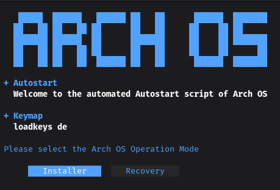

# Arch OS ISO

<p></p>

Stock Arch `releng`, patched: boot ➜ Plymouth ➜ the installer. Nothing in
between.

- The [runtime](../runtime) and the [setup](../setup) tree, installed at
  `/opt/installer`, started directly by a systemd unit on tty1 — no autologin,
  no shell, and a root shell handed back on that same console whenever the
  installer stops: because somebody chose to leave it, or because it crashed
- `installer` on the path, which is how it is started again from that shell —
  the same script the unit runs, so both keep their answers in `/opt/installer`
  and a second run picks up where the first left off. `/etc/motd` and
  `/etc/issue` say so, and so does the installer on its way out
- Plymouth bootsplash with the Arch OS theme
- Nord palette and a console font, put on by the `installer` script itself and
  so by every start of it, so the installer looks like itself on a bare VT — a
  console font holds at most 512 glyphs, and the interface draws itself out of
  what one is guaranteed to have
- Networking left exactly as the Arch ISO ships it (iwd, systemd-networkd);
  the installer's own preflight check says to use `iwctl` if there is none
- UEFI only, squashfs/zstd

## Building

```sh
make -C .. build   # assembles ../release: the binary, installer.yaml, tasks/
make -C .. iso     # the above, then this ISO, into ../release/iso
```

Run from here directly once a release exists:

```sh
make build          # or: RELEASE_DIR=../release SNAPSHOT_VERSION=1234abc ./build.sh
```

The generated `*.iso` (and its `.sha256`) land in `RELEASE_DIR/iso`, which
defaults to `../release/iso`. `SNAPSHOT_VERSION` defaults to the short commit
SHA of `HEAD`, the same scheme [runtime](../runtime) uses for the binary.

The Plymouth theme is taken from a
**[plymouth-theme-arch-os](https://github.com/murkl/plymouth-theme-arch-os)**
checkout beside this repository when there is one, and fetched otherwise.
Point `PLYMOUTH_THEME_SRC` at a `src/` directory to build against a different
one.

## What is where

```
build.sh                                   assembles and runs mkarchiso
src/etc/systemd/system/installer.service   starts the installer on tty1
src/usr/local/bin/installer                the one way in: the unit and the prompt both run this, and it dresses the console first
src/usr/local/bin/installer-console-theme  paints the console in the Nord palette
```

`make lint` shellchecks and shfmts every script here; `archiso` itself, and
root, are only needed for `make build`.
