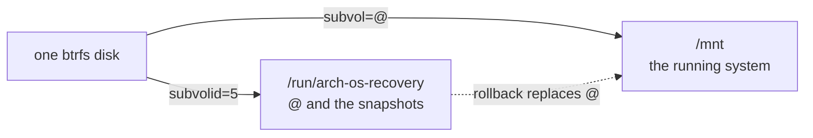

# Arch OS Recovery

Everything this Recovery knows about Arch Linux. It is data - one YAML file and the folders beside it - and it does not run on its own: [Oak](https://github.com/murkl/oak) draws the interface, asks the questions and runs the tasks in order.

**Note:** _Putting Arch Linux on disk and writing the device this boots from are separate modules: **[➜ Installer](../installer)** · **[➜ Create boot medium](../imager)**_

**Note:** _What it reads and repairs: **[➜ Arch OS Reference](../../docs/REFERENCE.md#the-recovery)**. The task contract: **[➜ Oak Reference](https://github.com/murkl/oak/blob/main/docs/REFERENCE.md#what-a-script-receives)**._

```
make -C ../.. check                              # load every module and lint every script
make -C ../.. run MODULE=recovery ARGS=--debug   # run it without touching this machine
```

## What is where

```
module.yaml                     what this Recovery is, what it asks, what order it runs in
module.sh                       what more than one script has to agree about
tasks/@<stage>/<id>/task.yaml   what that step is: its needs, conditions and offers
tasks/@<stage>/<id>/task.sh     what it does, plus any file it ships with, beside it
tasks/@<stage>/<id>/test.sh     optional: how to tell, on the machine, that it took
hooks/@<hook>/<id>/hook.yaml    a moment Oak runs itself, rather than as part of the work
locales/                        one <code>.po per language, and the template they come from
```

## What it does

Three stages; after the first, every step is optional.

| Task | Stage | Description |
| --- | --- | --- |
| `open` | `open` | Unlocks and mounts at `/mnt`, the same way the system mounts itself |
| `rollback` | `repair` | Puts a snapshot in place of the root subvolume. Skipped where there are none |
| `kernel` | `repair` | Rebuilds kernel images and initramfs from the package cache, re-signs if needed |
| `shell` | `repair` | `arch-chroot`s into the repaired system |
| `close` | `close` | Unmounts everything and locks the disk again |

**Note:** _Each of the three under `repair` has its own `confirm:`, so a run can stop after any. `needs:` orders them - a shell is worth having once the boot files are back._

## Nothing is downloaded

A broken network may be the problem, so this module never asks for one: no `@online` hook, and kernel images come from the local pacman cache. `hooks/@preflight/` checks only root - not firmware, since this machine is not what is being set up.

## Two Questions, and no more

Everything else about the disk is read, not asked:

| Read | How | When |
| --- | --- | --- |
| Root partition | The disk's second partition, when it is a LUKS container or a btrfs labelled `BTRFS` | Before the run |
| Encryption | LUKS header, no password needed | Before the run, as an `answer:` |
| File system | `lsblk` on the unlocked device - btrfs, or it is turned away | Once open |
| Subvolumes | `btrfs subvolume list` on the top level - every one the Installer lays down, or it is turned away | Once open |
| `/boot` | The installation's own `fstab` | While mounting |
| Snapshots | `@snapshots` on the btrfs top level | Mid-run, once mounted |

None to offer means the step is skipped, not asked about.

**Note:** _Only what the Installer of the same release makes is opened. An installation from an earlier release is turned away with the reason - its own release's Recovery opens it._

**Note:** _A derived answer is never asked, on the settings page or written to `recovery.conf` - the next run reads it again. See `answer:` in the **[➜ Oak Reference](https://github.com/murkl/oak/blob/main/docs/REFERENCE.md)**._

## Two Views of one Disk

The running system, mounted at `/mnt`, sits on a top level holding `@` and the snapshots, mounted separately at `/run/arch-os-recovery` - a rollback needs `@` replaceable while `/mnt` stays gone.



**Note:** _Subvolume table and mount options are the Installer's own, from `oak.sh` at the root, which both modules are given. **[➜ Btrfs Subvolumes](../../docs/REFERENCE.md#btrfs-subvolumes)**_

## Answers

`recovery.conf`, beside wherever the Recovery was started - its own file, never the Installer's.

| Variable | Description |
| --- | --- |
| `ARCH_OS_RECOVERY_KEYMAP` | The console keyboard, asked `first` |
| `ARCH_OS_RECOVERY_DISK` | The disk holding the installation to repair |
| `ARCH_OS_RECOVERY_ENCRYPTED` | LUKS or not - read, never asked |
| `ARCH_OS_RECOVERY_PASSWORD` | Asked right before the run, never written |
| `ARCH_OS_RECOVERY_SNAPSHOT` | Asked mid-run by the rollback task |

Only keyboard and disk are asked up front. The password follows right before the run, the snapshot only if a rollback is chosen.

## Requirements

A booted **Arch Linux live image** - `requires:` in `module.yaml`. Root on it - `hooks/@preflight/`. Nothing else.
