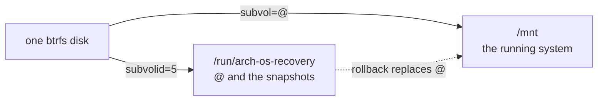

# Arch OS Recovery

Everything this Recovery knows about Arch Linux. It is data - one YAML file and the folders beside it - and it does not run on its own: [Oak](https://github.com/murkl/oak) draws the interface, asks the questions and runs the tasks in order.

**Note:** _Putting Arch Linux on disk and writing the device this boots from are separate modules: **[➜ Installer](../installer)** · **[➜ Create boot medium](../imager)**_

**Note:** _What it reads and repairs: **[➜ Arch OS Reference](../../docs/REFERENCE.md#the-recovery)**. The task contract: **[➜ Oak Reference](https://github.com/murkl/oak/blob/main/docs/REFERENCE.md#what-a-script-receives)**._

```
make -C ../.. check                              # load every module and lint every script
make -C ../.. run MODULE=recovery ARGS=--debug   # run it without touching this machine
```

## What is where

```
module.yaml                       what this Recovery is, what it asks, what order it runs in, its rules
tasks/@<stage>/<id>/task.yaml     what that step is: its questions and pages
tasks/@<stage>/<id>/task.sh       what it does, plus any file it ships with, beside it
tasks/@<stage>/<id>/test.sh       optional: how to tell, on the machine, that it took
actions/<id>/action.yaml          an action: one page at most, and what a no means
actions/<id>/action.sh            what it does, and nothing else
locales/                          one <code>.po per language, and the template they come from
```

**Note:** _What several scripts share, and every function the yaml calls, is in **[oak.sh](../../oak.sh)** beside `oak.yaml`. Its actions - the live image, root, the wireless network, the ways out, sharing the log, the shell - are the Installer's too, and each `action.sh` calls the same function there._

## Stages

Every step after the first is optional.

| Stage | Task | Description |
| --- | --- | --- |
| `open` | `system` | Unlocks and mounts at `/mnt`, the same way the system mounts itself - after closing whatever an earlier attempt left |
| `rollback` | `snapshot` | Puts a snapshot in place of the root subvolume. Skipped where there are none |
| `rebuild` | `boot` | Rebuilds kernel images and initramfs from the package cache, re-signs if needed |

**Note:** _`snapshot` and `boot` each ask first and open on No, so a run can stop after any. The page the repair ends on offers **Open a shell** in the repaired system and opens on **Continue**. A restart or a shutdown leaves unmounting and locking to systemd._

## Nothing is downloaded

A broken network may be the problem, so this module never waits for one, and kernel images come from the local pacman cache. `root` is all the work requires - not firmware, since this machine is not what is being set up.

It can join one all the same, for whatever somebody wants to fetch in the shell: `wifi` puts **Configure the wireless network** into its **Configuration** wherever there is a card and no internet over a cable - the same action the Installer has. On its own partition a cable comes up at boot and is preferred while both are up, and the wireless daemon starts once there is a card to ask it about. `restart` and `shutdown` are the ways out, and `share-log` puts the log of a repair that failed online for whoever is helping.

## Two Questions, and no more

Everything else about the disk is read, not asked:

| Read | How | When |
| --- | --- | --- |
| Root partition | The disk's second partition, when it is a LUKS container or a btrfs labelled `BTRFS` | Before the run |
| Encryption | LUKS header, no password needed | Before the run, as a `value-from:` |
| File system | `lsblk` on the unlocked device - btrfs, or it is turned away | Once open |
| Subvolumes | `btrfs subvolume list` on the top level - every one the Installer lays down, or it is turned away | Once open |
| `/boot` | Partition 1, as the Installer lays it out - not the `fstab`, which may be what broke | While mounting |
| Snapshots | `@snapshots` on the btrfs top level | Mid-run, once mounted, as `type: deferred` |

None to offer means the step is skipped, not asked about.

**Note:** _Only what the Installer of the same release makes is opened._

**Note:** _A derived answer is never asked, in the **Configuration** or written to `recovery.conf` - the next run reads it again. See `value-from:` in the **[➜ Oak Reference](https://github.com/murkl/oak/blob/main/docs/REFERENCE.md)**._

## Two Views of one Disk

The running system, mounted at `/mnt`, sits on a top level holding `@` and the snapshots, mounted separately at `/run/arch-os-recovery` - a rollback needs `@` replaceable while `/mnt` stays gone.


```mermaid
flowchart LR
    D["one btrfs disk"] -->|"subvol=@"| M["/mnt<br/>the running system"]
    D -->|"subvolid=5"| T["/run/arch-os-recovery<br/>@ and the snapshots"]
    T -.->|"rollback replaces @"| M
```

**Note:** _Subvolume table and mount options are the Installer's own, from `oak.sh` at the root, which both modules are given. **[➜ Btrfs Subvolumes](../../docs/REFERENCE.md#btrfs-subvolumes)**_

## Answers

`recovery.conf`, beside wherever the Recovery was started - its own file, never the Installer's.

| Variable | Description |
| --- | --- |
| `ARCH_OS_RECOVERY_KEYMAP` | The console keyboard, asked `first` |
| `ARCH_OS_RECOVERY_DISK` | The disk holding the installation to repair |
| `ARCH_OS_RECOVERY_ENCRYPTED` | LUKS or not - read, never asked |
| `ARCH_OS_RECOVERY_PASSWORD` | Asked right before the run, tried on the disk where it is typed, never written |
| `ARCH_OS_RECOVERY_SNAPSHOT` | Asked mid-run by the rollback task |

Only keyboard and disk are asked up front. The password follows right before the run, the snapshot only if a rollback is chosen.

On its own partition neither is asked: the Installer leaves the keyboard it was typed on, together with the language it was read in, and the disk is the one the Recovery was started from - **[➜ The Recovery Partition](../../docs/REFERENCE.md#the-recovery-partition)**. Both values are held to their `pattern:` and to the list they come from, like any answer read from a file, and the keyboard is loaded before the first page is drawn - one that will not load is asked for again rather than left standing, since the password is typed on it next.

## Requirements

A booted **Arch Linux live image** - `rules: offer-if` in `module.yaml`. Root on it - `rules: start-if`. Nothing else.

**Note:** _Two images are one: the ISO, and the Recovery image the Installer writes to a partition of its own, where this module is the only one - **[➜ The Recovery Partition](../../docs/REFERENCE.md#the-recovery-partition)**. It copies itself to memory before it starts, so the disk it came from is free to be opened like any other._
